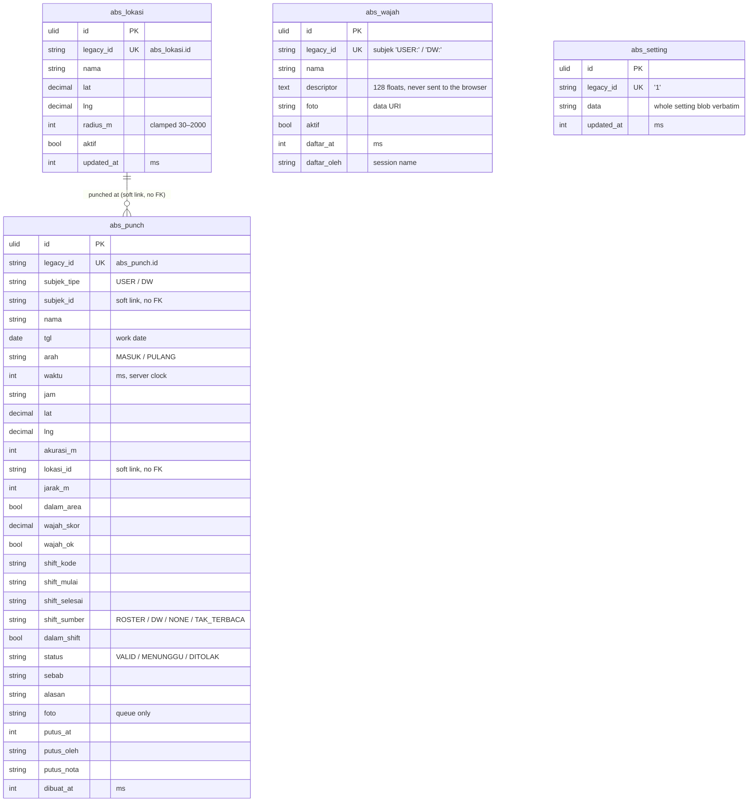

# Absensi in `core`

Clock-in locations, registered faces, punches and the setting blob. Fifth
in the cutover order (PRD #1), after identity, jadwal, marketing and dw:
punches name crew and daily workers by legacy id and resolve acting Office
Users best-effort, so this import has no hard dependency. Shift lookups keep
calling the Jadwal and Dw services in-process and follow whatever connection
those modules use.

Migration: `database/migrations/2026_09_26_160000_create_absensi_tables.php`.
Importer: `App\Core\Imports\AbsensiImporter` (`php artisan core:import absensi`).
Served from core when `DB_ABSENSI_CONNECTION=core`: `AbsensiService` reads
and writes these tables and rebuilds the legacy wire shapes (legacy ids,
faces without descriptors); unset = legacy (rollback).

## ERD

Every table also carries the ADR-0003 technical columns `created_by`,
`updated_by` (FK → `user`, `ON DELETE SET NULL`, best-effort from the
session name) and `version`; they are left out of the diagram. There are no
Laravel timestamps: the legacy millisecond stamps (`updated_at`, `daftar_at`,
`dibuat_at`, `putus_at`) ARE the change record, and `version` is the ADR
concurrency column. No table has `deleted_at`: locations, faces and decided
punches are hard-deleted.



## Legacy → core mapping

| Legacy | core | Notes |
|---|---|---|
| `abs_lokasi.*` | `abs_lokasi` + `legacy_id` | `updated_by` NAME not carried: never served (`locations()` returns no actor) |
| `abs_wajah.*` | `abs_wajah`, `subjek` → `legacy_id` | natural key kept; `descriptor`/`foto` verbatim |
| `abs_punch.*` | `abs_punch` + `legacy_id` | every column verbatim; the composite unique key `(subjek_tipe,subjek_id,tgl,arah)` is kept — it is the PULANG upsert target |
| `abs_setting.(id,data,updated_at)` | `abs_setting.(legacy_id,data,updated_at)` | `updated_by` NAME not carried: never served |

Only punches are stored; lateness, overtime and durations stay computed on
read (`hitungHari`), never stored — unchanged.

## Delete behaviour

Hard deletes, as in legacy. Decided punches are never deleted by the
service; faces and locations are removed only by explicit HR calls.

## Concurrency

Punches are granular last-write-wins with domain guards (MASUK first-wins,
PULANG last-wins with decision reset, `putusAbsen` only while MENUNGGU);
`version` starts at `1` and bumps on every executed write. Compat and v1
never expose it.

## Import and switch

```bash
php artisan core:import absensi   # reads legacy_absensi, writes core
```

Idempotent: rows are matched on `legacy_id`, unchanged rows are left alone,
changed rows get `version + 1`, and rows whose legacy source is gone are
deleted.

```dotenv
DB_ABSENSI_CONNECTION=core   # after the import; unset = legacy (rollback)
```

- **Ids.** Compat routes and v1 keep the legacy ids (punch `id`, face
  `USER:<id>`/`DW:<id>`, `lokasi_id`); the ULID never reaches the wire.
- **List order.** `locations` is `ORDER BY nama`; the face list
  (`wajahDaftar`) has no `ORDER BY` on either connection (the legacy query
  never had one), so the parity cases compare it as a multiset
  (`unordered`, like jadwal `data.sel`).
- **Deviations.** None known: `parity.mjs absensi --core` is 38/38
  identical, including the face-match, queue, recap and shift-lookup paths.
