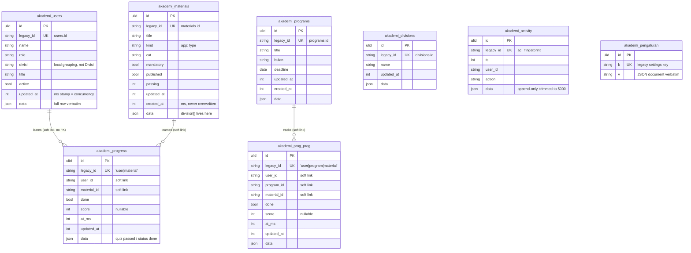

# Akademi in `core`

Training-platform rows, composite-key progress maps, the append-only
activity trail and the settings documents. Seventh in the cutover order
(PRD #1), after identity, jadwal, marketing, dw, absensi and konten:
akademi rows carry no user links, so this import has no dependency. The HR
Panel reads `trainingStats` in-process through `AkademiStats`, never the
tables directly.

Migration: `database/migrations/2026_09_26_180000_create_akademi_tables.php`.
Importer: `App\Core\Imports\AkademiImporter` (`php artisan core:import akademi`).
Served from core when `DB_AKADEMI_CONNECTION=core`: the akademi services
read and write these tables and rebuild the legacy wire shapes (legacy ids,
nested progress maps, whole-state `getAll`); unset = legacy (rollback).

## ERD

Every table also carries the ADR-0003 technical columns `created_by`,
`updated_by` (FK → `user`, `ON DELETE SET NULL`, always `NULL` for akademi:
actors are free-text names kept in the row itself) and `version`; they are
left out of the diagram. There are no Laravel timestamps: the legacy
millisecond stamps (`updated_at`, `created_at`) ARE the change record, and
`version` is the ADR concurrency column. No table has `deleted_at`: deletes
are hard (and unbounded — see below).



## Legacy → core mapping

| Legacy | core | Notes |
|---|---|---|
| `users/divisions/materials/programs.(id + indexed cols + updated_at [+ created_at])` | `akademi_*.(legacy_id + same columns)` | ULID `id` is new; every column copied verbatim |
| `*.data` | `data` | verbatim: the open-ended training fields (`division[]`, quiz bodies); indexed columns derived from the row on every write via `RowSync::ambil` |
| `progress.(user_id,material_id,…)` | `akademi_progress` + `legacy_id "user\|material"` | composite PK becomes one unique string (like jadwal_sel's `"user\|tgl"`) |
| `prog_prog.(user_id,program_id,material_id,…)` | `akademi_prog_prog` + `legacy_id "user\|program\|material"` | same |
| `activity.(id,ts,user_id,action,data)` | `akademi_activity`, fingerprint → `legacy_id` | resends stay idempotent via INSERT IGNORE |
| `settings(k,v)` | `akademi_pengaturan(k,v)` | key kept verbatim (`settings`, `version`, `createdAt`, `extra:*`) |

Links between rows stay soft strings with no FKs, as in legacy: deleting a
user, material or program never cascades into progress rows.

## Delete behaviour

Hard deletes, as in legacy — including the unbounded variant: `saveAll`
deletes every row missing from the payload with no `_sejak` bound
(reproduced exactly; v1 has no whole-state save). An empty collection or an
empty progress map never deletes. `activity` trims to the newest 5000.

## Concurrency

The millisecond stamp is the concurrency scheme (`baseUpdatedAt` guard,
column-only cap bump: `data.updatedAt` keeps the client-sent value). No
`versi` map, no identical-content escape. `version` starts at `1` and bumps
on every executed write; compat never exposes it, v1 versions by the stamp.

## Import and switch

```bash
php artisan core:import akademi   # reads legacy_akademi, writes core
```

Idempotent: rows are matched on `legacy_id` (or `k`), unchanged rows are
left alone (`data` compares decoded, so re-encoding drift never counts as a
change), changed rows get `version + 1`, and rows whose legacy source is
gone are deleted.

```dotenv
DB_AKADEMI_CONNECTION=core   # after the import; unset = legacy (rollback)
```

- **Ids.** Compat routes, v1 and HR (`trainingStats`) keep the legacy ids;
  the ULID never reaches the wire.
- **Stats keys** stay the legacy table names (`users`, `materials`,
  `progress`, `prog_prog`, `activity`) on both connections.
- **Files** (`receipts/`, 8 MB, 1-hour hard-unlink GC over `materials`)
  stay on disk in the same `AKADEMI_DATA_DIR` layout; only the live-key
  scan moves to `akademi_materials`.
- **Lock.** `saveAll`/v1 writes hold `GET_LOCK('<db>:akademi_save')`; on
  core the lock name uses the core database name. Post-cutover only Laravel
  writes (the legacy database is frozen), so the single writer holds.
- **Deviations.** None known: `parity.mjs akademi --core` is 25/25
  identical, including the conflict/column-bump/unbounded-delete guards,
  the composite progress maps, the fingerprint activity ids and the file
  upload/stream paths.
