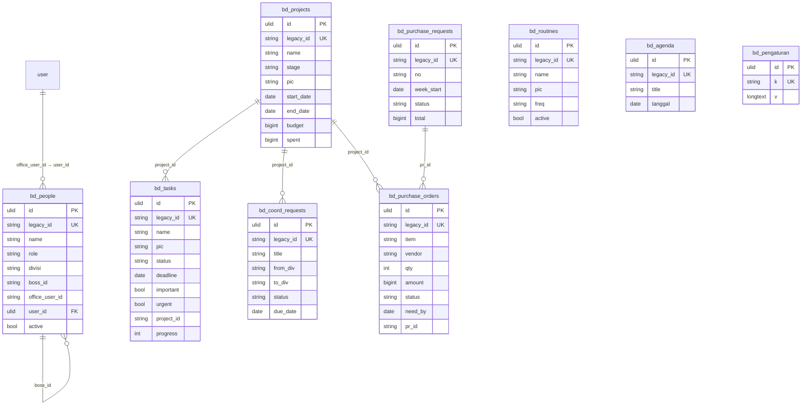

# BD OS in `core`

#59 (PRD #1, ADR-0002/0003/0004). BD OS moves from `lakk5493_db_bd` to the `bd_*` tables of `core`.

- **Same storage model as legacy.** Each row is its indexed columns (the query surface, derived from the row on every write) plus the full row as the app edits it in `data`. The `data` JSON stays because BD rows are open-ended: task checklists, PR signers, PO notes.
- **Ids.** Legacy ids live in `legacy_id`, so the compat routes and v1 keep speaking them.
- **The only new relation.** A BD crew member's link to an Office User is a real FK: `bd_people.user_id` → `user`.

## ERD



**Columns on every row table:**

- `updated_at` / `created_at`: legacy millisecond stamps.
- `data`: the full row.
- `version`, `created_by`, `updated_by`: ADR-0003. The actors stay NULL, because BD actors are free-text names inside the rows.

**Plain strings, not FKs.** `boss_id`, `project_id` and `pr_id` hold legacy ids exactly as the app writes them. The app saves collections independently, so a task may briefly name a project that another tab has not saved yet. An FK would refuse writes that legacy accepted.

## Legacy → core mapping

| legacy (`lakk5493_db_bd`) | core | notes |
|---|---|---|
| `people` | `bd_people` | + `user_id`, resolved from `office_user_id` via `user.legacy_id` (NULL when unlinked or unknown) |
| `projects`, `tasks`, `routines`, `agenda` | `bd_projects`, `bd_tasks`, `bd_routines`, `bd_agenda` | columns verbatim |
| `coord_requests` | `bd_coord_requests` | columns verbatim |
| `purchase_orders`, `purchase_requests` | `bd_purchase_orders`, `bd_purchase_requests` | columns verbatim |
| `settings` (`focus`, `approverSets`, `promos`) | `bd_pengaturan` | `k`/`v`, `version` + 1 per write |
| `id` | `legacy_id` | a new ULID `id` is minted per row |

## Behaviour kept exactly

- **saveAll** keeps its rules:
  - the `sinceTs`-bounded delete of missing rows;
  - "not sent ⇒ untouched";
  - the `updated_at` ordering guard, per column, in the upsert.

  On core, the same guard also bumps `version` (only accepted writes count).
- **addPo** stays insert-only with server-generated ids.
- **setRealisasi** (Finance → Kas Kecil) keeps the status/`statusSebelum` marker, and bumps `version` on core.
- **v1** row versions are still the `updated_at` stamp; documents are still content-hashed (`docs/api/bd.md`).
- **Locks.** Writes still run under `GET_LOCK('<db>:bd_save')`. On core, `<db>` is the core database, so it no longer serialises with the old PHP; after the cutover the old backend no longer writes.
- **Cross-module reads** (kompas investor agenda, radar) go through `BdState::read()` only; nothing reads the bd tables directly.

## Delete behaviour

- **Rows:** a deleted BD row is gone, exactly as in legacy (saveAll's bounded delete, v1 `DELETE`).
- **Deleting a User:** sets `bd_people.user_id` to NULL. It never deletes the crew member.

## Import and switch

```bash
php artisan core:import account   # first: bd_people.user_id points at core Users
php artisan core:import bd        # idempotent; re-run to follow legacy edits and deletions
DB_BD_CONNECTION=core             # serve BD OS from core; unset = legacy (rollback)
```

**Verified:**

- `node tools/parity/parity.mjs bd --core`: 32/32 identical (plain `bd`: 32/32).
- Pest is green on both connections.
- `tests/Feature/Core/BdImportTest.php`: 1:1 copy, idempotent, User link, follows legacy edits and deletions.
- `tests/Feature/Core/BdOnCoreTest.php`: getAll, saveAll guard + version, setRealisasi, v1.
