# DW in `core`

Pekerja Harian (talent pool), shift assignments, head requests and the
setting blob. Fourth in the cutover order (PRD #1), after identity, jadwal
and marketing: DW rows name workers and requests by legacy id and resolve
acting Office Users best-effort, so this import has no hard dependency.

Migration: `database/migrations/2026_09_26_150000_create_dw_tables.php`.
Importer: `App\Core\Imports\DwImporter` (`php artisan core:import dw`).
Served from core when `DB_DW_CONNECTION=core`: `DwService` reads and writes
these tables and rebuilds the legacy wire shapes (legacy ids throughout);
unset = legacy (rollback).

## ERD

Every table also carries the ADR-0003 technical columns `created_by`,
`updated_by` (FK → `user`, `ON DELETE SET NULL`, best-effort from the
session name) and `version`; they are left out of the diagram. There are no
Laravel timestamps: the legacy millisecond stamps (`dibuat_at`, `putus_at`,
`hadir_at`, `diubah_at`, `updated_at`) ARE the change record, and `version`
is the ADR concurrency column. No table has `deleted_at`: the legacy rules
hard-delete every row.

```mermaid
erDiagram
    dw_pekerja ||--o{ dw_ajuan : "assigned (soft link, no FK)"
    dw_permintaan ||--o{ dw_ajuan : "staffed (soft link, no FK)"

    dw_pekerja {
        ulid id PK
        string legacy_id UK "dw_pekerja.id (DW…)"
        string nama
        string no_hp UK "normalised 08…, the worker identity"
        string pin "legacy, never read nor written"
        string gender
        string area
        string bank
        string divisi "CSV, first value primary"
        string posisi "CSV"
        string skill
        string status "AKTIF / NONAKTIF"
        string catatan
        int dibuat_at "ms"
        string dibuat_oleh "session name"
        int updated_at "ms"
        string updated_oleh "session name"
        string bayar_jenis "BANK / GOPAY / DANA"
        string bayar_nomor
        string bayar_nama
        string bayar_bank
    }
    dw_ajuan {
        ulid id PK
        string legacy_id UK "dw_ajuan.id (AJ…)"
        string dw_id "soft link, no FK"
        date tgl
        string jam_mulai
        string jam_selesai
        string divisi "single value"
        string posisi
        string catatan
        string status "MENUNGGU / DISETUJUI / …"
        int dibuat_at
        string dibuat_oleh
        int putus_at
        string putus_oleh
        string putus_nota
        string hadir "'' / HADIR / TELAT / ALFA"
        int nilai "rating bookkeeping, never read by the service"
        string nilai_nota
        string nilai_oleh
        int nilai_at
        string hadir_nota
        string hadir_oleh
        int hadir_at
        string permintaan_id "soft link, no FK"
    }
    dw_permintaan {
        ulid id PK
        string legacy_id UK "dw_permintaan.id (PM…)"
        string divisi
        date tgl
        string jam_mulai
        string jam_selesai
        string posisi
        int jumlah
        string catatan
        string status
        int dibuat_at
        string dibuat_oleh
        int putus_at
        string putus_oleh
        string putus_nota
        string usulan "CSV of suggested worker ids"
        int diubah_at
        string diubah_oleh
    }
    dw_setting {
        ulid id PK
        string legacy_id UK "'1'"
        string data "whole setting blob verbatim"
        int updated_at "ms"
    }
```



## Legacy → core mapping

| Legacy | core | Notes |
|---|---|---|
| `dw_pekerja.*` | `dw_pekerja` + `legacy_id` | every column verbatim, incl. `pin` and CSV `divisi`/`posisi` |
| `dw_ajuan.*` | `dw_ajuan` + `legacy_id` | every column verbatim, incl. `nilai*` and the soft links |
| `dw_permintaan.*` | `dw_permintaan` + `legacy_id` | verbatim; "how many staffed" stays COUNTED, never stored |
| `dw_setting.(id,data,updated_at)` | `dw_setting.(legacy_id,data,updated_at)` | `updated_by` NAME not carried: never served on any wire shape (like jadwal `sel.updated_by`) |
| `dw_login_gagal`, `dw_sesi` | — | legacy login remnants the port ignores; not imported |

Deleting a worker keeps their assignments (orphans draw as "(DW dihapus)");
deleting a request only releases `permintaan_id` on its assignments. Neither
delete cascades, so there are no FKs between the dw tables — the links stay
soft strings, as in legacy.

## Delete behaviour

All hard deletes, as in legacy. `kosongkanSemua` wipes assignments and
requests (workers only on explicit request); the setting blob is kept.

## Concurrency

DW writes are granular last-write-wins (no `baseUpdatedAt` scheme);
`version` starts at `1` and bumps on every executed write, including the
read-path expiry sweep. Compat and v1 never expose it.

## Import and switch

```bash
php artisan core:import dw   # reads legacy_dw, writes core
```

Idempotent: rows are matched on `legacy_id`, unchanged rows are left alone,
changed rows get `version + 1`, and rows whose legacy source is gone are
deleted.

```dotenv
DB_DW_CONNECTION=core   # after the import; unset = legacy (rollback)
```

- **Ids.** Compat routes, v1 and absensi (`scheduleRange`) keep the legacy
  ids (`DW…`/`AJ…`/`PM…`, `dwId`, `permintaan_id`); joins translate inside
  the service (`legacy_id`), the ULID never reaches the wire.
- **Deviations the soft links force.** Legacy stored dangling links
  silently (deleted workers, unknown suggestion ids); on core they are kept
  as-is too — no FKs, no invented rows.
