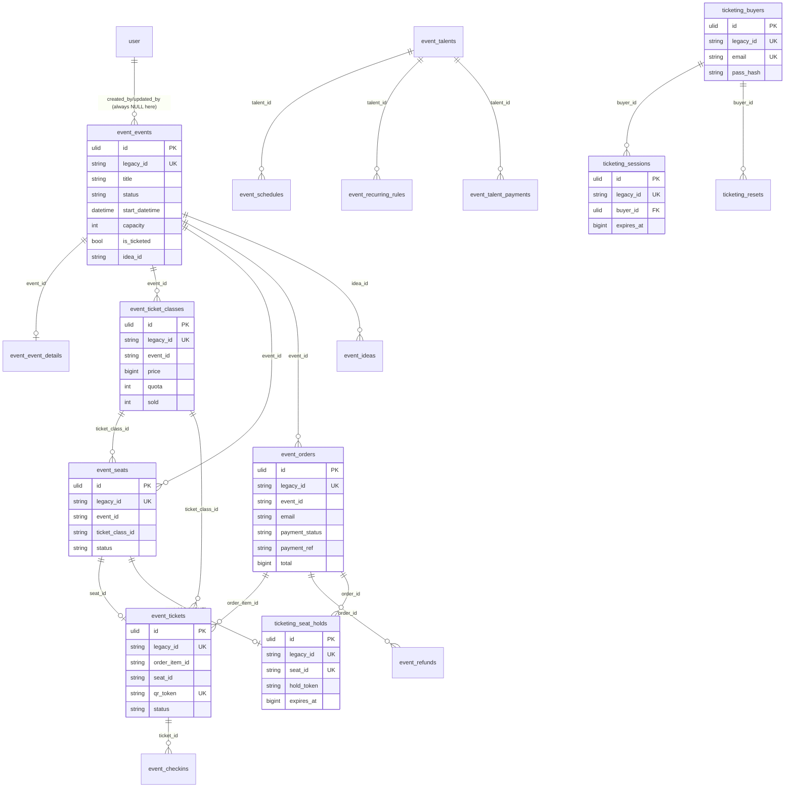

# EMS in `core` — event + ticketing

#61 (PRD #1, ADR-0002/0003/0004). One legacy database, `lakk5493_db_ems`, serves
two Modul: the Event Planner (`event`) and the public ticket shop (`ticketing`).
Both move onto `core` here.

**How the tables are named.** ADR-0003 prefixes a Modul's tables with its key.
The EMS rows belong to `event` — `docs/modules/ticketing.md` already lists
`events`, `ticket_classes`, `seats`, `orders` and `tickets` as "from the EMS
module". So those fifteen tables take the `event_` prefix, and the shop's own
five (`seat_holds`, `tix_users`, `tix_sessions`, `tix_reset`, `tix_gagal`) take
`ticketing_`. Because the shop needs the EMS rows, it reaches them through
`EventState` (a service), never with SQL of its own — the ADR-0002 rule that a
cross-module read has to move behind the owning Modul's service.

- **Same storage model as legacy for `event_*`.** Each row is its indexed
  columns (the query surface, written on every save) plus the full row in
  `data`, because the Event Planner's rows are open-ended (event details,
  talent schedules, order payloads).
- **`ticketing_*` is normalised instead.** Those five tables never had a JSON
  blob, so they are plain relational rows: the legacy primary key moves to
  `legacy_id` (`token` for sessions/resets) and every business column is kept.
- **Ids.** Legacy ids live in `legacy_id` (or stay the natural key, see the
  deviations), so compat and v1 keep speaking them.
- **No new FKs into `user` here.** EMS rows carry free-text actor names inside
  `data`, so `created_by`/`updated_by` stay NULL. The only real FK is
  `ticketing_sessions.buyer_id` / `ticketing_resets.buyer_id` → `ticketing_buyers`
  (the Buyer is not a User, CONTEXT.md).

## ERD



**Columns on every `event_*` row table:** `updated_at`/`created_at` (the legacy
millisecond stamps, the change record and the version compat/v1 expose), `data`
(the full row, verbatim — a client's `baseUpdatedAt` is kept), and
`version`/`created_by`/`updated_by` (ADR-0003; actors stay NULL). Rows whose
legacy primary key is not the app id keep the natural key instead: see the
deviations.

## Legacy → core mapping

| legacy (`lakk5493_db_ems`) | core | notes |
|---|---|---|
| `talents`, `events`, `schedules`, `recurring_rules`, `talent_payments`, `ticket_classes`, `seats`, `orders`, `tickets`, `checkins`, `refunds`, `ideas`, `calendar_extra` | `event_<same name>` | legacy indexed columns verbatim + the full row in `data`; `id` → `legacy_id` |
| `event_details` | `event_event_details` | `event_id` is the natural key (UNIQUE) and also fills `legacy_id` |
| `settings` | `event_pengaturan` | `k`/`v`, `version` + 1 per accepted write |
| `seat_holds` | `ticketing_seat_holds` | plain columns, UNIQUE `seat_id` kept |
| `tix_users` | `ticketing_buyers` | the Buyer (CONTEXT.md): UNIQUE `email`, `pass_hash`, `name`, `phone` |
| `tix_sessions` | `ticketing_sessions` | legacy PK `token` → `legacy_id`; `user_id` kept verbatim **and** `buyer_id` FK |
| `tix_reset` | `ticketing_resets` | same shape as sessions |
| `tix_gagal` | `ticketing_gagal` | `kunci`/`at` rate-limit rows |
| `id` | `legacy_id` | a new ULID `id` is minted per row |

## Behaviour kept exactly

- **`saveAll`** keeps every rule: the `updated_at` guard only (no `baseUpdatedAt` check, no cap bump), a collection that is not sent is untouched, deletion of missing rows is bounded by the newest stamp in the payload (`maxUpd`, unbounded when no row carries one, never on an empty list), `data` stored verbatim (`baseUpdatedAt` included).
- **`checkins`** stay append-only (`INSERT IGNORE`, never updated or deleted) and `getAll` still returns the newest 2000.
- **`eventDetails`** is still the map `event_id → detail`; missing entries are deleted without a bound.
- **Settings** documents (`entertainmentRules`, `role`, `layoutTemplates`) keep their defaults and are written only when sent.
- **Locks**: writes still run under `GET_LOCK('<db>:ems_save')` and `GET_LOCK('<db>:tix')`. On core `<db>` is the core database, so they no longer serialise with the old PHP — after the cutover the old backend no longer writes.
- **Versions on the wire are unchanged**: compat and v1 still version a record by its `updated_at` stamp (v1 documents by their content hash). `version` is an internal counter and on core it counts only the writes the `updated_at` guard accepted (`versionAccepted`), like `bd_` (#59): an older copy a client re-sends is not a write.
- **The shop keeps its own encoding and statements**: every EMS statement the shop used is now a method on `EventState` (`emsSaveOrder`, `emsInsertTicket`, `emsSetSeatStatus`, …) with the same columns, guards and error paths; the same call that collided on `tickets.qr_token` still throws the same `QueryException`.

## Delete behaviour

- **Rows** are hard-deleted exactly where legacy allowed it (`saveAll`'s bounded delete, v1 `DELETE`, `eventDetails`'s unbounded delete of missing entries, the shop's own `release`/sweep deletes). No table gains `deleted_at`.
- **Importing twice** deletes the rows whose legacy source is gone, so a legacy delete or purge is mirrored into core.
- **Deleting a Buyer** sets `ticketing_sessions.buyer_id` and `ticketing_resets.buyer_id` to NULL (`nullOnDelete`); the session/reset row itself is never deleted, and the verbatim `user_id` stays, exactly like legacy.

## Import and switch

```bash
php artisan core:import event       # 15 event_* tables + event_pengaturan; idempotent
php artisan core:import ticketing   # the shop's five ticketing_* tables + the Buyer links; idempotent
DB_EVENT_CONNECTION=core            # serve the Planner from core; unset = legacy (rollback)
DB_TICKETING_CONNECTION=core        # serve the shop from core;   unset = legacy (rollback)
```

Order matters: **event first, then ticketing.** The shop reads and writes the EMS rows through `EventState`, i.e. through the *event* Modul's connection, so with `ticketing` on core and `event` still on legacy the shop would read EMS rows from the legacy database while writing its own tables into core. Both switches together (as in the parity gate) are the supported state; the reverse order is not.

## Deliberate deviations

- **`event_event_details` keeps the natural key.** Its legacy primary key is the event id, so the row is keyed by `event_id` (UNIQUE) and `legacy_id` carries the same value; there is no separate legacy `id` to preserve.
- **`ticketing_*` have no `data` blob.** Those five tables never had one — they are plain relational rows, so their columns are kept verbatim instead of wrapping them in JSON (ADR-0002: JSON stays only for open-ended data).
- **Millisecond columns stay milliseconds.** `expires_at`, `created_at` and `at` keep their bigint meaning because the shop's hold/reset/rate-limit maths is in milliseconds.
- **Indexes added where the shop queries**: `event_orders.payment_ref`/`payment_status`, `event_tickets.order_item_id`/`seat_id`/`status`, `ticketing_seat_holds.order_id`, `ticketing_buyers.created_at`, `ticketing_gagal.kunci+at`. The legacy schema had no index on some of them; nothing else changed.
- **`ticketing_sessions.buyer_id` / `ticketing_resets.buyer_id`** are new: the only real FK in this cutover (Buyer → `ticketing_buyers`). The importer resolves them from `user_id`; a row whose `user_id` is unset or unknown stays NULL.
- **`created_by`/`updated_by` are always NULL** here: EMS actors are free-text names inside `data`.
- **Kept on purpose (legacy quirks, not bugs):** the newest-stamped-row delete quirk (#103) and the reused-`qr_token` upsert quirk (#100) are behaviour, so they were not "fixed" in the compat path.

## Verified

- `node tools/parity/parity.mjs event --core` → **65/65 identical**; plain `event` stays 65/65.
- `node tools/parity/parity.mjs ticketing --core` → **83/83 identical**; plain `ticketing` stays 83/83.
- `php artisan core:import event` / `ticketing` copy every row 1:1 (25 events, 25 details, 670 seats, 117 schedules, 3 settings, 2 Buyers, 3 sessions in the restored dump) and are idempotent (`tests/Feature/Core/EventImportTest.php`, `TicketingImportTest.php`).
- `vendor/bin/pint --test` clean; `php artisan route:list` unaffected.


