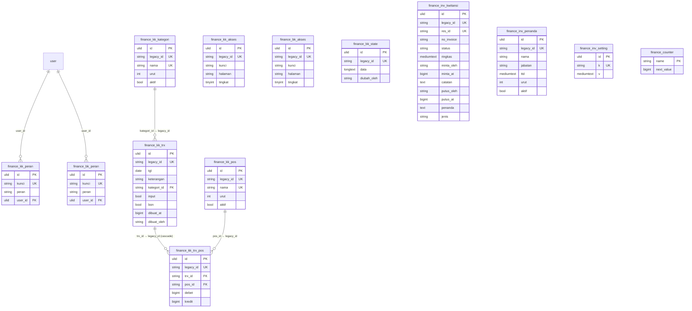

# Finance in `core`

#67 (PRD #1, ADR-0002/0003/0004). Finance moves from `lakk5493_db_finance` to the
`finance_*` tables of `core`: Kas Kecil (petty cash), Brankas (the vault document), the
page/role maps of both panels and the invoice/kwitansi queue that Reservasi and Marketing
also call.

- **The legacy shape is already relational.** Unlike the JSON-blob modules, twelve legacy
  tables keep one row per record, so `core` stores the same columns verbatim: the legacy id
  in `legacy_id`, the legacy indexes, plus the ADR-0003 technical columns. There is no `data`
  JSON to keep — except `finance_bk_state.data`, the vault document, which stays a blob
  because its contents are open-ended lists (`rekening`, `piutang`, `bayar`, `investor`,
  `mutasi`, `setting`) that the frontend owns.
- **Ids stay integers.** The old screens build inline handlers out of these ids
  (`onclick="kkEdit('+t.id+')"` in `deploy/finance/kas/index.html`), so the compat surface
  must keep handing out numbers. A row created after the cutover therefore mints its id from
  `finance_counter`, which the importer seeds with the legacy `AUTO_INCREMENT`: the numbering
  continues exactly where the legacy backend left it.
- **The one Office-User link.** `kk_peran.kunci` / `bk_peran.kunci` hold `#<Office User id>`.
  `kunci` stays verbatim (the wire shape is keyed by it) and a nullable `user_id` FK resolves
  it, like `bd_people.user_id`.

## ERD



**Columns on every row table:** `updated_at` / `created_at` (the legacy millisecond stamps),
`version`, `created_by` / `updated_by` (ULID → `user`, NULL: Finance's actors are the free-text
names inside the rows). `finance_counter` is technical (the next integer id per int-keyed
table) and carries no technical columns.

**Ids inside rows stay strings.** `kategori_id`, `trx_id` and `pos_id` hold the legacy ids
exactly as the client sends them; the FKs reference `legacy_id`, so referential integrity is
the legacy integrity (`fk_trx_kat` SET NULL, `fk_tp_trx` CASCADE, `fk_tp_pos` RESTRICT) while
`read()` keeps returning the numbers the screens know.

## Legacy → core mapping

| legacy (`lakk5493_db_finance`) | core | notes |
|---|---|---|
| `kk_pos`, `kk_kategori` | `finance_kk_pos`, `finance_kk_kategori` | columns verbatim; `nama` keeps its UNIQUE (the `"…" sudah ada dalam daftar.` error) |
| `kk_trx` | `finance_kk_trx` | `dibuat_at` / `dibuat_oleh` verbatim; `kategori_id` holds the legacy id, FK → `finance_kk_kategori.legacy_id` SET NULL |
| `kk_trx_pos` | `finance_kk_trx_pos` | `trx_id` / `pos_id` hold the legacy ids, FK → `*.legacy_id` (CASCADE / RESTRICT) |
| `kk_akses`, `bk_akses` | `finance_kk_akses`, `finance_bk_akses` | `kunci`+`halaman` unique; `tingkat` clamped to 0..2 by the service |
| `kk_peran`, `bk_peran` | `finance_kk_peran`, `finance_bk_peran` | `kunci` unique (natural key, the `bd_pengaturan.k` shape); + `user_id` |
| `bk_state` | `finance_bk_state` | the vault document (one row, legacy id 1); `updated_by` → `diubah_oleh` |
| `inv_kwitansi` | `finance_inv_kwitansi` | varchar `id` → `legacy_id`; `res_id` unique; `ringkas` / `catatan` / `penanda` verbatim |
| `inv_penanda` | `finance_inv_penanda` | varchar `id` → `legacy_id`; `ttd` verbatim (base64 image) |
| `inv_setting` | `finance_inv_setting` | `k` / `v` + the technical columns |
| int `id` / `AUTO_INCREMENT` | `legacy_id` + `finance_counter` | a ULID `id` is minted per row; new ids continue the legacy counter |
| `#<Office User id>` | `user_id` | resolved via `user.legacy_id`, NULL when unknown |
| three k/v maps | kept per panel (`*_akses`, `*_peran`, `inv_setting`) | no merged `finance_pengaturan`: the services read and write them separately |

## Behaviour kept exactly

- **getAll** keeps its whole shape: `pos`, `kategori`, `trx` (with `baris`) and `akses` /
  `peran` as objects, ids as integers, ordered by `urut`/`tgl` and then the id.
- **simpanTrx**: the same validation and messages, one row per transaction, split rows
  rewritten on edit (an emptied source disappears), and `Transaksi sudah tidak ada` when the
  row was removed meanwhile.
- **hapusTrx** deletes the split rows with it; **tandai** / **aktif** / **nonaktif** return
  the legacy affected-row count.
- **simpanPos/Kategori** keep the duplicate-name message; **hapusPos/hapusKategori** are
  refused while used.
- **Akses Halaman**: the whole matrix is replaced (`tingkat` clamped to 0..2, junk skipped);
  one person's role with an empty role deletes the row.
- **Brankas**: `brankasSave` writes the whole state filtered to `KEPT_KEYS`, `bayarSave`
  replaces only `bayar`, and the blob's `updated_at` stays the version the v1 endpoints use.
- **Invoices**: one row per `res_id` (an idempotent request; an issued one is returned
  untouched), a decision moves that row `MENUNGGU → DIBUAT / DITOLAK / BATAL`, the number is
  `PREFIX/YYYY/MM/NNNN` (WIB month, highest + 1, given once per prefix pool under
  `GET_LOCK('<db>:inv_nomor')`), signatories are snapshotted by name and title while their
  images are read live when printing, a signatory on an issued document cannot be deleted,
  and `invSetting` writes only the keys that were sent.
- **Locks.** `GET_LOCK('<db>:inv_nomor')`; on core `<db>` is the core database, so it no
  longer serialises with the old PHP — after the cutover the old backend no longer writes.
- **Cross-module reads.** Kompas reads the vault in-process (`InvestorAnalytics` →
  `Brankas::read()`), never the table; nothing outside this module touches the `finance_*`
  tables. The one fixture that still did (Kompas's `InvestorAnalyticsTest`) now seeds the
  vault through `Brankas::save()`, which is what ADR-0002 asks of a cross-module read.

## Delete behaviour

- **Transactions**: gone, and their split rows with them (the legacy `fk_tp_trx` cascade is a
  real cascade on `finance_kk_trx_pos.trx_id`).
- **Sources/categories**: refused while a transaction uses them — the legacy guard and the
  legacy RESTRICT FK, both kept.
- **Signatories**: refused once they sign an issued document (deactivate instead).
- **Deleting a User** clears `finance_kk_peran.user_id` / `finance_bk_peran.user_id`; the role
  row stays, keyed by its `#<user id>` exactly as legacy (which had no FK at all).

## Import and switch

```bash
php artisan core:import account   # first: the '#<user id>' role keys resolve to core Users
php artisan core:import finance   # idempotent; re-run to follow legacy edits and deletions
DB_FINANCE_CONNECTION=core        # serve Finance from core; unset = legacy (rollback)
```

The import copies the twelve tables verbatim, resolves `user_id` for the role keys, and
seeds `finance_counter` from the legacy `AUTO_INCREMENT` (never moving it backwards).

**Verified (#67):** `parity.mjs finance --core` 92/92 identical and plain `finance` 92/92;
Pest green on both connections (557 passed with the module on legacy and with it on core);
`vendor/bin/pint --test` passed; `route:list` OK; no `parity_i67_*` databases left behind.

## Deviations, and why

1. **`bk_state.updated_by` → `diubah_oleh`.** ADR-0003 reserves `updated_by` for the ULID
   actor column; the legacy value was a free-text name that nothing read back.
2. **New ids continue the legacy counter instead of `MAX(id)+1`.** The old screens build
   inline handlers from these ids (`onclick="kkEdit('+t.id+')"`, `kkTandai(t.id, …)`), so the
   compat surface must keep returning integers, and a row created on core gets the number the
   legacy backend would have handed out next (the parity run compares the ids of created rows,
   and a later re-import cannot collide with them).
3. **The k/v maps keep their natural key.** `kk_peran` / `bk_peran` / `inv_setting` are key →
   value tables, so they use `kunci` / `k` unique instead of a minted `legacy_id` (the
   `bd_pengaturan` / `hr_pengaturan` shape).
4. **Marker flips do not bump `version`.** `tandai`, `aktifPos`/`nonaktifPos` and
   `aktifKategori`/`nonaktifKategori` return MySQL's affected-row count (`{"diubah":0}` when
   nothing changed), which a version bump would turn into 1.
5. **No Office-User FK besides the role keys.** `dibuat_oleh`, `minta_oleh`, `putus_oleh` and
   `diubah_oleh` are free-text names the client sends; Finance has no other user reference.
6. **Ordering on core is `CAST(legacy_id AS UNSIGNED)`.** The legacy ids are numeric but live
   in a varchar, so `'10'` must not sort before `'2'` (`ORDER BY urut,id`, `ORDER BY tgl,id`
   and the split rows' `ORDER BY id`).
7. **The parity cases ignore the id of the rows the run itself creates** (`simpanPos create`,
   `simpanKategori create`, and those two rows' ids in the last `getAll`). A rejected
   duplicate-name insert still burns an InnoDB `AUTO_INCREMENT` value on the legacy side,
   while the core counter is transactional and rolls back with the failed insert: the next
   created source or category is one number lower on core. That value is a generated id, not
   a stored one — every imported row's id is compared 1:1 in `FinanceImportTest`.
