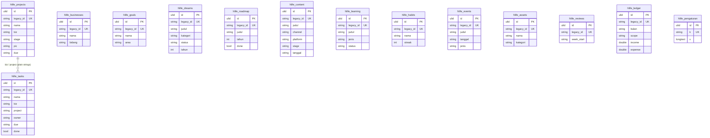

# Howandi Life OS in `core`

#65 (PRD #1, ADR-0002/0003/0004). Howandi Life OS moves from `lakk5493_db_hlife` to the
`hlife_*` tables of `core`.

- **Same storage model as legacy.** Each row is its indexed columns (the query surface,
  derived from the row on every write) plus the full record in `data`. The `data` JSON stays
  because hlife records are open-ended (checklist items, logs, KPI answers, note text).
- **Ids.** Legacy ids (7-char `[0-9a-z]` strings minted by the frontend) live in `legacy_id`,
  so the compat routes and v1 keep speaking them.
- **No Office User links.** hlife is a private Life OS: no legacy table references an Office
  User, so there is no `user_id` FK anywhere (only the ADR-0003 actor columns, which stay
  NULL), and the import needs no account import first.

## ERD



Technical columns on every table (`updated_at` / `created_at` ms, `created_by` /
`updated_by` ULID FKs → `user`, `version`): ADR-0003. **Legacy hlife rows carry no
timestamps and no conflict guard** (last save wins, `hl_simpan_semua`), so the ms stamps are
tech columns only — the server sets `created_at` once and `updated_at` on every write;
nothing on the wire exposes them. Legacy ids stay plain strings: `biz`, `project` and
`owner` reference records the app saves independently, and an FK would refuse writes
legacy accepted (ADR-0002/bd.md precedent).

## Legacy → core mapping

| legacy (`lakk5493_db_hlife`) | core | notes |
|---|---|---|
| `businesses`, `projects`, `tasks`, `goals`, `dreams`, `roadmap`, `content`, `learning`, `habits`, `events`, `assets`, `reviews`, `ledger` | `hlife_businesses` … `hlife_ledger` | columns verbatim, incl. the legacy indexes (`idx_prj_biz`, `idx_tsk_biz`, `idx_tsk_done`, `idx_cnt_stage`, `idx_evt_tgl`, `idx_rev_week`, `idx_led_bulan`) |
| `settings` (`firstRun`, `mood`, `energy`, `focus`, `weeklyTarget`, `auth`, `channels`, `dump`) | `hlife_pengaturan` | `k`/`v`, `version` + 1 per write |
| `id` | `legacy_id` | a new ULID `id` is minted per row |

Column names stay the legacy Indonesian ones (`nama`, `judul`, `tahun`, `bulan`, …) — they
are the glossary terms the frontend speaks. String columns keep the legacy
`NOT NULL DEFAULT ''` shape: `hl_nilai` fills them with `''`, never NULL. `tahun`
(dreams/roadmap) stays the one nullable column ("empty" vs "not filled in", `hl_kolom_null`).

## Behaviour kept exactly

- **saveAll** replaces the whole state: every collection missing from the payload is
  treated as `[]` (empties its table), only `tasks` must be an array (`payload_rusak`),
  records without an id are skipped, and the whole save is one transaction — a bad row
  (e.g. a missing `expense`, rejected by strict mode) rolls everything back with
  `kesalahan server` 500.
- **Settings** are only written for the eight known keys; unknown top-level payload keys
  (`notASetting`) are ignored. Missing rows read as the `emptyState()` defaults.
- **v1** record/setting versions stay the SHA-1 content hash of the stored JSON
  (`docs/api/hlife.md`), identical on both storages; writes still check it under
  `SELECT … FOR UPDATE`.
- **Ledger** reads keep the `ORDER BY bulan`; every other collection keeps the natural
  order the legacy `SELECT` returned.

## Delete behaviour

- **Rows:** a deleted hlife row is gone, exactly as in legacy (saveAll's
  delete-not-in-payload, v1 `DELETE`).
- **Deleting a User:** touches nothing — no hlife table references `user`.

## Import and switch

```bash
php artisan core:import hlife    # idempotent; re-run to follow legacy edits and deletions
DB_HLIFE_CONNECTION=core         # serve Howandi Life OS from core; unset = legacy (rollback)
```

**Verified:**

- `node tools/parity/parity.mjs hlife --core`: 22/22 identical (plain `hlife`: 22/22).
- Pest is green on both connections.
- `tests/Feature/Core/HlifeImportTest.php`: 1:1 copy, idempotent, follows legacy edits
  and deletions.
- `tests/Feature/Core/HlifeOnCoreTest.php`: getAll, saveAll + version, strict rejection,
  v1 records and settings.

## Deviations

- **`core` is strict, production's legacy server was not.** Legacy hlife left sql_mode to
  the server, and the config note records that non-strict production stored e.g.
  `dreams.year: ''` as `tahun=0` with a warning. On `core` (strict, like the local parity
  environment) such a write is rejected and the whole save answers
  `kesalahan server` 500 — exactly what the local legacy server already did (parity case
  "saveAll ledger without expense fails like legacy (strict mode)", and
  `HlifeLegacyTest` pins the legacy connection's passthrough). No payload the parity suite
  or the frontend sends changes result: values are either valid or already rejected locally.
- **Timestamps.** Legacy hlife had no stamps; the ms `created_at`/`updated_at` tech columns
  import as 0 and are server-set on subsequent writes. Nothing reads them.
