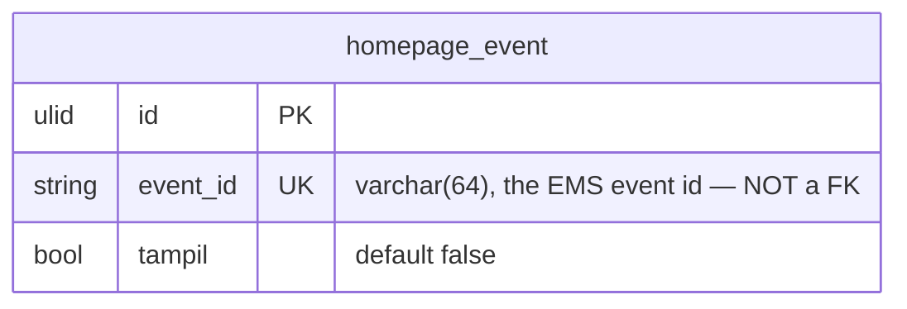

# Homepage in `core`

The website's dynamic sections that need a switch of their own. Today that is
only the **event switch**: which Event (EMS) event appears on the public
website. **Greenfield** like `menu`/`news`: no legacy backend, no legacy
database, no importer, no parity.

The event data is **not** stored here — it stays in EMS (`event_*`, owned by the
Event module). This module stores one small row per event that has been touched:
the switch.

Consequences, stated once:

- **No `legacy_id`.** There is no legacy id to keep; `id` is the only key.
- **No `Importer`, no `core:import`, no parity cases.**
- **No `deploy/homepage` panel.** The old laksamana-office has no such screen and
  is not touched.

Migration: `database/migrations/2026_09_30_090000_create_homepage_tables.php`
(`Schema::connection('core')`). `down()` drops the table.

## ERD



The table also carries the ADR-0003 technical columns `created_by`, `updated_by`
(FK → `user`, `ON DELETE SET NULL`), `version` (unsigned int, default `1`) and
the Laravel timestamps `created_at` / `updated_at`; they are documented once in
[Technical columns](#technical-columns). No `deleted_at`: the row is never
deleted.

## Columns

### `homepage_event`

| Column | Type | Null | Default | Notes |
|---|---|---|---|---|
| `id` | ULID | no | — | primary key |
| `event_id` | varchar(64) | no | — | unique; the EMS event id (`events.id` on legacy, `event_events.legacy_id` on core). **Not** a FK — EMS is a separate database |
| `tampil` | bool | no | `false` | the switch: may this event appear on the website? |
| `created_by` / `updated_by` / `version` / `created_at` / `updated_at` | — | — | — | see technical columns |

Index: `event_id` unique.

There is **no `legacy_id`** column and **no `deleted_at`**.

## "No row = off"

A row is created the first time the switch is touched (`upsert by event_id`).
The public feed reads only rows where `tampil = true`; a missing row therefore
means off. Switching off sets `tampil = false` (the row stays, so its `version`
keeps counting and staff can see it was deliberately turned off).

The switch never deletes anything and never touches EMS: an event that is
switched on and later is no longer eligible (status left Upcoming/Today, or the
event passed) simply drops out of the public feed through `eligible()` — see
[docs/api/homepage.md](../api/homepage.md#the-rule-boleh-tampil).

## Technical columns

Follows ADR-0003:

| Column | Meaning |
|---|---|
| `created_at`, `updated_at` | Laravel timestamps |
| `created_by`, `updated_by` | ULID references to the `user` who caused the write, FKs to `user(id)` `ON DELETE SET NULL`. Every office toggle stamps `updated_by` from the Sanctum user. |
| `version` | Integer optimistic-concurrency value; new rows start at `1` and `CoreRecord` bumps it on every save. Returned to the Office screen as `version`. |
| `deleted_at` | **Not present** — the row is never deleted. |

There is **no `legacy_id`**.

## Concurrency

The single ADR-0003 `version` column. The toggle is deliberately **exempt from
`If-Match`**: a boolean has nothing to merge, so the last writer wins (the same
choice as the `tampil` toggle in `news`/`menu`). `version` still bumps on every
write and is returned in the office row.

## Consumers

- **laksamana-homepage** — the `Malam` section reads
  `GET /api/v1/homepage/events` (public).
- **laksamana-office-vue** — the Homepage module's `Event` screen toggles
  `PATCH /api/v1/homepage/office/events/{id}/tampil`.
- **laksamana-office** (legacy) is **not** touched; the EMS data it owns is read
  through the Event module only.

## Tests

`tests/Feature/Homepage/`: `HomepagePublicTest.php` + `HomepageOfficeTest.php`
(shared `helpers.php`). Fixtures are EMS rows inserted relative to "now"
(`+2 days`, `-2 days`), never pinned dates.

```bash
php artisan test tests/Feature/Homepage
```
