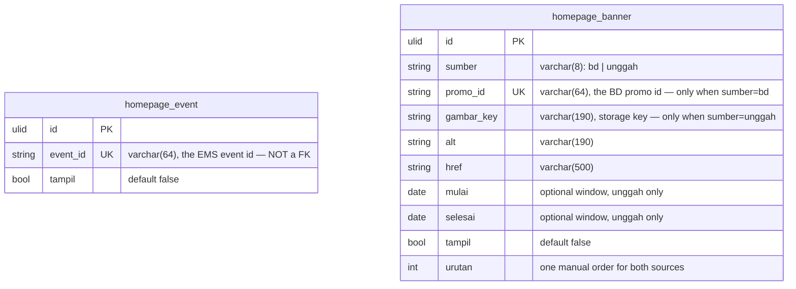

# Homepage in `core`

The website's dynamic sections that need a switch of their own:

- the **event switch** — which Event (EMS) event appears on the public website;
- the **promo slider** — the manual order over BD OS promos with a poster and
  banners uploaded in the Homepage panel.

**Greenfield** like `menu`/`news`: no legacy backend, no legacy database, no
importer, no parity.

Neither data source is **stored here** — the event data stays in EMS (`event_*`,
owned by the Event module) and the promo data stays in BD
(`BdState::setting('promos')`, owned by the BD module). This module stores the
switches, the manual order and the uploaded files.

Consequences, stated once:

- **No `legacy_id`.** There is no legacy id to keep; `id` is the only key.
- **No `Importer`, no `core:import`, no parity cases.**
- **No `deploy/homepage` panel.** The old laksamana-office has no such screen and
  is not touched.

Migrations: `database/migrations/2026_09_30_090000_create_homepage_tables.php`
(`homepage_event`) and `2026_09_30_100000_create_homepage_banner_table.php`
(`homepage_banner`) — both `Schema::connection('core')`, `down()` drops the
tables.

## ERD



Both tables also carry the ADR-0003 technical columns `created_by`, `updated_by`
(FK → `user`, `ON DELETE SET NULL`), `version` (unsigned int, default `1`) and
the Laravel timestamps `created_at` / `updated_at`; they are documented once in
[Technical columns](#technical-columns). No `deleted_at`: `homepage_event` rows
are never deleted, and a `homepage_banner` upload is hard-deleted with its file.

## Columns

### `homepage_event`

| Column | Type | Null | Default | Notes |
|---|---|---|---|---|
| `id` | ULID | no | — | primary key |
| `event_id` | varchar(64) | no | — | unique; the EMS event id (`events.id` on legacy, `event_events.legacy_id` on core). **Not** a FK — EMS is a separate database |
| `tampil` | bool | no | `false` | the switch: may this event appear on the website? |
| `created_by` / `updated_by` / `version` / `created_at` / `updated_at` | — | — | — | see technical columns |

Index: `event_id` unique.

### `homepage_banner`

| Column | Type | Null | Default | Notes |
|---|---|---|---|---|
| `id` | ULID | no | — | primary key |
| `sumber` | varchar(8) | no | — | `bd` (a BD promo switch) or `unggah` (an uploaded banner) |
| `promo_id` | varchar(64) | yes | `NULL` | unique; the BD promo id. Required for `sumber = bd`, `NULL` for `unggah`. MySQL allows many `NULL`s, so the unique key only constrains BD rows |
| `gambar_key` | varchar(190) | yes | `NULL` | server-made storage key `hb_<hex>.<ext>` under `storage/app/homepage/`. Required for `unggah` |
| `alt` | varchar(190) | yes | `NULL` | override of the BD `nama`; the title of an upload |
| `href` | varchar(500) | yes | `NULL` | optional link: `https://…` or a `/…` path |
| `mulai` / `selesai` | date | yes | `NULL` | optional WIB window, `unggah` only (`mulai ≤ selesai`). `NULL` = no bound |
| `tampil` | bool | no | `false` | the switch: may this row appear? **Default off.** |
| `urutan` | int | no | `0` | the single manual order over both sources; new rows get max+10 |
| `created_by` / `updated_by` / `version` / `created_at` / `updated_at` | — | — | — | see technical columns |

Indexes: `promo_id` unique, `(tampil, urutan)`.

There is **no `legacy_id`** column and **no `deleted_at`**.

## "No row = off"

For an event, a row is created the first time the switch is touched (upsert by
`event_id`). For a BD promo, a banner row likewise appears the first time its
switch is touched (`PATCH /homepage/office/promos/bd/{promoId}/tampil`); a promo
with no row is a *candidate* in the office list and never shows on the website.
Uploads are created explicitly in the panel.

Switching off sets `tampil = false` (the row stays, so its `version` keeps
counting and staff can see it was deliberately turned off). An event or promo
that is switched on and later stops being eligible simply drops out of the
public feed through `HomepageEvents::eligible()` /
`HomepagePromos::eligibility()` — see
[docs/api/homepage.md](../api/homepage.md#the-promo-rule-boleh-tampil).

## Technical columns

Follows ADR-0003:

| Column | Meaning |
|---|---|
| `created_at`, `updated_at` | Laravel timestamps |
| `created_by`, `updated_by` | ULID references to the `user` who caused the write, FKs to `user(id)` `ON DELETE SET NULL`. Every office write stamps `updated_by` from the Sanctum user |
| `version` | Integer optimistic-concurrency value; new rows start at `1` and `CoreRecord` bumps it on every save. Returned to the Office screen as `version` |
| `deleted_at` | **Not present** — nothing is soft-deleted |

There is **no `legacy_id`**.

## Concurrency

The single ADR-0003 `version` column.

- The event toggle and every promo `tampil` toggle are **exempt from `If-Match`**:
  a boolean has nothing to merge, so the last writer wins (the same choice as the
  `tampil` toggle in `news`/`menu`). `version` still bumps on every write.
- Upload/BD-row `PATCH` and `DELETE` **require `If-Match`** (or `?version=`):
  missing → `428 version_required`, stale → `409 version_conflict`. The bulk
  `PUT /urutan` is exempt (an order is a preference, last writer wins).

## Consumers

- **laksamana-homepage** — the `Malam` section reads
  `GET /api/v1/homepage/events` and the promo slider reads
  `GET /api/v1/homepage/promos` (both public).
- **laksamana-office-vue** — the Homepage module's `Event` screen toggles
  `PATCH /api/v1/homepage/office/events/{id}/tampil`; the `Promo` screen manages
  `/api/v1/homepage/office/promos`.
- **BD OS** (legacy panel and Radar/Kompas) owns the `promos` document; this
  module reads it through `BdState` and **never writes it**.
- **laksamana-office** (legacy) is **not** touched.

## Tests

`tests/Feature/Homepage/`: `HomepagePublicTest.php`, `HomepageOfficeTest.php`,
`PromoPublicTest.php`, `PromoOfficeTest.php` (shared `helpers.php`). Fixtures
are EMS rows, BD promo documents and banner rows built relative to today
(`+2 days`, `-2 days`), never pinned dates.

```bash
php artisan test tests/Feature/Homepage
```
