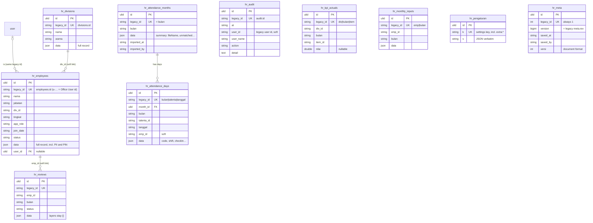

# HR in `core`

Staff Performance (HR / People OS): the 18 record collections, the
append-only audit trail, the KPI actual and monthly input maps, the
attendance months with their day rows, the settings documents and the
whole-document revision. Cut over after identity (#44), because employees
link to `user`.

Migration: `database/migrations/2026_09_26_190000_create_hr_tables.php`.
Importer: `App\Core\Imports\HrImporter` (`php artisan core:import hr`).
Served from core when `DB_HR_CONNECTION=core`: `HrState` / `HrRecords` run
the same statements on the `hr_*` tables (`HrState::t()`, rows keyed by
`legacy_id`) and rebuild the legacy wire shapes; unset = legacy (rollback).
No other module reads these tables; HR itself reads akademi only through
`AkademiStats`.

## ERD

Every table except `hr_meta` also carries the ADR-0003 technical columns
`created_by`, `updated_by` (FK → `user`, `ON DELETE SET NULL`, always `NULL`
for hr: the legacy actor is the free-text `saved_by` of the whole document)
and `version`; they are left out of the diagram. No Laravel timestamps (hr
rows never had any) and no `deleted_at` (deletes are hard, as in legacy).

The 18 record tables share one shape; the diagram shows three of them and
lists the rest's indexed columns below.



Other record tables (`legacy_id` + these columns + `data`): `hr_kpi_templates`
(div_id), `hr_okrs` (owner_type, owner_id, periode), `hr_competencies`
(emp_id), `hr_trainings` (judul, div_id, jenis, mandatory), `hr_training_records`
(training_id, emp_id, status, skor?, tanggal), `hr_coachings` (emp_id,
coach_id, tanggal, status), `hr_rewards` (emp_id, tanggal, jenis, points),
`hr_badges` (emp_id, bulan, badge), `hr_violations` (emp_id, tanggal, jenis,
severity, sp, status), `hr_feedbacks` (emp_id, tanggal, kind),
`hr_career_paths` (track), `hr_successions` (posisi, emp_id, readiness),
`hr_moods` (emp_id, tanggal, mood?), `hr_suggestions` (emp_id? — NULL for an
anonymous suggestion, tanggal, status), `hr_calendar` (tanggal, kind, judul).
`?` = nullable.

## Legacy → core mapping

| Legacy (`lakk5493_db_hr`) | core | Notes |
|---|---|---|
| 18 record tables `(id, indexed cols, data)` | `hr_<same name>` `(legacy_id, same cols, data)` | columns derived from `data` on every write, as in legacy |
| `employees.id` | `hr_employees.legacy_id` + `user_id` | `user_id` = the `user` with the same `legacy_id` (50 of 52 live employees); NULL otherwise |
| `audit` | `hr_audit` | append-only: an existing id is never rewritten |
| `kpi_actuals (div_id, bulan, item_id)` PK | `hr_kpi_actuals`, `legacy_id "div\|bulan\|item"` | composite key as one string, plus the unique triple |
| `monthly_inputs (emp_id, bulan)` PK | `hr_monthly_inputs`, `legacy_id "emp\|bulan"` | |
| `attendance_months` / `attendance_days` (repo schema) | `hr_attendance_months` / `hr_attendance_days` | copied row for row when the legacy DB has them; orphan days (invisible to `getAll`) are skipped |
| `settings['extra:attendance']` (production, #101) | `hr_attendance_months` / `hr_attendance_days` | exploded exactly as `writeAttendance` stores a month; the setting is not copied |
| `settings (k, v)` | `hr_pengaturan (k, v)` | key and JSON verbatim |
| `meta (rev, saved_at, saved_by, versi)` | `hr_meta (version, saved_at, saved_by, versi)` | `version` IS the rev |

Soft links (`div_id`, `emp_id`, `coach_id`, `owner_id`, `training_id`) stay
strings with no FK, as in legacy: saveAll replaces collections one by one,
and the frontend may send a record that points at one not saved yet.

## Attendance (#101)

Production has no attendance tables and keeps the whole map in the
`extra:attendance` setting (~1 380 day rows for 2026-06). On core the
attendance tables always exist: the import explodes that setting into them,
and from then on `HrState` behaves as the repo backend does with its tables.
Visible differences after the import, all harmless to the frontend: within
a month `importedAt`/`importedBy`/`days` come after the summary keys, days
sort by `talentaId, date`, and `stats` counts the month and days
(`attendance_months`, `attendance_days`) with one setting fewer.
If the legacy database does have the tables (the parity clones do), they
are copied as they are and every setting, including a stray
`extra:attendance`, is copied verbatim — so `parity.mjs hr --core` sees the
exact legacy answer.

## Delete behaviour

Hard deletes, as in legacy: `saveAll` replaces every collection (DELETE of
ids missing from the payload, everything when the list is empty), and the
KPI actual, monthly input and settings maps are emptied and rewritten.
`hr_audit` is append-only. Deleting an attendance month cascades to its
days (`month_id` FK).

## Concurrency

One whole-document revision, as in legacy: every save and every v1 write
locks `hr_meta` (`SELECT … FOR UPDATE`), checks the client's rev against
`hr_meta.version` and bumps it. Row `version` bumps only when the stored
content changes (`data`, `nilai`, `v`), so a whole-document save of
unchanged rows leaves their versions alone. Compat never exposes row
versions; v1 versions by the document rev (`meta.version`, ETag).

## Import and switch

```bash
php artisan core:import account   # first: employees link to user
php artisan core:import hr        # reads legacy_hr, writes core
```

Idempotent: rows are matched on `legacy_id` (or `k`), unchanged rows are
left alone (`data`/`v` compare decoded), changed rows get `version + 1`,
rows whose legacy source is gone are deleted, and `hr_meta.version` is set
to the legacy rev. The employee → user link is refreshed on every import.

```dotenv
DB_HR_CONNECTION=core   # after the import; unset = legacy (rollback)
```

- **Ids.** Compat and v1 keep the legacy ids; the ULID never reaches the wire.
- **Stats keys** stay the legacy table names on both connections.
- **Deviations.** Only the attendance storage above. `parity.mjs hr --core`
  is 21/21 identical.
