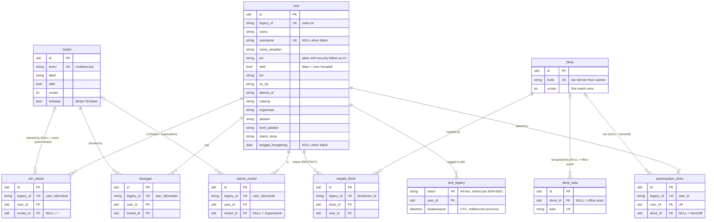

# Identity in `core`

User, Modul, Akses (Izin Akses, Larangan, Admin Modul), Divisi (its words,
Kepala Divisi, Penempatan Divisi) and the legacy Sesi tokens. First in the
cutover order (PRD #1): every other FK points at `user`.

Migration: `database/migrations/2026_09_26_090000_create_identity_tables.php`.
Importer: `App\Core\Imports\AccountImporter` (`php artisan core:import account`).
Served from core when `DB_ACCOUNT_CONNECTION=core` (#44): `App\Auth\CoreAccountRepository`
replaces `AccountRepository` behind the same contract, and the switch back to
the legacy connection is the rollback path (ADR-0004).

## ERD

Every table except `sesi_legacy` also carries the ADR-0003 technical columns
`created_by`, `updated_by` (FK → `user`, `ON DELETE SET NULL`), `version`,
`created_at` and `updated_at`; they are left out of the diagram. No table has
`deleted_at`: the legacy rules hard-delete all of these rows.



## Legacy → core mapping

| Legacy | core | Notes |
|---|---|---|
| `account.users.id` | `user.legacy_id` | ULID `id` is new |
| `users.name`, `pin`, `active`, `no_hp`, `talenta_id` | `nama`, `pin`, `aktif`, `no_hp`, `talenta_id` | |
| `users.username` | `username` | `''` → `NULL`, so the unique index allows many Users without one |
| `users.display_name` | `nama_tampilan` | |
| `users.keterangan` | `tim` | Tim, free text: Akses Bawaan, Divisi |
| `users.branch`, `organization`, `job_position`, `job_level`, `employment_status` | `cabang`, `organisasi`, `jabatan`, `level_jabatan`, `status_kerja` | HR data |
| `users.join_date` (varchar) | `tanggal_bergabung` (DATE) | `''` → `NULL`; anything that is not `Y-m-d` stops the import |
| `users.created_at`, `updated_at` | `created_at`, `updated_at` | |
| `account.modules.key`, `label`, `active`, `urut` | `modul.kunci`, `label`, `aktif`, `urutan` | `kunci` is the legacy id |
| — | `modul.terbatas` | from `OfficeAccess::aturanTerbatas()` (today only `dw`) |
| `account.grants` with `access = 1` | `izin_akses` | `module = '*'` → `modul_id NULL` |
| `account.grants` with `access = 0` | `larangan` | a Larangan on `*` stops the import |
| `grants.granted_by` | `created_by`, `updated_by` | when it names a User; `import`, `seed` and `''` → `NULL` |
| `grants.ts` | `created_at`, `updated_at` | |
| `account.admins` | `admin_modul` | `module = '*'` (Superadmin) → `modul_id NULL` |
| `Divisi::SYNONYMS` (code) | `divisi` + `divisi_kata` | `divisi.urutan` keeps the legacy first-match order; also every Divisi code met in `heads`/`divOverride` |
| `Divisi::OFFICE_WORDS` (code) | `divisi_kata` with `divisi_id NULL` | office words win over every Divisi word |
| `jadwal.jadwal_setting.data.heads` `{divisi: [userId…]}` | `kepala_divisi` | a head id with no User is dropped |
| `jadwal_setting.data.divOverride` `{userId: divisi}` | `penempatan_divisi` | `nonshift` → `divisi_id NULL`; an id with no User is dropped |
| `account.sessions.token`, `user_id`, `expiry` (epoch ms), `dibuat` | `sesi_legacy.token`, `user_id`, `kedaluwarsa`, `created_at` | |
| `core.personal_access_tokens.tokenable_id` = `users.id` | same column = `user.id` (ULID) | re-keyed; the morph type (`office_user`) is kept |

A grant or admin row naming a missing User or Modul stops the import: that is
data to fix before cutover, not to guess.

Adding a Divisi word (such as `foh` → `floor`, #3) is one `divisi_kata` row.
`Divisi::resolve()` takes the word lists as arguments, so #44 feeds it from
this table. The Tim word lists for Akses Bawaan (`TIM_BAWAAN_JADWAL`,
`TIM_BOLEH_DW`, `TIM_ADMIN_ROSTER`) stay in code (PRD open item).

## Delete behaviour

All hard deletes, as in legacy. Deleting a `user` cascades to its
`izin_akses`, `larangan`, `admin_modul`, `penempatan_divisi` and
`sesi_legacy`, and is **refused** while the User is in `kepala_divisi`
(`ON DELETE RESTRICT`, #2). A `divisi` still used by a Kepala Divisi or a
Penempatan Divisi cannot be deleted; its words go with it.

## Concurrency

Account has no legacy concurrency field; `version` starts at `1` and the
importer bumps it on every row it changes.

## Import and switch

```bash
php artisan core:import account      # reads legacy_account + legacy_jadwal, writes core
```

Idempotent: rows are matched on `legacy_id` (or `kunci`, `kode`, `kata`,
`token`), unchanged rows are left alone, changed rows get `version + 1`, and
rows whose legacy source is gone are deleted.

## Serving from core (#44)

```dotenv
DB_ACCOUNT_CONNECTION=core   # after `core:import account`; unset = legacy (rollback)
```

- **Ids.** Compat routes and every other Modul keep the legacy user ids
  (`whoami`, rosters, `userId`), because unmigrated modules store them.
  `AccountUser::getKey()` stays the legacy id; Sanctum tokens point at the
  ULID. v1 adds the ULID as `ulid` on `auth/login`, `me` and
  `account/users`; path parameters stay legacy ids.
- **Divisi.** The jadwal setting no longer holds `heads` or `divOverride`.
  Saving it writes `kepala_divisi` (with `urutan` as the list order) and
  `penempatan_divisi`, and reading it rebuilds both maps. Divisi words come
  from `divisi_kata`.
- **Deviations the FKs force.** Legacy stored these rows silently; on core
  they are dropped instead:
  - a grant or admin row for an unknown User or Modul key;
  - a Larangan on `*`;
  - a head or placement id with no User;
  - a Divisi key with an empty head list.

  A join date that is not a real date becomes empty. The Office screens
  only send registered keys and ids, so none of this is reachable from
  them.
- **Deleting a Kepala Divisi** is refused with `is_kepala_divisi` (and the
  Divisi codes) on both surfaces, and v1 answers 409 (#2).
