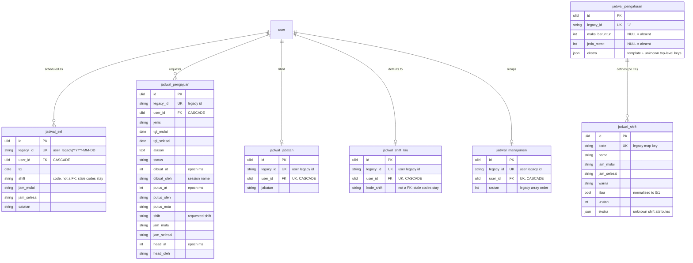

# Jadwal in `core`

Shift cells, requests and the normalised setting. Second in the cutover
order (PRD #1), after identity: every user-linked row points at `user`.
Heads and Penempatan Divisi already live in identity (#43/#44) and are not
imported here.

Migration: `database/migrations/2026_09_26_130000_create_jadwal_tables.php`.
Importer: `App\Core\Imports\JadwalImporter` (`php artisan core:import jadwal`,
after `core:import account`).
Served from core when `DB_JADWAL_CONNECTION=core`: `JadwalService` reads and
writes these tables and rebuilds the legacy wire shapes (legacy user ids,
the setting blob with `heads`/`divOverride` from identity); unset = legacy
(rollback).

## ERD

Every table also carries the ADR-0003 technical columns `created_by`,
`updated_by` (FK → `user`, `ON DELETE SET NULL`), `version`, `created_at`
and `updated_at`; they are left out of the diagram. No table has
`deleted_at`: the legacy rules hard-delete all of these rows
(`kosongkanSemua` wipes cells and requests; settings are kept).



## Legacy → core mapping

| Legacy | core | Notes |
|---|---|---|
| `jadwal_sel.(user_id,tgl)` PK | `jadwal_sel.legacy_id` (`uid\|tgl`), `UNIQUE(user_id,tgl)` | `user_id` becomes the User ULID; the wire keeps the legacy id |
| `sel.shift/jam_mulai/jam_selesai/catatan` | same columns | verbatim |
| `sel.updated_at/updated_by` (ms/name) | — | not carried: never served on any wire shape; technical columns record writes from cutover on |
| `jadwal_pengajuan.id` | `jadwal_pengajuan.legacy_id` | ULID `id` is new; the wire keeps the legacy id |
| `pengajuan.user_id` | `user_id` (ULID FK) | the wire keeps the legacy id |
| `jenis/tgl_mulai/tgl_selesai/alasan/status/dibuat_at/dibuat_oleh/putus_at/putus_oleh/putus_nota/shift/jam_mulai/jam_selesai/head_at/head_oleh` | same columns | verbatim, including epoch-ms stamps and session names |
| `jadwal_setting.data.shifts` `{kode: {n,m,s,w,libur,urut}}` | `jadwal_shift` | `kode` is the key; absent attributes stay NULL and stay absent on the wire (partial definitions round-trip verbatim); `libur` normalised to 0/1 when present (`true` → 1); unknown shift attributes → `ekstra` |
| `setting.data.jabatan` `{uid: text}` | `jadwal_jabatan` | blank values dropped; unknown Users dropped |
| `setting.data.shiftKru` `{uid: code}` | `jadwal_shift_kru` | `kode_shift` stays a string so a deleted shift code survives, as in legacy |
| `setting.data.manajemen` `[uid…]` | `jadwal_manajemen` | `urutan` keeps the array order; unknown Users dropped |
| `setting.data.maksBeruntun/jedaMin` | `jadwal_pengaturan.maks_beruntun/jeda_menit` | NULL when the blob lacks the key; absent keys stay absent on the wire |
| `setting.data.template` + unknown top-level keys | `jadwal_pengaturan.ekstra` | verbatim; an empty `template` list becomes `{}` (PETA rule) |
| `setting.data.heads/divOverride` | — | already in identity (`kepala_divisi`, `penempatan_divisi`); the wire rebuilds them from there |

A cell or request for a User that no longer exists is dropped, not
invented (FK, like identity #43). Deleting a `user` cascades to its cells,
requests, jabatan, shiftKru and manajemen rows — the crew member disappears
from the schedule, as in legacy.

## Delete behaviour

All hard deletes, as in legacy. `kosongkanSemua` deletes every cell and
every request; settings (shifts, maps, pengaturan) are kept. Deleting a
shift leaves crew cells and `shiftKru` codes pointing at it untouched.

## Concurrency

Jadwal has no legacy concurrency field (granular last-write-wins);
`version` starts at `1` and the importer/service bump it on every row they
change. Compat never exposes it; v1 keeps its current contract (no version
field — settled per module, PRD open item).

## Import and switch

```bash
php artisan core:import account   # first: user ULIDs the jadwal rows point at
php artisan core:import jadwal    # reads legacy_jadwal, writes core
```

Idempotent: rows are matched on `legacy_id` (or `kode`), unchanged rows are
left alone, changed rows get `version + 1`, and rows whose legacy source is
gone are deleted.

```dotenv
DB_JADWAL_CONNECTION=core   # after both imports; unset = legacy (rollback)
```

- **Ids.** Compat routes, v1 and every other Modul keep the legacy user ids
  (`u`, `userId`, rosters), because unmigrated modules store them. Joins
  translate ULID ↔ legacy id inside the service; the ULID never reaches the
  wire.
- **Setting.** Reading assembles the blob from `jadwal_shift`,
  `jadwal_jabatan`, `jadwal_shift_kru`, `jadwal_manajemen` and
  `jadwal_pengaturan` (+ `heads`/`divOverride` from identity). Saving splits
  it back. Empty `shifts`/`jabatan`/`shiftKru` rebuild as `{}` (never `[]`);
  an empty `manajemen` rebuilds as `[]`.
- **Deviations the FKs force.** Legacy stored these silently; on core they
  are dropped instead: cells/requests/maps for unknown Users, blank
  `jabatan`/`shiftKru` values, duplicate `manajemen` ids. A `libur: true`
  becomes `1`, and a setting part absent from the input rebuilds as its
  empty shape (`{}` maps, `[]` manajemen) instead of staying absent — the
  real frontend always sends the full merged blob (frontend `KUNCI_SETTING`),
  so absent and empty are never distinguished on screen (`manajemen||[]`).
  The Office screens only send registered ids and `0/1`, so none of this is
  reachable from them (the two parity cases that sent `true` / omitted
  `manajemen` now send `1` / `[]`).
