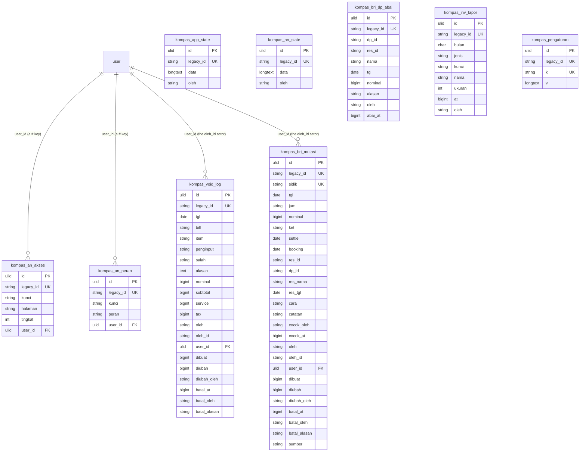

# Kompas in `core`

#69 (PRD #1, ADR-0002/0003/0004). Kompas moves from `lakk5493_db_kompas` to the `kompas_*`
tables of `core`: the omset blob, Catatan Void, QRIS BRI matching, the Investor Compass
reports and Analytics.

- **The blob stays a blob.** `app_state` is the whole app document (daily rows, Daily
  Reports, deposits, employees and targets, compliments, piutang…), edited whole by Cashier
  and Finance → Omset and in parts by v1. Its shape is open-ended, so `data` LONGTEXT is
  the storage, exactly as legacy; the indexed columns ADR-0003 wants are the ones the
  module actually queries (`updated_at`, the author).
- **Ids.** Legacy ids live in `legacy_id`, so compat and v1 keep speaking them.
- **The new relation.** Two links to the Roster: the Analytics access matrix is per User (a
  `#<legacy user id>` `kunci`), and a void / BRI row records the User its `oleh_id` names.
  Both become real FKs (`user_id` → `user`).

## ERD



**Columns on every table:**

- `created_at` / `updated_at`: the legacy **millisecond** stamps, not Laravel timestamps
  (the bd/hlife convention). On the two documents `updated_at` is also the version the wire
  exposes; the settings document keeps its own inside `v.updated_at`.
- `version`, `created_by`, `updated_by`: ADR-0003. The actors stay **NULL** — see the
  deviations.

**Keys kept from legacy, verbatim:** `kompas_bri_mutasi.sidik` is UNIQUE (it is the
`ON DUPLICATE KEY` target of an upload), `kompas_bri_mutasi.dp_id` and every `tgl` are
indexed, `kompas_an_akses` keeps `UNIQUE(kunci, halaman)` and `kompas_inv_lapor` keeps
`UNIQUE(bulan, jenis)` (the upsert target of a report upload).

## Legacy → core mapping

| legacy (`lakk5493_db_kompas`) | core | notes |
|---|---|---|
| `app_state` (id 1) | `kompas_app_state` | `data` byte-identical; the `updated_by` NAME → `oleh`; `legacy_id` = `1` |
| `an_state` (id 1) | `kompas_an_state` | same shape (the Analytics document) |
| `void_setting` (id 1) | `kompas_pengaturan` (`k` = `void`) | `v` = `{tax_persen, service_persen, updated_at, oleh}`, DECIMAL(6,3)-rounded as legacy stored it |
| `void_log` | `kompas_void_log` | every column verbatim, `id` → `legacy_id`; `user_id` from `oleh_id` |
| `bri_mutasi` | `kompas_bri_mutasi` | every column verbatim, `id` → `legacy_id`; `user_id` from `oleh_id` |
| `bri_dp_abai` | `kompas_bri_dp_abai` | the legacy primary key `dp_id` **is** `legacy_id` |
| `inv_lapor` | `kompas_inv_lapor` | `legacy_id` = `"<bulan>|<jenis>"` (the legacy counter id is never on the wire) |
| `an_akses` | `kompas_an_akses` | `legacy_id` = `"<kunci>|<halaman>"`; `user_id` resolved from a `#<legacy user id>` kunci |
| `an_peran` | `kompas_an_peran` | the legacy primary key `kunci` **is** `legacy_id`; `user_id` as above |

**Not cut over on purpose.** `daily`, `targets`, `cashiers`, `pics`, `settings` and `log`
are the pre-`app_state` tables of the old backend: `lib_kompas_mysql.php` says they are
deliberately left alone ("dibiarkan sebagai cadangan data lama") and no live code path reads
them. They stay in the frozen legacy database as an archive.

## Behaviour kept exactly

- **The blob.** `saveAll` refuses a stale write (`baseTs` ≠ the stored `updated_at`,
  answering `konflik` with the stored `ts` and the name that saved it), read under
  `GET_LOCK('<db>:kompas_save')`; `simpanTarget` / `simpanRekap` stay narrow
  read-modify-writes under the same lock; v1 keeps the whole-blob version (`updated_at`) and
  the per-part content hashes.
- **Catatan Void.** A void's nominal is still computed here (subtotal + service + tax),
  bill-level service/tax still split cumulatively, cancelling still needs a reason, and
  nothing is ever deleted. On core the row's `version` also counts accepted writes.
- **QRIS BRI.** `sidik` generation, the "one DP per live mutation" rule, an upload only
  refreshing `ket`/`settle`/`booking`, and the manual-row collision loop are unchanged.
- **Investor Compass.** Reports still live on disk in `<KOMPAS_DATA_DIR>/lapor`, one row per
  `(bulan, jenis)`, the old file removed only after the new one is written.
- **Analytics.** The empty shape is still the complete one (`{laporan: {}, setting: {}}`),
  `tingkat` clamped 0–2, and the versions still come from the stored document and a content
  hash.
- **Locks.** The lock name uses the database the Modul is on, so on core it is
  `<core db>:kompas_save`: it no longer serialises with the old PHP, which is correct once
  the old backend stops writing (ADR-0002).
- **Cross-module reads.** Investor Compass reads marketing, event, bd and finance through
  their services (`MarketingState`, `EventState`, `BdState`, `Brankas`), never through their
  tables — nothing changes on core.

## Delete behaviour

- **Rows:** a deleted void/BRI/report row is gone, as legacy (`investorLaporHapus`, lifting
  an ignored-DP marker). Void and BRI rows are *cancelled*, never deleted.
- **Deleting a User:** sets `kompas_an_akses.user_id` / `kompas_an_peran.user_id` to NULL;
  the access row itself survives (its `kunci` still names the legacy id).
- **Re-import:** a row whose legacy source is gone is deleted from core, and the two
  documents are removed when their legacy row disappeared.

## Import and switch

```bash
php artisan core:import account   # first: kompas_an_akses/an_peran.user_id point at core Users
php artisan core:import kompas    # idempotent; re-run to follow legacy edits and deletions
DB_KOMPAS_CONNECTION=core         # serve kompas from core; unset = legacy (rollback)
```

The import reads the legacy connection and writes only to `core`, refuses to run unless both
hosts are local, and matches rows on `legacy_id` — `version + 1` for a changed row, delete
for a row whose source is gone.

## Deviations (every one is forced by ADR-0002/0003 or a real FK)

1. **The legacy author NAME is `oleh`, not `updated_by`.** `app_state.updated_by`,
   `an_state.updated_by` and `void_setting.updated_by` are display names, and ADR-0003 gives
   `updated_by` to the ULID FK. The values move to `oleh` (the module's own word for the
   actor, as in `void_log.oleh`); nothing on either wire changes.
2. **`created_by` / `updated_by` stay NULL; the actor links are `user_id`.** A compat or v1
   write carries a display name (`oleh`, `diubah_oleh`), and the account id only in
   `oleh_id` — which is *not* always a legacy id: a Sesi sends the Office account id, a
   Sanctum token sends the core ULID (that is pre-existing behaviour, kept byte-identical).
   So the ULID actor columns of ADR-0003 stay NULL, exactly as in bd/hr/event, and the one
   place the module recorded a User id becomes a real FK: `kompas_void_log.user_id` and
   `kompas_bri_mutasi.user_id`, resolved from `oleh_id` (as a legacy id *or* as a ULID) on
   write and from the legacy column on import. NULL when the key is empty or unknown —
   never invented. The legacy row's own `oleh_id` stays verbatim.
3. **`legacy_id` is not always the legacy id.** `an_akses` and `inv_lapor` are keyed by a
   MySQL counter that never appears on any wire shape; their `legacy_id` therefore carries
   the module's own key (`kunci|halaman`, `bulan|jenis`), exactly as `hr_kpi_actuals` carries
   `div|bulan|item`. `bri_dp_abai` keeps `dp_id` and `an_peran` keeps `kunci`, which *are*
   the legacy primary keys.
4. **`kompas_an_akses.user_id` / `kompas_an_peran.user_id` are new FKs.** The Analytics
   matrix is per actor: `deploy/analytics` keys a row `#<legacy user id>` (or `@<name>` for
   someone without an id, or a plain role name like `staf`). The `#` form resolves to the
   Office User (`user.legacy_id`), the other forms stay NULL, and the kunci itself is kept
   verbatim. Deleting a User NULLs the link and never deletes the access row.
5. **The settings document is a document.** Legacy `void_setting` (one row of columns)
   becomes `kompas_pengaturan`'s `void` document, like bd/event/konten/hr settings. The
   DECIMAL(6,3) rounding of the two percentages is reproduced on write (`round(x, 3)`), so
   the read-back value is exactly what the old column would have held.
6. **`created_at` has no legacy source.** On the two documents and on `void_log` /
   `bri_mutasi` / `bri_dp_abai` / `inv_lapor` the import seeds `created_at` from the only
   stamp legacy has (`updated_at`, `dibuat`, `abai_at`, `at`); `an_akses` / `an_peran` carry
   no stamp at all, so they keep `0`. Later writes keep the seeded value (`created_at` is
   never in an `ON DUPLICATE KEY UPDATE` list).
7. **The legacy-only tables are not migrated** (`daily`, `targets`, `cashiers`, `pics`,
   `settings`, `log`) — see above. `kompas_pengaturan` therefore does *not* hold the old
   `settings` k/v rows (7 of them in the local dump): nothing reads them, and after the
   cutover the legacy database is an archive.

## Verified

- `node tools/parity/parity.mjs kompas --core` and plain `kompas`: run in the gate pass
  (numbers recorded there).
- Pest is green on both connections.
- `tests/Feature/Core/KompasImportTest.php`: 1:1 copy, idempotent, User links, follows legacy
  edits and deletions.
- `tests/Feature/Core/KompasOnCoreTest.php`: getAll from core, the saveAll version guard, a
  legacy void write/cancel/list, v1 writes (targets, voids) and the settings document, and
  the cross-module Investor agenda.
- `tests/Feature/Kompas/helpers.php` routes the module tests' direct SQL through
  `KompasState::t()` / `idCol()` / `byCol()`.
