# Konten in `core`

Content-production rows, the append-only logs and the settings documents.
Sixth in the cutover order (PRD #1), after identity, jadwal, marketing, dw
and absensi: konten rows carry no user links, so this import has no
dependency. Konten is the older RowSync variant (column-only cap bump, no
`versi` map, unbounded deletes) — the wire keeps every quirk.

Migration: `database/migrations/2026_09_26_170000_create_konten_tables.php`.
Importer: `App\Core\Imports\KontenImporter` (`php artisan core:import konten`).
Served from core when `DB_KONTEN_CONNECTION=core`: the konten services read
and write these tables and rebuild the legacy wire shapes (legacy ids, the
whole-state `getAll`); unset = legacy (rollback).

## ERD

Every row table also carries the ADR-0003 technical columns `created_by`,
`updated_by` (FK → `user`, `ON DELETE SET NULL`, always `NULL` for konten:
actors are free-text names kept in the row itself) and `version`; they are
left out of the diagram. There are no Laravel timestamps: the legacy
millisecond stamps (`updated_at`, `created_at`) ARE the change record, and
`version` is the ADR concurrency column. No table has `deleted_at`: deletes
are hard (and unbounded — see below).

```mermaid
erDiagram
    konten_users ||--o{ konten_content : "creates (soft link, no FK)"
    konten_brands ||--o{ konten_content : "briefs (soft link)"
    konten_campaigns ||--o{ konten_content : "groups (soft link)"
    konten_kols ||--o{ konten_visits : "visited (soft link)"

    konten_users {
        ulid id PK
        string legacy_id UK "users.id"
        string name
        string email
        string divisi "local grouping, not Divisi"
        int capacity
        string avail
        int updated_at "ms stamp = concurrency"
        json data "full row verbatim"
    }
    konten_brands {
        ulid id PK
        string legacy_id UK "brands.id"
        string name
        int updated_at
        json data
    }
    konten_campaigns {
        ulid id PK
        string legacy_id UK "campaigns.id"
        string name
        string brand "soft link"
        date start_date
        date end_date
        int updated_at
        json data
    }
    konten_content {
        ulid id PK
        string legacy_id UK "content.id"
        string title
        string brand "soft link"
        string campaign "soft link"
        string platform
        string pillar
        string content_type
        string status
        string priority
        string pic
        date deadline
        date publish_date
        string publish_time
        int updated_at
        int created_at "ms, never overwritten"
        json data "brief, assets, perf per platform"
    }
    konten_prod_tasks {
        ulid id PK
        string legacy_id UK "prod_tasks.id"
        string kind
        string title
        string brand "soft link"
        string pic
        string priority
        string status
        date tanggal
        int updated_at
        json data
    }
    konten_shootings {
        ulid id PK
        string legacy_id UK "shootings.id"
        string title
        date tanggal
        string location
        string status
        int updated_at
        json data
    }
    konten_assets {
        ulid id PK
        string legacy_id UK "assets.id"
        string name
        string kind
        string by_user
        int at_ms
        int updated_at
        json data
    }
    konten_bank {
        ulid id PK
        string legacy_id UK "bank.id"
        string owner
        string title
        string brand "soft link"
        string platform
        string kind
        string status
        int at_ms
        int updated_at
        json data "kept although its screen is gone"
    }
    konten_kols {
        ulid id PK
        string legacy_id UK "kols.id"
        string name
        string kol_type
        string instagram
        string whatsapp
        int rate_value
        int updated_at
        int created_at
        json data
    }
    konten_visits {
        ulid id PK
        string legacy_id UK "visits.id"
        string title
        string kol_id "soft link"
        string brand "soft link"
        string pic
        date tanggal
        string location
        string status
        int updated_at
        int created_at
        json data
    }
    konten_ads {
        ulid id PK
        string legacy_id UK "ads.id"
        string name
        string brand "soft link"
        string objective
        string platform
        string status
        int budget
        int spent
        date start_date
        date end_date
        int updated_at
        int created_at
        json data
    }
    konten_ad_funds {
        ulid id PK
        string legacy_id UK "ad_funds.id"
        string platform
        int amount
        date tanggal
        int updated_at
        int created_at
        json data
    }
    konten_notifs {
        ulid id PK
        string legacy_id UK "notifs.id"
        string for_user
        string kind
        int at_ms
        bool seen
        int updated_at
        json data
    }
    konten_logs {
        ulid id PK
        string legacy_id UK "logs.id"
        string ref_id
        string action
        string by_user
        int at_ms
        json data "append-only, trimmed to 5000"
    }
    konten_pengaturan {
        ulid id PK
        string k UK "legacy settings key"
        string v "JSON document verbatim"
    }
```



## Legacy → core mapping

| Legacy | core | Notes |
|---|---|---|
| `users/brands/campaigns/content/prod_tasks/shootings/assets/bank/kols/visits/ads/ad_funds/notifs.(id + indexed cols + updated_at [+ created_at])` | `konten_*.(legacy_id + same columns)` | ULID `id` is new; every column copied verbatim |
| `*.data` | `data` | verbatim: the open-ended production fields (briefs, assets, `perf`); indexed columns derived from the row on every write via `RowSync::ambil` |
| `logs.*` | `konten_logs` | same columns, `legacy_id` = log id |
| `settings(k,v)` | `konten_pengaturan(k,v)` | key kept verbatim (`settings`, `perms`, `seeded`, `extra:*`) |

Links between rows (`brand`, `campaign`, `kol_id`, `pic`, `for_user`) stay
soft strings with no FKs, as in legacy. `bank` is imported although its
screen is gone — dropping the collection would empty the table.

## Delete behaviour

Hard deletes, as in legacy — including the legacy BUG: `saveAll` deletes
every row missing from the payload with no `_sejak` bound (reproduced
exactly; v1 has no whole-state save so it cannot happen there). An empty
list never deletes. `logs` trim to the newest 5000 on append.

## Concurrency

The millisecond stamp is the concurrency scheme (`baseUpdatedAt` guard,
column-only cap bump: `data.updatedAt` keeps the client-sent value — unlike
marketing). No `versi` map, no identical-content escape. `version` starts
at `1` and bumps on every executed write; compat never exposes it, v1
versions by the stamp.

## Import and switch

```bash
php artisan core:import konten   # reads legacy_konten, writes core
```

Idempotent: rows are matched on `legacy_id` (or `k`), unchanged rows are
left alone (`data` compares decoded, so re-encoding drift never counts as a
change), changed rows get `version + 1`, and rows whose legacy source is
gone are deleted.

```dotenv
DB_KONTEN_CONNECTION=core   # after the import; unset = legacy (rollback)
```

- **Ids.** Compat routes and v1 keep the legacy ids; the ULID never reaches
  the wire.
- **Stats keys** stay the legacy table names (`brands`, `content`, …) on
  both connections.
- **Files** (`receipts/`, 8 MB, 1-hour hard-unlink GC) stay on disk in the
  same `KONTEN_DATA_DIR` layout; only the live-key scan moves to the
  `konten_content`/`konten_assets`/`konten_bank` tables.
- **Lock.** `saveAll`/v1 writes hold `GET_LOCK('<db>:konten_save')`; on core
  the lock name uses the core database name. Post-cutover only Laravel
  writes (the legacy database is frozen), so the single writer holds.
- **Deviations.** None known: `parity.mjs konten --core` is 22/22
  identical, including the conflict/column-bump/unbounded-delete guards and
  the file upload/stream paths.
