# Marketing in `core`

CRM rows, Reservasi VIP and Request Design. Third in the cutover order
(PRD #1), after identity and jadwal: marketing rows name local panel users
and clients by legacy id, never Office Users, so this import has no
dependency on `core:import account`.

Migration: `database/migrations/2026_09_26_140000_create_marketing_tables.php`.
Importer: `App\Core\Imports\MarketingImporter` (`php artisan core:import marketing`).
Served from core when `DB_MARKETING_CONNECTION=core`: the marketing services
read and write these tables and rebuild the legacy wire shapes (legacy ids,
the whole-state `getAll` with `_versi`); unset = legacy (rollback).

## ERD

Every row table also carries the ADR-0003 technical columns `created_by`,
`updated_by` (FK → `user`, `ON DELETE SET NULL`, always `NULL` for
marketing: actors are free-text session names kept in the row itself) and
`version`; they are left out of the diagram. There are no Laravel timestamps:
the legacy millisecond stamps (`updated_at`, and `created_at` where the
legacy table has one) already carry those names and ARE the change record;
`version` is the ADR concurrency column. No table has `deleted_at`: the
legacy rules hard-delete every row (deletes bounded by `_sejak`).

```mermaid
erDiagram
    marketing_klien ||--o{ marketing_acara : "books (soft link, no FK)"
    marketing_klien ||--o{ marketing_tindak_lanjut : "followed up (soft link)"
    marketing_acara ||--o{ marketing_tindak_lanjut : "followed up (soft link)"
    marketing_acara ||--o{ marketing_persetujuan : "approved (soft link)"

    marketing_klien {
        ulid id PK
        string legacy_id UK "clients.id"
        string nama
        string perusahaan
        string hp
        string email
        string source
        string status
        string mkt_pic "marketing_pengguna legacy id, no FK"
        date last_contact
        date next_fu
        int updated_at "ms stamp = concurrency + _versi"
        int created_at "ms, never overwritten"
        json data "full row verbatim (open-ended CRM fields)"
    }
    marketing_acara {
        ulid id PK
        string legacy_id UK "events.id"
        string client_id "soft link, no FK"
        string nama
        string jenis
        date tanggal
        int pax
        string status
        string pipe_col
        string mkt_pic "no FK"
        bool invoice_sent
        int updated_at
        int created_at
        json data "detail, payments, tasks, attachments"
    }
    marketing_tindak_lanjut {
        ulid id PK
        string legacy_id UK "followups.id"
        string client_id "soft link"
        string event_id "soft link"
        string by_user
        datetime at_time
        date next_fu
        int updated_at
        json data
    }
    marketing_persetujuan {
        ulid id PK
        string legacy_id UK "approvals.id"
        string event_id "soft link"
        string status
        int updated_at
        json data
    }
    marketing_pengguna {
        ulid id PK
        string legacy_id UK "users.id"
        string name
        string role
        string divisi "local grouping, not Divisi"
        bool active
        int updated_at
        json data
    }
    marketing_staf {
        ulid id PK
        string legacy_id UK "staff.id"
        string nama
        string divisi "local grouping, not Divisi"
        int updated_at
        json data
    }
    marketing_template_tugas {
        ulid id PK
        string legacy_id UK "task_templates.id"
        string divisi "local grouping"
        int updated_at
        json data
    }
    marketing_kategori_tugas {
        ulid id PK
        string legacy_id UK "task_categories.id"
        int updated_at
        json data
    }
    marketing_kategori {
        ulid id PK
        string legacy_id UK "categories.id"
        int updated_at
        json data
    }
    marketing_notifikasi {
        ulid id PK
        string legacy_id UK "notifs.id"
        datetime at_time
        int updated_at
        json data
    }
    marketing_aktivitas {
        ulid id PK
        string legacy_id UK "activities.id"
        string ref_type
        string ref_id
        string action
        string by_user
        datetime at_time
        json data "append-only, trimmed to 5000"
    }
    marketing_vip {
        ulid id PK
        string legacy_id UK "vip row id"
        date tanggal
        string jenis
        int updated_at "from data.updatedAt"
        int urutan "insert-only list position"
        json data "full VIP row verbatim"
    }
    marketing_permintaan_desain {
        ulid id PK
        string legacy_id UK "designreq row id"
        int updated_at "from data.updatedAt"
        int urutan "insert-only list position"
        json data "brief + embedded refs verbatim"
    }
    marketing_pengaturan {
        ulid id PK
        string k UK "legacy settings key incl. extra: prefix"
        string v "JSON document verbatim"
    }
```



## Legacy → core mapping

| Legacy | core | Notes |
|---|---|---|
| `clients/events/followups/approvals/users/staff/task_templates/task_categories/categories/notifs.(id + indexed cols + updated_at [+ created_at])` | `marketing_klien/acara/tindak_lanjut/persetujuan/pengguna/staf/template_tugas/kategori_tugas/kategori/notifikasi.(legacy_id + same columns)` | ULID `id` is new; every column copied verbatim, including `NULL`s |
| `*.data` | `data` | verbatim: the open-ended CRM fields (custom client fields, event `detail`/`payments`/`tasks`, attachments). Indexed columns are derived from the row on every write, exactly like legacy `ambil()` |
| `activities.*` | `marketing_aktivitas` | same columns, `legacy_id` = `act_…` |
| `settings(k,v)` except `extra:vip`, `extra:designreqs` | `marketing_pengaturan(k,v)` | key kept verbatim (`settings`, `baseline`, `rolePerms`, `roleNav`, `extra:designreqprog`, `extra:designreqopsi`, `extra:menuDb`, …); scalars and open-ended docs stay JSON |
| `settings.extra:vip` JSON array | `marketing_vip` | one row per id-carrying entry; `tanggal`/`jenis` derived, `updated_at` from `data.updatedAt`, `urutan` = array position |
| `settings.extra:designreqs` JSON array | `marketing_permintaan_desain` | one row per id-carrying entry; `urutan` = array position; progress (`designreqprog`) stays a map in pengaturan |
| `settings.extra:designreqprog`, `extra:designreqopsi` | `marketing_pengaturan` | untouched maps/docs, written only by `designReqSet`/`designReqOpsi` |

A row without an `id` (settings lists only) is dropped, not invented.
Dangling links (`client_id`, `event_id`, `mkt_pic` naming a missing row) are
kept as-is: legacy deletes never cascade, so there are no FKs between
marketing tables — deleting a client leaves its events behind, as before.

## Delete behaviour

All hard deletes, as in legacy. `saveAll` deletes only rows missing from the
payload with `updated_at <= _sejak`; `_sejak` missing/0 deletes nothing; an
empty list never deletes. `activities` trims to the newest 5000 on append.

## Concurrency

The millisecond stamp is the concurrency scheme on both connections
(`baseUpdatedAt` guard, `sidik` exemption, `cap_tulis` bump, `versi` reply —
`docs/modules/marketing.md` babak 1–7). `version` starts at `1` and bumps on
every executed write; compat never exposes it, v1 versions by the stamp.

`urutan` is insert-only (new rows append `MAX + 1`, existing rows never move),
mirroring the legacy JSON array (stored order, newcomers appended), so every
listing order round-trips verbatim. Reordering existing rows without editing
them is a no-op on both connections.

## Import and switch

```bash
php artisan core:import marketing   # reads legacy_marketing, writes core
```

Idempotent: rows are matched on `legacy_id` (or `k`), unchanged rows are
left alone (`data` compares decoded, so re-encoding drift never counts as a
change), changed rows get `version + 1`, and rows whose legacy source is
gone are deleted.

```dotenv
DB_MARKETING_CONNECTION=core   # after the import; unset = legacy (rollback)
```

- **Ids.** Compat routes, v1 and every other Modul keep the legacy ids
  (row `id`s, `clientId`, `eventId`, `mkt_pic`), because unmigrated modules
  and the file GC read them. Joins translate inside the service; the ULID
  never reaches the wire.
- **Stats keys** stay the legacy table names (`clients`, `events`, …) on
  both connections.
- **Files** (`receipts/`, chunks, trash) stay on disk in the same `DATA_DIR`
  layout; only the file GC's event scan moves to `marketing_acara`.
- **Lock.** `saveAll`/v1 writes hold `GET_LOCK('<db>:mkt_save')`; on core
  the lock name uses the core database name. Post-cutover only Laravel
  writes (the legacy database is frozen), so the single writer holds.
- **Deviations.** None known: `parity.mjs marketing --core` is 46/46
  identical, including the conflict/cap/skip/delete guards and the file
  upload/stream paths. One deliberate asymmetry: on an empty database the
  core `getAll` always includes the `vip`/`designreqs` keys (possibly `[]`),
  while legacy omits a key its settings row never had; every real database
  has both keys from its first save.
