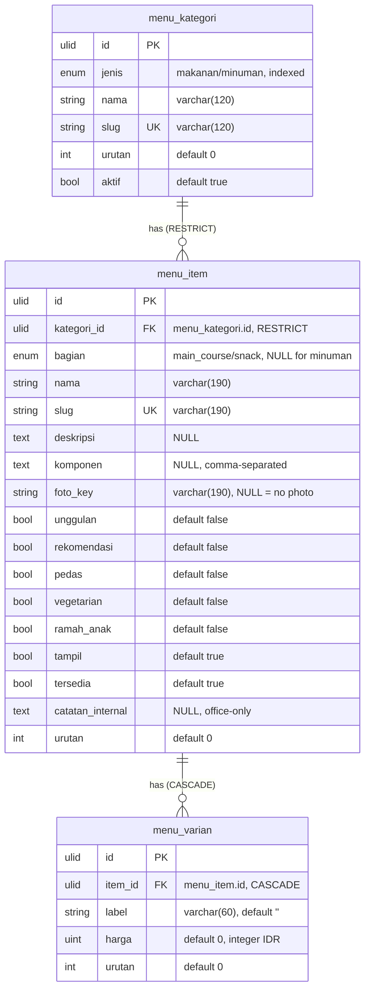

# Menu in `core`

The sellable menu of the homepage ("Our Best Menu" and the future `/menu`
page) and the Office Menu panel. **Greenfield:** unlike every other module
here, menu has no legacy backend and no legacy database — there is nothing to
port and nothing to be byte-compatible with.

Consequences, stated once:

- **No `legacy_id`.** There is no legacy id to keep; `id` is the only key.
- **No `Importer`, no `core:import`, no parity cases.** The porting checklist
  (`CLAUDE.md` §2) does not apply. The first data load is a committed JSON
  file (§ [Seeding](#seeding)), not an import from a legacy database.
- **No `deploy/menu` panel.** The old laksamana-office has no menu screen and
  is not touched.

The `TopMenu` shape in the homepage repo (`docs/01`, `docs/05`, `docs/07`)
belongs to an abandoned earlier attempt (`F:\PROJEK\file`) and is **not an
authority**. The deliberate differences are listed under
[Deviations from the abandoned `TopMenu` shape](#deviations-from-the-abandoned-topmenu-shape).

`stock.hpp_resep` already stores sellable recipes (`nama`, `jenis`, `tipe`,
`seksi`, `harga_baru`, `harga_upsize`, `aktif`). **Menu does not touch it** —
no FK, no sync, no copied price. Sell price lives in `menu_varian.harga`.

Migration: `database/migrations/2026_09_29_090000_create_menu_tables.php`
(`Schema::connection('core')`). There is no rollback importer: `down()` drops
the three tables.

## ERD

Every table also carries the ADR-0003 technical columns `created_by`,
`updated_by` (FK → `user`, `ON DELETE SET NULL`), `version` (unsigned int,
default `1`) and the Laravel timestamps `created_at` / `updated_at`; they are
left out of the diagram and documented once in
[Technical columns](#technical-columns). No table has `deleted_at`: deletes
are hard.



| Relationship | Cardinality | On delete |
|---|---|---|
| `menu_kategori` → `menu_item` | one kategori has many items | **RESTRICT** — a kategori with items cannot be deleted |
| `menu_item` → `menu_varian` | one item has many varian | **CASCADE** — deleting an item removes its varian at the DB |

`harga_mulai` is **not stored**: it is computed as `MIN(harga)` at read time.
A `varian` row with `label = ''` is a single-price item (see
[API contract](../api/menu.md#public-item-shape)).

## Columns

### `menu_kategori`

| Column | Type | Null | Default | Notes |
|---|---|---|---|---|
| `id` | ULID | no | — | primary key |
| `jenis` | enum(`makanan`,`minuman`) | no | — | indexed |
| `nama` | varchar(120) | no | — | e.g. `Nusantara`, `Coffee` |
| `slug` | varchar(120) | no | — | unique |
| `urutan` | int | no | `0` | display order within `jenis` |
| `aktif` | bool | no | `true` | `false` = hidden from every list, items kept |
| `created_by` | ULID | yes | `NULL` | FK → `user.id`, `ON DELETE SET NULL` |
| `updated_by` | ULID | yes | `NULL` | FK → `user.id`, `ON DELETE SET NULL` |
| `version` | unsigned int | no | `1` | optimistic concurrency |
| `created_at` | timestamp | yes | `NULL` | |
| `updated_at` | timestamp | yes | `NULL` | |

Indexes: `jenis` (single), `(jenis, urutan)`.

### `menu_item`

| Column | Type | Null | Default | Notes |
|---|---|---|---|---|
| `id` | ULID | no | — | primary key |
| `kategori_id` | ULID | no | — | FK → `menu_kategori.id`, `RESTRICT` |
| `bagian` | enum(`main_course`,`snack`) | yes | `NULL` | required for `makanan`, `NULL` for `minuman` (service-enforced, §6) |
| `nama` | varchar(190) | no | — | |
| `slug` | varchar(190) | no | — | unique |
| `deskripsi` | text | yes | `NULL` | marketing paragraph (premium items) |
| `komponen` | text | yes | `NULL` | comma-separated components (list items) |
| `foto_key` | varchar(190) | yes | `NULL` | `NULL` = no photo; the card falls back |
| `unggulan` | bool | no | `false` | the homepage "Our Best Menu" cards |
| `rekomendasi` | bool | no | `false` | |
| `pedas` | bool | no | `false` | |
| `vegetarian` | bool | no | `false` | |
| `ramah_anak` | bool | no | `false` | |
| `tampil` | bool | no | `true` | listed publicly at all |
| `tersedia` | bool | no | `true` | today's stock state |
| `catatan_internal` | text | yes | `NULL` | office-only |
| `urutan` | int | no | `0` | display order within `kategori` |
| `created_by` / `updated_by` / `version` / `created_at` / `updated_at` | — | — | — | see technical columns |

Indexes: `(kategori_id, urutan)`, `(tampil, unggulan)`. `slug` unique.

The two flags people confuse: **`tampil`** = in the public catalogue at all;
**`tersedia`** = habis/tersedia right now. `jenis` is **not** stored on the
item: it comes from the item's `kategori`.

### `menu_varian`

| Column | Type | Null | Default | Notes |
|---|---|---|---|---|
| `id` | ULID | no | — | primary key |
| `item_id` | ULID | no | — | FK → `menu_item.id`, `CASCADE` |
| `label` | varchar(60) | no | `''` | `R`, `L`, `H`, `C`, `Kaya`, `Matcha`, `1L`; `''` = single price |
| `harga` | unsigned int | no | `0` | integer IDR |
| `urutan` | int | no | `0` | |
| `created_by` / `updated_by` / `version` / `created_at` / `updated_at` | — | — | — | see technical columns |

Index: `(item_id, urutan)`.

## Technical columns

Written once here; every table above carries them. Follows ADR-0003:

| Column | Meaning |
|---|---|
| `created_at`, `updated_at` | Laravel timestamps |
| `created_by`, `updated_by` | ULID references to the `user` who caused the write. Real FKs to `user(id)` with `ON DELETE SET NULL`, as implemented by the migration: identity is already in `core`, so the relationship is a real one, not a `NULL` placeholder. Every office write stamps `updated_by` from the Sanctum user; `created_by` and `updated_by` are `NULL` when the row is made by the seeder (no acting user). |
| `version` | Integer optimistic-concurrency value; new rows start at `1` and `CoreRecord` bumps it on every save. |
| `deleted_at` | **Not present** — menu uses hard deletes (below). |

There is **no `legacy_id`** column on any of the three tables.

## Delete behaviour

- **Hard deletes everywhere.** No soft-delete column.
- **Deleting a kategori with items is refused.** The FK is `RESTRICT`, and the
  service checks first → `409 kategori_dipakai`. `aktif = false` is the way to
  hide a kategori while keeping its items.
- **Deleting an item cascades its varian** at the database
  (`menu_varian.item_id` `ON DELETE CASCADE`).
- Deleting a photo file (`DELETE /menu/office/foto/{key}`) removes the file;
  the item's `foto_key` is cleared by its own PATCH.

## Concurrency

The single ADR-0003 `version` column, no per-row timestamps or `versi` maps:

- **Public GET** returns the newest `updated_at` of the returned set as a
  version hash in `meta.version` and the `ETag` header.
- **Office PATCH/DELETE** require `If-Match: "<version>"` (or `?version=`);
  missing → `428 version_required`, stale → `409 version_conflict` with
  `error.details.current`.
- The two one-field toggles (`tampil`, `tersedia`) and `PUT /urutan` are
  deliberately exempt from `If-Match`: the last writer wins, a boolean has
  nothing to merge. They still bump `version`.

## Photos

No legacy folder exists, so menu deliberately does **not** use a `data_dir`:
files live under `storage/app/menu/` (private) and are streamed by
`GET /api/v1/menu/foto/{key}`. Key format `mn_<hex>.<ext>`, ext ∈
jpg/jpeg/png/webp. Orphan files are **not garbage-collected in v1**; the item
PATCH clears `foto_key` and the file stays. See §7 of the spec and
[the API contract](../api/menu.md#photos).

## Seeding

```bash
php artisan menu:seed           # idempotent by slug
php artisan menu:seed --fresh   # delete every menu row first
```

The one-time data source is the committed `database/seeders/data/menu.json`
(kept small and diff-friendly). It currently ships the 8 food + 9 drink
categories and an **empty** `item` array, so the panel can be filled by hand.
Prices in the JSON are **integer IDR** (`45000`, not `45`); the seeder does
**not** multiply. The seeder resolves each item's `kategori` by slug and
aborts the whole run before writing when a slug is unknown or repeated; a
second run changes nothing.

## Deviations from the abandoned `TopMenu` shape

`TopMenu` (homepage `docs/07-GLOSSARY.md`) was
`id, name, category, description, price, image, spice_level, is_available`.
Menu is not modelled on it. The deliberate differences:

1. **Indonesian names** (`nama`, `deskripsi`, `harga`, `tersedia`, …), as
   ADR-0003 requires of the shared vocabulary.
2. **`category` becomes a real row.** `menu_kategori` is a table with a ULID
   key and a unique `slug`; `menu_item.kategori_id` is an FK, not a free
   string.
3. **A single `price` becomes `menu_varian` rows.** One item may have 1..n
   `{label, harga}` variants; `harga_mulai` is computed as `MIN(harga)`.
4. **`spice_level` becomes the boolean `pedas`** (plus `rekomendasi`,
   `vegetarian`, `ramah_anak`), and `is_available` becomes `tersedia` with a
   separate `tampil` publication flag.
5. **`name` → `nama` with a stable `slug`**, and `image` → `foto_key` (a
   streamed `foto_url`), rather than a stored image path.
6. **A hierarchy the old shape did not have:** `jenis`
   (`makanan`/`minuman`) and `bagian` (`main_course`/`snack`) are columns on
   the kategori/item, never table rows.
