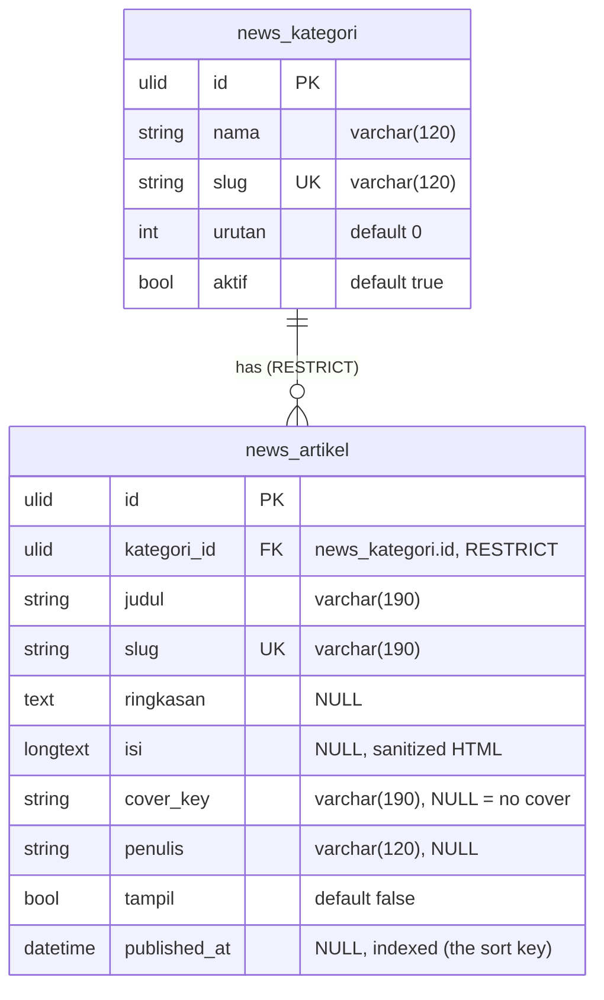

# News in `core`

The Berita articles behind the homepage **"Kabar dari Laksamana"** rail, the
public `/news` listing and `/news/{slug}` detail page, and the Office Berita
panel. **Greenfield:** like `menu`, news has no legacy backend and no legacy
database — there is nothing to port and nothing to be byte-compatible with.

Consequences, stated once:

- **No `legacy_id`.** There is no legacy id to keep; `id` is the only key.
- **No `Importer`, no `core:import`, no parity cases.** The porting checklist
  (`CLAUDE.md` §2) does **not** apply. The first data load is a committed JSON
  file (§ [Seeding](#seeding)), not an import from a legacy database.
- **No `deploy/news` panel.** The old laksamana-office has no berita screen and
  is not touched.

The `News` shape in the homepage repo (`docs/01`, `docs/05`, `docs/07` —
`id, title, slug, excerpt, content, image, is_published, published_at`) belongs
to an abandoned earlier attempt and is **not** an authority. Where the two
overlap, the field names in this file win.

`konten` (`/api/v1/konten`) is **not** a source: it is the internal marketing
content pipeline behind auth + `module:konten`. News does not read from or write
to it.

Migration: `database/migrations/2026_09_29_100000_create_news_tables.php`
(`Schema::connection('core')`). There is no rollback importer: `down()` drops
the two tables.

## ERD

Every table also carries the ADR-0003 technical columns `created_by`,
`updated_by` (FK → `user`, `ON DELETE SET NULL`), `version` (unsigned int,
default `1`) and the Laravel timestamps `created_at` / `updated_at`; they are
left out of the diagram and documented once in
[Technical columns](#technical-columns). No table has `deleted_at`: deletes
are hard.



| Relationship | Cardinality | On delete |
|---|---|---|
| `news_kategori` → `news_artikel` | one kategori has many articles | **RESTRICT** — a kategori with articles cannot be deleted |

`published_at` is the **only** ordering key. There is no `urutan` on the
article and no "featured" flag: "what is on the homepage" is simply "the
newest" (decision #3).

## Columns

### `news_kategori`

| Column | Type | Null | Default | Notes |
|---|---|---|---|---|
| `id` | ULID | no | — | primary key |
| `nama` | varchar(120) | no | — | e.g. `Event`, `Promo`, `Kabar` |
| `slug` | varchar(120) | no | — | unique |
| `urutan` | int | no | `0` | display order in the filter chips |
| `aktif` | bool | no | `true` | `false` = hidden from every public list, articles kept |
| `created_by` | ULID | yes | `NULL` | FK → `user.id`, `ON DELETE SET NULL` |
| `updated_by` | ULID | yes | `NULL` | FK → `user.id`, `ON DELETE SET NULL` |
| `version` | unsigned int | no | `1` | optimistic concurrency |
| `created_at` | timestamp | yes | `NULL` | |
| `updated_at` | timestamp | yes | `NULL` | |

Index: `(urutan)`.

### `news_artikel`

| Column | Type | Null | Default | Notes |
|---|---|---|---|---|
| `id` | ULID | no | — | primary key |
| `kategori_id` | ULID | no | — | FK → `news_kategori.id`, `RESTRICT` |
| `judul` | varchar(190) | no | — | |
| `slug` | varchar(190) | no | — | unique; the public URL is `/news/{slug}` |
| `ringkasan` | text | yes | `NULL` | short excerpt for cards + listing |
| `isi` | longtext | yes | `NULL` | **sanitized** HTML body (see below) |
| `cover_key` | varchar(190) | yes | `NULL` | `NULL` = no cover; the card falls back to a gradient |
| `penulis` | varchar(120) | yes | `NULL` | display author, free text (no user FK in v1) |
| `tampil` | bool | no | `false` | `false` = draft; never returned publicly |
| `published_at` | datetime | yes | `NULL` | the public timestamp; **the sort key** |
| `created_by` / `updated_by` / `version` / `created_at` / `updated_at` | — | — | — | see technical columns |

Indexes: `(tampil, published_at)`, `(kategori_id, published_at)`. `slug` unique.

An article with `tampil = true` should have a `published_at`; the service stamps
`now()` when it is missing, both on create/update and on the `tampil` toggle.

**Time zone:** `published_at`, `created_at` and `updated_at` are stored in
**UTC** and returned in WIB (`+07:00`); the public `date` is the WIB calendar
day. A `published_at` sent (or seeded) without an offset is read as WIB.

## Technical columns

Written once here; every table above carries them. Follows ADR-0003:

| Column | Meaning |
|---|---|
| `created_at`, `updated_at` | Laravel timestamps |
| `created_by`, `updated_by` | ULID references to the `user` who caused the write. Real FKs to `user(id)` with `ON DELETE SET NULL`, as implemented by the migration: identity is already in `core`. Every office write stamps `updated_by` from the Sanctum user; both are `NULL` when the row is made by the seeder (no acting user). |
| `version` | Integer optimistic-concurrency value; new rows start at `1` and `CoreRecord` bumps it on every save. |
| `deleted_at` | **Not present** — news uses hard deletes (below). |

There is **no `legacy_id`** column on either table.

## Delete behaviour

- **Hard deletes everywhere.** No soft-delete column.
- **Deleting a kategori with articles is refused.** The FK is `RESTRICT`, and
  the service checks first → `409 kategori_dipakai`. `aktif = false` is the way
  to hide a kategori while keeping its articles.
- Deleting a cover file (`DELETE /news/office/foto/{key}`) removes the file;
  the article's `cover_key` is cleared by its own PATCH.

## Concurrency

The single ADR-0003 `version` column, no per-row timestamps or `versi` maps:

- **Public GET** returns the newest `updated_at` of the returned set as a
  version hash in `meta.version` and the `ETag` header.
- **Office PATCH/DELETE** require `If-Match: "<version>"` (or `?version=`);
  missing → `428 version_required`, stale → `409 version_conflict` with
  `error.details.current`.
- The one-field `tampil` toggle and `PUT /urutan` are deliberately exempt from
  `If-Match`: the last writer wins, a boolean has nothing to merge. They still
  bump `version`.

## The body is stored sanitized

`isi` holds **server-sanitized HTML**. The raw client HTML is never stored; the
homepage renders the stored value with `v-html` and adds no sanitizer of its own.
v1 adds no dependency (`NewsSanitize`, built on ext-dom): scripts, styles,
frames, forms and SVG/MathML are removed with their content, any other unknown
tag is unwrapped (its text kept), only the attributes allowed per tag survive
(so every `on*` handler, `style` and `class` goes), and `href`/`src` must be
http(s), mailto/tel (links) or relative — `javascript:`/`data:` are dropped.
The seeder sanitizes too.

## Photos

No legacy folder exists, so news deliberately does **not** use a `data_dir`:
files live under `storage/app/news/` (private) and are streamed by
`GET /api/v1/news/foto/{key}`. Key format `nw_<hex>.<ext>`, ext ∈
jpg/jpeg/png/webp. Orphan files are **not garbage-collected in v1**; the article
PATCH clears `cover_key` and the file stays. See
[the API contract](../api/news.md).

## Seeding

```bash
php artisan news:seed           # idempotent by slug
php artisan news:seed --fresh   # delete every news row first
```

The one-time data source is the committed `database/seeders/data/news.json`
(kept small and diff-friendly). It ships the three start categories (`Event`,
`Promo`, `Kabar`) and `"artikel": []`: articles are written in the Office
panel. The seeder resolves each
article's `kategori` by slug and aborts the whole run before writing when a slug
is unknown or repeated; a second run changes nothing. The old homepage
`newsItems` fixture is **not** the seed source — it is only the frontend
fallback.
