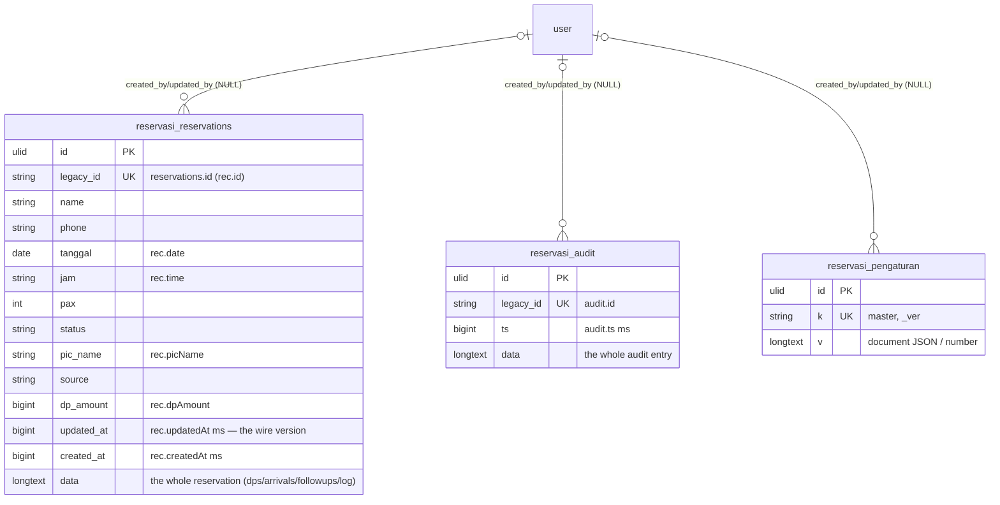

# Reservasi in `core`

Reservasi (also the Service Excellent `master` blob) moves from
`lakk5493_db_reservasi` to the `reservasi_*` tables of `core` (#71, PRD #1,
ADR-0002/0003/0004). The compat endpoint `/reservasi-api-mysql/api.php` and
`/api/v1/reservasi` keep answering exactly as before: legacy ids, the ms
`updated_at` row version, the global `_ver` and every Indonesian error string.

Migration: `database/migrations/2026_09_26_220000_create_reservasi_tables.php`.
Importer: `App\Core\Imports\ReservasiImporter` (`php artisan core:import reservasi`).
Served from core when `DB_RESERVASI_CONNECTION=core`: `ReservasiState` /
`ReservasiRecords` run the same statements on the `reservasi_*` tables
(`ReservasiState::t()`, rows keyed by `legacy_id`) and rebuild the legacy wire
shapes; unset = legacy (rollback).

## ERD

Every table also carries the ADR-0003 technical columns `created_by`,
`updated_by` (real FKs → `user`, `ON DELETE SET NULL`) and `version`; they are
left out of the diagram. No Laravel timestamps and no `deleted_at` anywhere
(deletes are hard, as in legacy; see below).



`reservations.data` is the source of truth, exactly as legacy: the columns
before it (plus `legacy_id`, `updated_at`, `created_at`) are re-derived from the
row on every write. The reservation's `dps`, `arrivals`, `followups`, `meta` and
`log` need no tables of their own — they are part of one reservation object, and
legacy never queried them separately.

## Legacy → core mapping

| legacy (`lakk5493_db_reservasi`) | core | notes |
|---|---|---|
| `reservations` | `reservasi_reservations` | columns verbatim (`id` → `legacy_id`) |
| `audit` | `reservasi_audit` | `id` → `legacy_id`, `ts` verbatim, whole entry in `data` |
| `settings` (`master`, `_ver`) | `reservasi_pengaturan` (`k`, `v`) | key and JSON verbatim; matched on `k` |
| `reservations.id` / `audit.id` | `legacy_id` | a new ULID `id` is minted per row |
| photo files (`DATA_DIR/files/*.txt`) | not in core | stay on disk; `@f:<key>` refs live in `data` |

The import reads `legacy_reservasi` only; it needs no other module's import
first, because the tables carry no per-row link to an Office User.

## Behaviour kept exactly

- **saveAll** keeps all of its rules: `baseVer` is required (`APP_LAWAS…`),
  a stale one returns `{conflict:true, saved:false, ver}` and writes nothing,
  rows are upserted under the `updated_at` ordering guard, rows missing from a
  non-empty payload are deleted, an empty payload never empties the table,
  audit rows are `INSERT IGNORE`d and then trimmed to the newest 500, `master`
  is written as one blob, and `_ver` + 1 is returned as `data.ver`.
  On core the same guard also bumps `version`, and only accepted writes count.
- **`_ver` stays a settings document.** The compat conflict protocol and the
  v1 `meta.ver` are built on it, so `version` is the per-row counter and `_ver`
  remains the client-visible global one — they are not the same thing.
- **Photos never enter MySQL.** Inline `data:` URIs are still moved to
  `<RESERVASI_DATA_DIR>/files/<key>.txt` and replaced with `@f:<key>`, and
  unreferenced files are still garbage-collected. The import copies no bytes of
  them: the same folder serves both backends during the cutover.
- **v1** keeps `updated_at` as the row version/ETag, the content hash (`sha1`,
  16 chars) for a whole `master` section, the 20-entry `log` cap, the
  180-character audit detail cut and the 500-row audit trim.
- **Locks.** Writes still run under `NamedLock('reservasi:reservasi_save')`
  plus the flock on `<DATA_DIR>/.lock`. On core the named lock is taken on the
  core database, so it no longer serialises with the old PHP — after the
  cutover the old backend no longer writes. The flock stays shared, so file
  writes still serialise with it.
- **`stats`** keeps its keys; `db` now reports the core database and `backend`
  is `laravel` on both connections, as before.

## Delete behaviour

Hard deletes, as in legacy: nothing carries `deleted_at`.

- **Reservations.** saveAll deletes the rows missing from a non-empty payload
  (`legacy_id NOT IN (…)` on core), and v1 `DELETE
  /api/v1/reservasi/reservations/{id}` deletes one row under its `updated_at`
  version. On core the delete is by `legacy_id`, so the sent ids are unchanged.
- **Audit.** Append-only, then trimmed to the newest 500 by `ts` (the trim runs
  on `legacy_id` on core).
- **Settings.** Never deleted; `master` and `_ver` are overwritten in place.
- **Deleting a User** only sets `created_by`/`updated_by` to NULL. It never
  touches a reservation, an audit row or a settings document.

## Import and switch

```bash
php artisan core:import reservasi   # idempotent; re-run to follow legacy edits and deletions
DB_RESERVASI_CONNECTION=core        # serve Reservasi from core; unset = legacy (rollback)
```

Idempotent: rows are matched on `legacy_id` (or `k`), unchanged rows are left
alone (`data`/`v` compare decoded, so re-encoding drift never counts), changed
rows get `version + 1`, and rows whose legacy source is gone are deleted. The
importer writes only to `core` and reads only local databases.

## Deviations (FK- or ADR-forced)

1. **`data` stays a LONGTEXT JSON document.** The reservation object is
   open-ended (its `dps`, `arrivals`, `followups`, `meta` and `log` are edited
   as one value by the panel) and legacy never queried them apart, so
   ADR-0002's "JSON stays only for open-ended data" applies. The indexed
   columns beside it are derived on every write, as legacy does.
2. **`master` stays one document** in `reservasi_pengaturan` (`perms`,
   `sePerms`, `users`, `rooms`, `tables`, `dpMethods`, `reviews`, `feedbacks`,
   `waitlist`, …). It is shared with Service Excellent and versioned per
   section by a content hash on the v1 side, so splitting it into tables would
   change the concurrency token every screen depends on.
3. **Therefore there is no `reservasi → user` FK.** `master.users` is a map
   inside that document (Service Excellent's own screen), not a row link, and
   nothing in the legacy schema identifies a User per reservation or per audit
   row. The only FKs to `user` are ADR-0003's `created_by`/`updated_by`, and
   they stay `NULL` for every row.
4. **No Laravel `created_at`/`updated_at`.** `reservations.updated_at` /
   `created_at` are the legacy millisecond stamps: `updated_at` IS the row
   version on the wire and the ordering guard inside the upsert, so they stay
   `BIGINT`. `reservasi_audit` carries only `ts`, as legacy did, and
   `reservasi_pengaturan` only its version — inventing a second stamp would add
   columns nothing reads.
5. **`reservasi_pengaturan` has no `legacy_id`**: its legacy key IS `k`, so it
   is matched on `k` (the same choice `bd_pengaturan`/`hr_pengaturan` make).
6. **A malformed legacy DATE becomes NULL** on core: the importer applies the
   app's own `tanggal_valid()` rule (`^\d{4}-\d{2}-\d{2}$`, never
   `0000-00-00`), so a strict core cannot refuse a row the app would have
   written as NULL on its next save anyway. The restored dump has no such row.
7. **Photos remain files, not rows.** Legacy already kept exactly one file per
   photo outside MySQL; the import deliberately moves none of them.
8. **`version` starts at 1 and counts accepted writes.** `version = version + 1`
   is the FIRST `ON DUPLICATE KEY UPDATE` assignment, so it reads the stored
   `updated_at` before the later assignments replace it — an ignored (older)
   write leaves the row and its version untouched.

## Verified

- `node tools/parity/parity.mjs reservasi --core`: **30/30 identical**.
- Plain `node tools/parity/parity.mjs reservasi`: **30/30 identical** (the
  legacy branch is byte-identical, which is what the first run proved: the same
  30 cases, unchanged).
- `php artisan test tests/Feature/Reservasi tests/Feature/Core/ReservasiImportTest.php
  tests/Feature/Core/ReservasiOnCoreTest.php`: **21 passed, 0 failed**
  (3 211 assertions) on the legacy connection; `vendor/bin/pint --test` clean.
- `tests/Feature/Core/ReservasiImportTest.php` (1:1 copy, idempotent,
  actor columns stay NULL behind real FKs, follows legacy edits and deletions)
  and `tests/Feature/Core/ReservasiOnCoreTest.php` (getAll identical to the
  legacy answer, saveAll guard + `_ver`, audit trim, one v1 write, the Finance
  kwitansi entry point); the module tests run on both connections through
  `tests/Feature/Reservasi/helpers.php`.
- **No Office User link exists to test.** The legacy reservasi schema never
  identifies a User per reservation or per audit row (the `master.users` map is
  Service Excellent's document, deviation 3), so the import test asserts the
  ADR-0003 contract instead: both actor FKs to `user` exist on all three
  tables, they stay `NULL` for every imported row, and the import needs no
  `account` import first.
- The `reservasi_*` DDL was read back from the migrated core test database:
  the legacy column types verbatim (`varchar(64)` `legacy_id`, `date tanggal`,
  `bigint updated_at/created_at`, `longtext data`), one unique key per
  `legacy_id`/`k`, and six `ON DELETE SET NULL` FKs to `user`.

## Test bootstrap: the import runs per test, on purpose

`tests/TestCase.php` imports every cut-over Modul in
`afterRefreshingDatabase()`, which Laravel calls from `setUp()` **after**
`refreshTestDatabase()` has begun the per-test transaction
(`RefreshDatabase::refreshTestDatabase()` → `beginDatabaseTransaction()`, then
`afterRefreshingDatabase()`). The import's rows are therefore written inside
that test's transaction and rolled back with it, and the next test needs its
own import: that is exactly why the hook runs per test and why memoising it
(`once()`, or a `static`) would leave every test after the first looking at an
empty core.

Reservasi's legacy state is the heaviest in the repo (2 962 rows / 2.6 MB,
measured 3.37 s for a standalone `php artisan core:import reservasi`, ~2.5 s
per test in-suite: `php artisan test tests/Feature/Reservasi` with
`DB_RESERVASI_CONNECTION=core` took 127.22 s for 13 tests, ~90 s of which is
the suite's `migrate:fresh`). A full suite on core is therefore expensive and
cannot run in one command on this box (~293 s cap); the on-core coverage is
run in chunks and the chunk list is reported with the gate, rather than
weakening the hook for one Modul.
