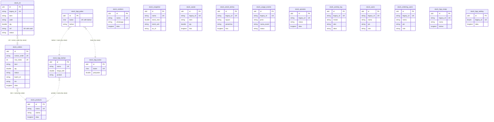

# Stock in `core`

#73 (PRD #1, ADR-0002/0003/0004). Stock (Ordering, Purchasing, Catat — waste, usage,
serah terima, opname, CK stock — HPP & Resep, the activity log) moves from
`lakk5493_db_stock` to the `stock_*` tables of `core`.

- **Every legacy table maps 1:1** onto a `stock_*` table with its legacy columns, types,
  defaults and indexes verbatim. The `data` LONGTEXT JSON stays the source of truth where
  legacy had one (as in reservasi): it is the object the screens edit, and legacy never
  queried inside it except through the indexed columns beside it.
- **The services keep their legacy statements.** Every stock SQL string is written against
  the legacy names and goes through `StockSupport::q()`: `{waste}` is the physical table,
  `{id}` the legacy-id column (`legacy_id` on core), `{*waste}` the legacy column list in
  legacy order with the legacy id aliased back to `id`. Rows, and so the wire, are identical
  on both connections.
- **The ULID comes from the column default.** An INSERT that names no `id` gets a
  lowercase ULID computed by the database (48-bit ms time + 80 random bits, Crockford
  base32; see the migration). That is what lets the legacy INSERTs run unchanged.
  The importer supplies monotonic `Str::ulid()` ids instead, in legacy key order.

## ERD

No table references another: stock links rows by value (an order's `item` is a product
`nama`, a CK movement's `ref` is an order's `nomor_order`, a recipe's `bahan` JSON names
`hpp_bahan` rows), and renames are followed in code (`StockHppNames`), exactly as legacy.
There is no Office User link either: `pic`, `aktor`, `updated_by` are free-text names.



The diagram lists the columns that key, link or index a table; every table also carries
every other legacy column verbatim (`StockSupport::COLUMNS` is the full list, in order).

## Mapping and legacy ids

| legacy table | core table | legacy key → core |
|---|---|---|
| `products` | `stock_products` | `nama` (unique) |
| `vendors` | `stock_vendors` | `nama` (unique) |
| `orders` | `stock_orders` | `nomor_order` (unique), `row_index` (unique) |
| `stock` | `stock_snapshot` | `nama` (unique) |
| `ck_stock` | `stock_ck` | `id` → `legacy_id`; `(ref, arah)` unique |
| `waste` | `stock_waste` | `id` → `legacy_id` |
| `serah_terima` | `stock_serah_terima` | `id` → `legacy_id` |
| `usage_events` | `stock_usage_events` | `id` → `legacy_id` |
| `opname` | `stock_opname` | `id` → `legacy_id` |
| `activity_log` | `stock_activity_log` | `id` → `legacy_id` |
| `users` | `stock_users` | `id` → `legacy_id` |
| `ordering_users` | `stock_ordering_users` | `id` → `legacy_id` |
| `hpp_bahan` | `stock_hpp_bahan` | `nama` (unique) |
| `hpp_resep` | `stock_hpp_resep` | `id` → `legacy_id` |
| `hpp_bulan` | `stock_hpp_bulan` | `bulan` (unique) |
| `hpp_pakai` | `stock_hpp_pakai` | `(bulan, bahan)` (unique) |
| `hpp_setting` | `stock_hpp_setting` | `id` (always 1) → `legacy_id` |
| `stock_settings` | — (`stock_pengaturan`, not created) | missing live, so missing here too |

Natural keys stay as they are (like finance's `kunci`): they are what every statement and
every screen addresses, and a rename (`UPDATE … SET nama = ?`) keeps working on them.

## Delete behaviour and concurrency

Hard deletes everywhere, as in legacy; nothing carries `deleted_at`. The snapshot is still
rewritten whole on every upload (`DELETE` + inserts in one transaction), so its ULIDs change
with every upload — nothing references them.

Concurrency is unchanged: compat keeps legacy's last-write-wins statements, v1 keeps its
content-hash versions (`StockRecords`, `StockEntryRecords`, `StockHppRecords`). Neither needs
a stored counter, so the tables carry no `version` (deviation 2).

## Import and switch

```bash
php artisan core:import stock   # idempotent; re-run to follow legacy edits and deletions
DB_STOCK_CONNECTION=core        # serve Stock from core; unset = legacy (rollback)
```

Rows match on their key above; unchanged rows are left alone, changed rows are updated,
rows gone from legacy are deleted (deletes run first, so a case-only rename of a unique
`nama` never collides with itself). Photos are base64 inside `foto`, as in legacy, so they
move with the rows. `STOCK_DATA_DIR` (training files) is untouched.

## Deviations (ADR-forced or deliberate)

1. **`data` stays LONGTEXT JSON** (and `hpp_resep.bahan` stays the JSON list of recipe
   lines): open-ended objects the screens edit whole, per ADR-0002's exception.
2. **No `version`, `created_by`, `updated_by`.** Nothing reads a counter (see above), and
   no stock row identifies an Office User — `pic`/`aktor`/`updated_by` are names typed by
   crew or sent by the app. The HPP tables' own `updated_at` (ms) and `updated_by` (name)
   are legacy columns and stay as they are.
3. **No Laravel timestamps.** Legacy stamps (`waktu`, `as_of`, HPP `updated_at`) are kept
   verbatim; a second stamp would be a column nothing reads.
4. **Explicit `ORDER BY` where legacy relied on primary-key order**: the snapshot read
   (`ORDER BY nama`, its map order is on the wire) and the batch join (`ORDER BY
   nomor_order`, its first row is the batch head). On legacy that is the order it already
   returned; on core the clustered key is the ULID.
5. **Strict SQL mode.** `core` runs Laravel's strict mode; legacy stock used the server's
   (non-strict in production, #97). An over-long value that legacy silently truncated fails
   on core instead. The services already cut most text to the column width.
6. **The ULID default needs MySQL 8.0.13+ / MariaDB 10.2+** (expression defaults).
   Production is MariaDB 10.11.

## Verified

- `node tools/parity/parity.mjs stock --core`: **212/214 identical**. The two differences
  (`ck GET`, `ck GET after writes`) are the CK movement list returning movements that share
  a `tanggal` and `waktu` second in another order. `ORDER BY tanggal DESC, waktu DESC` leaves
  ties to MySQL's filesort, and legacy's own order within a tie is neither id order
  (`8E86C5, 6E2DEC, 1755A1, 93CD85`), so no tiebreak reproduces it; the row set and every
  value are identical. Adding a tiebreak would instead break plain parity against the old PHP.

- `php artisan test tests/Feature/Stock`: **69 passed** on the legacy connection and
  **69 passed** with `DB_STOCK_CONNECTION=core` (the module tests' own SQL goes through
  `StockSupport::q()` too, so they run on both).
- `tests/Feature/Core/StockImportTest.php`: every table 1:1 against the restored dump,
  a repeat import keeps every ULID, and a legacy-shaped INSERT gets its ULID from the
  column default.
