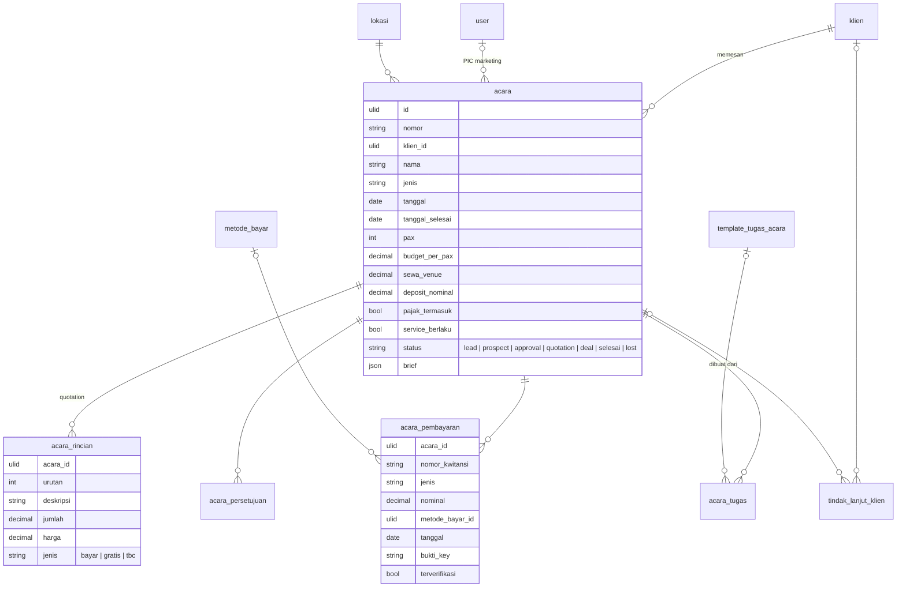

# Area: Tamu — Acara Marketing

Status: **rancangan + migration** (`2026_10_07_190000_create_erp_acara_marketing_tables.php`), di atas [Orang & Divisi](orang-divisi.md) (`klien`) dan [Kas](kas.md) (`metode_bayar`). Importer belum ditulis, karena butuh dump lama untuk diuji.

## Sumber di sistem lama (diperiksa 2026-10-06)

- `laksamana-office/marketing-mysql` + `deploy/marketing` (±20 ribu baris): koleksi `clients`, `events` (booking acara dari klien: gathering, birthday, wedding, paket), `approvals`, `followups`, `activities`, `task_templates`, `vip`, `staff`, `users`, `notifs`, kategori, pengaturan.
- Acara Marketing **bukan** Event EMS: ini pesanan klien atas venue dan F&B (paket), dijual oleh PIC Marketing. Event EMS adalah acara yang diselenggarakan venue sendiri.

### Aturan lama yang dipertahankan

1. **Pipeline**: Lead → Prospect → Approval → Quotation Terkirim → Deal → Event Done, atau Lost. Tahap Negotiation dihapus 3 Agu 2026 (digabung ke Quotation Terkirim). Approval = penawaran menunggu keputusan manajemen.
2. **Quotation** dari tabel **rincian item** (deskripsi, jumlah, harga, jenis `bayar`/`gratis`/`tbc`); total baris = jumlah × harga. F&B Deal lama dipindah ke rincian.
3. **Pembayaran acara**: nomor kwitansi, jenis (DP, pelunasan, …), nominal, metode/rekening, tanggal, bukti, terverifikasi, pencatat. DP dari tab Finance dicatat sebagai pembayaran jenis DP.
4. **Persetujuan penawaran**: status, penyetuju (bisa dua orang), alasan, waktu putusan, dan penanda otomatis.
5. **Tindak lanjut** klien/acara dengan tanggal tindak lanjut berikutnya; layar mengingatkan yang jatuh tempo.
6. **Tugas acara** dari template (tugas per divisi, H-minus hari dari tanggal acara), status Pending / On Progress / Done.
7. Pajak termasuk atau tidak, dan service berlaku atau tidak, dipilih per acara.

## Keputusan

| Hal | Keputusan |
|---|---|
| Klien | `pihak` + `klien` (area Orang & Divisi); status klien di layar dihitung dari acaranya, tidak disimpan |
| Acara | `acara` dengan status pipeline `CHECK`; uang (budget per pax, sewa venue, deposit) sebagai kolom; isi brief yang hanya dibaca (area, layout, highlight, dekor, privasi, menu final, gambar) sebagai JSON `brief` |
| Rincian | `acara_rincian` (aturan 2) |
| Pembayaran | `acara_pembayaran` dengan `metode_bayar` (area Kas) dan nomor kwitansi unik |
| Persetujuan | `acara_persetujuan` |
| Tindak lanjut | `tindak_lanjut_klien` (menunjuk klien dan/atau acara) |
| Tugas | `acara_tugas` + `template_tugas_acara` |
| VIP, notifikasi, log aktivitas, Kalkulator HPP (`kalkHistori`, #184), permintaan desain | belum: VIP perlu dicek bentuknya; log dan notifikasi menjadi fitur bersama; Kalkulator menyalin Modal dari `resep-hpp.md`; permintaan desain ke area Konten |

## ERD

### Aturan (langkah 7)

Dijaga database (diuji di `tests/Feature/Erp/AcaraMarketingSchemaTest.php`):

- `acara.status` tujuh nilai; `tanggal_selesai >= tanggal`; `pax >= 0`; uang `>= 0`.
- `acara_rincian`: `jenis` tiga nilai; jumlah dan harga `>= 0`; urutan unik per acara; baris `gratis`/`tbc` berharga 0.
- `acara_pembayaran`: `nominal > 0`; nomor kwitansi unik.
- `acara_persetujuan.status IN ('menunggu','disetujui','ditolak')`; diputus ⇔ `diputuskan_at`.
- `acara_tugas.status IN ('pending','on_progress','done')`.
- `tindak_lanjut_klien`: menunjuk klien atau acara (paling tidak satu).
- Rincian dan tugas ikut acara (`CASCADE`); acara yang punya pembayaran tidak bisa dihapus permanen.

Dijaga service: perpindahan tahap pipeline, total quotation, sisa tagihan = total − Σ pembayaran terverifikasi, tugas dari template (tanggal acara − H-minus).

### JSON (langkah 8)

| Kolom | Alasan |
|---|---|
| `acara.brief` | isi brief yang hanya dibaca dan dicetak (area, layout, gambar, highlight, dekor, privasi, menu final); semua angka uang sudah dikeluarkan ke kolom |

### Riwayat (langkah 9)

Harga di quotation adalah baris acara itu sendiri (`acara_rincian`), bukan rujukan ke daftar harga.

## Pemetaan lama → v2

| Lama | v2 | Aturan impor |
|---|---|---|
| `clients` | `pihak` + `klien` | area Orang & Divisi |
| `events` | `acara` | `status` → huruf kecil (`Quotation Terkirim` → `quotation`, `Event Done` → `selesai`, `Negotiation` → `quotation`); `clientId` → klien; `mktPIC` → User; `detail` uang → kolom, sisanya → `brief` |
| `events[].detail.rincianItem` | `acara_rincian` | `free` → `gratis` |
| `events[].payments` | `acara_pembayaran` | `no` → `nomor_kwitansi`; `method` → `metode_bayar` lewat nama, sisanya `metode_impor`; `receiptUrl` → berkas |
| `events[].tasks` | `acara_tugas` | |
| `approvals` | `acara_persetujuan` | `by`/`by2` → pencocok nama |
| `followups` | `tindak_lanjut_klien` | |
| `task_templates` | `template_tugas_acara` | `div` → Divisi; `hminus` → `h_minus` |

## Belum dikerjakan

1. Importer `core:import erp-acara` (setelah `erp-orang` dan `erp-kas`). Butuh dump `marketing`.
2. Pembayaran acara ke `arus_kas` dan pencocokan DP dengan mutasi bank (bersama DP reservasi).
3. VIP, log aktivitas, notifikasi, Kalkulator HPP, permintaan desain.
