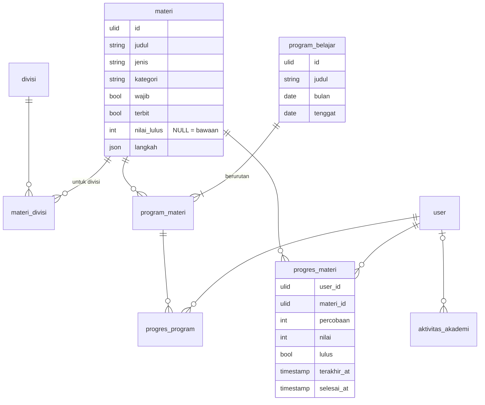

# Area: SDM — Akademi

Status: **rancangan + migration** (`2026_10_07_180000_create_erp_akademi_tables.php`), di atas area [Orang & Divisi](orang-divisi.md) (divisi kantor). Importer belum ditulis, karena butuh dump lama untuk diuji.

## Sumber di sistem lama (diperiksa 2026-10-06)

- `laksamana-office/akademi-mysql` + `deploy/akademi`: blob per koleksi `users`, `divisions`, `materials`, `programs`, `progress` (User × materi), `prog_prog` (User × program × materi), `activity`, `settings`. Bentuknya juga sudah dipetakan di migration `core` Tim A (`2026_09_26_180000`), yang dibekukan.
- Kru Akademi adalah salinan Roster Office (`listModuleRoster`, lihat `orang-divisi.md`); `role` adalah peran di modul.

### Aturan lama yang dipertahankan

1. **Materi** terdiri dari langkah berurutan (video, teks, kuis); bisa wajib, bisa belum terbit, dan punya nilai lulus sendiri atau memakai nilai lulus bawaan (Pengaturan).
2. **Materi untuk divisi tertentu**; "Service/FOH" berlaku untuk dua divisi shift (`orang-divisi.md`).
3. **Program** adalah paket materi untuk satu bulan dengan tenggat.
4. **Progres per User × materi**: jumlah percobaan, nilai, lulus, waktu terakhir, waktu selesai. Progres program dicatat terpisah per materi di dalam program.
5. **Menghapus materi atau program tidak menghapus progres** (G-17, `laksamana-office-vue` `_gap-api.md`): riwayat belajar orang tetap ada.

## Keputusan

| Hal | Keputusan |
|---|---|
| Kru, divisi Akademi | `user` + `karyawan.divisi_id` + `penempatan_peran` (akademi); tidak ada tabel kru/divisi sendiri |
| Materi | `materi`; langkah (isi video/teks/kuis) sebagai JSON `langkah` |
| Materi ↔ divisi | `materi_divisi` (banyak-ke-banyak); tanpa baris = untuk semua divisi |
| Program | `program_belajar` (`bulan` `DATE` hari pertama) + `program_materi` berurutan |
| Progres | `progres_materi` (User × materi), `progres_program` (User × materi dalam program) |
| Hapus | materi dan program di-soft-delete; progres menunjuk dengan `RESTRICT`, jadi hapus permanen ditolak selama ada progres (aturan 5) |
| Pengaturan | `pengaturan_akademi` berlaku-dari (nilai lulus bawaan). `syncUrl`/`syncKey`/`requirePinChange` lama tidak dibawa: roster sudah satu, PIN milik login Office |
| Log | `aktivitas_akademi` (User, aksi, detail, waktu) |

## ERD

### Aturan (langkah 7)

Dijaga database (diuji di `tests/Feature/Erp/AkademiSchemaTest.php`):

- `materi.nilai_lulus` 0–100 bila diisi; `progres_*.nilai` 0–100 bila diisi; `percobaan >= 0`.
- `progres_materi`: satu per User × materi; `lulus` ⇒ `selesai_at` terisi.
- `progres_program`: satu per User × materi-dalam-program.
- `program_belajar.bulan` hari pertama; `tenggat >= bulan` bila diisi.
- `program_materi`: materi sekali per program, urutan unik per program.
- Materi/program yang punya progres tidak bisa dihapus permanen (`RESTRICT`).

### JSON (langkah 8)

| Kolom | Alasan |
|---|---|
| `materi.langkah` | isi pelajaran (teks, tautan video, soal kuis dan kuncinya); dibaca utuh oleh layar belajar, tidak pernah difilter atau dijumlah |
| `aktivitas_akademi.detail` | detail log |

### Riwayat (langkah 9)

Nilai lulus yang dipakai saat seseorang lulus tidak dihitung ulang: `lulus` disimpan di progres. Nilai lulus bawaan berlaku-dari.

## Pemetaan lama → v2

| Lama | v2 | Aturan impor |
|---|---|---|
| `users` | `user` (+ `penempatan_peran` akademi) | id Office, lalu nama (`orang-divisi.md`) |
| `divisions` | `divisi` | pemetaan L4 (`orang-divisi.md`) |
| `materials` | `materi` + `materi_divisi` | `steps` → `langkah`; `division` → Divisi (Service/FOH → floor + cashier) |
| `programs` | `program_belajar` + `program_materi` | `bulan` `YYYY-MM` → `DATE`; `materialIds` → baris berurutan |
| `progress` | `progres_materi` | `user\|material` → FK; `completedAt` ms → `TIMESTAMP` |
| `prog_prog` | `progres_program` | |
| `activity` | `aktivitas_akademi` | |
| `settings.passingDefault` | `pengaturan_akademi` | berlaku dari `2000-01-01` |

## Belum dikerjakan

1. Importer `core:import erp-akademi` (setelah `erp-orang`). Butuh dump `akademi`.
2. Service penilaian kuis (nilai, lulus) dari `langkah`.
