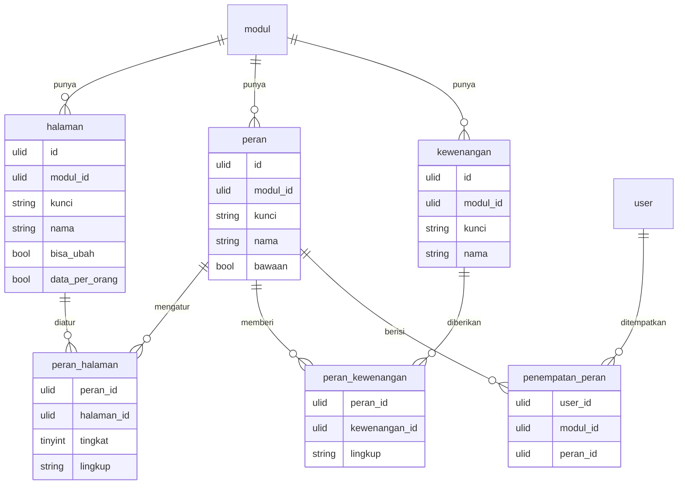

# Akses di dalam Modul — rancangan v2

Jawaban owner Q1 (2026-10-02): semua kru adalah User Office. Owner juga meminta agar **di dalam modul** kru tertentu tidak melihat atau tidak bisa memakai sebagian fitur.
Dokumen ini merancang bagaimana permintaan itu dijaga oleh server untuk semua modul, bukan oleh layar per modul.
Status: **tabel jadi** (migration `2026_10_07_120000_create_erp_akses_tables.php`, model `app/Erp/Akses/Models`). Middleware dan seeder halaman per Modul belum. L3 di [`pertanyaan-owner.md`](pertanyaan-owner.md) hanya menentukan siapa yang boleh mengubah matriks, bukan bentuk tabelnya.

## Kondisi sekarang

Hak akses di Office punya dua lapis, dan lapis kedua sudah ada di sembilan tempat dengan bentuk berbeda-beda.

| Lapis | Ada di | Dijaga oleh |
|---|---|---|
| **Akses**: boleh membuka Modul (Izin Akses, Larangan, Akses Bawaan) | `user`, `izin_akses`, `larangan`, `admin_modul` di core; sudah relasional | server |
| **Akses Halaman**: Peran × halaman → Tingkat 0 Tak Terlihat / 1 Lihat / 2 Boleh Ubah | Kas, Brankas, Analytics, Marketing, Event, Reservasi, Konten, Service Excellent, Purchasing; masing-masing di blob modulnya, dengan daftar peran sendiri (`viewer`/`admin`, `content_planner`, `host`/`cashier`/`manager`, `full`/`view`, …) | **peramban saja** |
| **Lingkup data**: hanya data milik sendiri | Performa Kasir (Cashier): kasir hanya melihat dirinya dan tab Semua. Aturan Head di Marketing & Event diminta 7 Sep 2026 tetapi belum dikerjakan | peramban saja |
| Peran yang ditegakkan server | `dw` (HRD, head divisi) dan `jadwal` (head divisi per baris, HRD mengesahkan) | server, ditulis tangan per modul |

Tiga masalah dari kondisi ini:

1. **Disembunyikan tidak sama dengan dilarang.** Halaman yang hanya tidak digambar tetap bisa dibuka dari devtools. Catatan Office sendiri sudah mengakui ini (pelajaran `uji-performa-kasir-akses.js`).
2. **Datanya tetap terkirim.** Banyak endpoint v1/legacy memulangkan seluruh blob modul (`getAll`). Menyembunyikan halaman tidak menyembunyikan isinya, karena isinya sudah ada di peramban.
3. **Sembilan salinan aturan yang sama.** Setiap modul punya daftar peran, matriks, dan penyimpanannya sendiri. Perbaikan di satu modul tidak sampai ke modul lain.

## Rancangan: tiga pertanyaan, satu tempat

Setiap permintaan ke v2 menjawab tiga pertanyaan secara berurutan. Semuanya dijawab di server.

1. **Boleh membuka Modul ini?** Ini **Akses** yang sudah ada, tidak berubah.
2. **Boleh membuka halaman ini, dan sampai tingkat apa?** Ini **Akses Halaman**: Peran User di Modul itu × Halaman → Tingkat (0 / 1 / 2).
3. **Data siapa yang boleh dilihat atau diubah di halaman itu?** Ini **Lingkup**: `sendiri`, `divisi` (Divisi yang ia kepalai), atau `semua`.

Ditambah **Kewenangan** untuk tindakan yang tidak melekat pada satu halaman, misalnya *mengesahkan pengajuan jadwal*, *mengoreksi stok*, *membatalkan dokumen final*, dan nanti *menyetujui pembelian* (P5: belum ada, tetapi tempatnya sudah disiapkan).

Admin Modul selalu penuh di modulnya dan tidak bisa diturunkan, seperti aturan Kas sekarang. Dengan begitu satu klik salah tidak membuat modul kehilangan semua pengurusnya.

### Tabel

- `halaman` dan `kewenangan` **didaftarkan oleh kode** (seeder per modul), bukan dibuat dari layar. Halaman ada karena programnya ada. Layar admin hanya mengisi matriksnya.
- `halaman.bisa_ubah = false` menjepit Tingkat paling tinggi ke 1. Ini aturan `AKS_HAL_ISI` yang sudah ada di Kas.
- `halaman.data_per_orang` menandai halaman yang memakai Lingkup, misalnya Performa Kasir atau performa PIC.
- `penempatan_peran` memiliki kunci unik `(user_id, modul_id)`: satu Peran per User per Modul. User tanpa baris di sini memakai peran `bawaan = true` milik Modul itu.
- `tingkat` dibatasi `CHECK (tingkat IN (0,1,2))`; `lingkup` dibatasi `CHECK (lingkup IN ('sendiri','divisi','semua'))`.
- Lingkup `divisi` dihitung dari **Kepala Divisi** dan Penempatan Divisi yang sudah ada di core. Tidak ada daftar head kedua.

### Keputusan saat dijadikan migration (2026-10-07)

- **Satu Modul per baris matriks, dijaga database.** `peran_halaman`, `peran_kewenangan`, dan `penempatan_peran` menyimpan `modul_id` dan memakai FK komposit `(peran_id, modul_id)`, `(halaman_id, modul_id)`, `(kewenangan_id, modul_id)`. Peran Kas tidak bisa diberi halaman Stock, dan penempatan di Stock tidak bisa menunjuk peran Kas.
- **Peran bawaan:** kolom `bawaan` bernilai `1` atau `NULL`, dengan unik `(modul_id, bawaan)`: paling banyak satu per Modul. Tanpa kolom generated, karena MariaDB menolak sebagian bentuknya (lihat PR #208).
- **Matriks tersimpan utuh, bukan selisih.** Matriks lama (`kk_akses`) hanya menyimpan sel yang berbeda dari bawaan di kode. Di v2 bawaan per Peran ditulis oleh seeder saat sebuah halaman didaftarkan. Halaman baru tetap langsung punya bawaan, dan isi matriks bisa dibaca dari database tanpa kode.
- **Hapus:** matriks ikut terhapus bersama Peran-nya (`CASCADE`); Peran yang masih dipegang User tidak bisa dihapus (`RESTRICT`); User yang dihapus membawa penempatannya (`CASCADE`, sama dengan `izin_akses`).

Dijaga service, tidak database:

- `halaman.bisa_ubah = false` menjepit Tingkat ke 1 (beda tabel).
- `lingkup` di `peran_halaman` hanya diisi untuk halaman `data_per_orang`.
- Admin Modul selalu Tingkat 2 dengan Lingkup `semua`, apa pun Peran-nya.

### Penegakan

- Setiap route v2 menyatakan halamannya: `->middleware('halaman:kas.bayar,2')`. Tingkat yang kurang menghasilkan `403` dengan kode `tidak_berhak:`, kode yang sudah dipakai v1.
- Lingkup diterapkan di service, sebagai filter query, bukan di controller. Daftar yang dikembalikan memang hanya berisi baris yang boleh dilihat, dan angka agregat (tab "Semua") dihitung di server tanpa nama.
- Setiap halaman v2 punya endpoint sempitnya sendiri. Tidak ada `getAll` berisi blob modul. Tanpa aturan ini, menyembunyikan halaman tidak menyembunyikan datanya.
- `GET /api/v2/saya/akses` mengembalikan Modul, halaman, tingkat, lingkup, dan kewenangan User yang sedang login. Layar memakainya untuk menyembunyikan menu, tetapi yang menjaga tetap server.
- Setiap perubahan matriks, penempatan peran, dan kewenangan dicatat siapa dan kapan (kolom aktor + `version`, ADR-0007).

### Pemindahan dari Office lama

Matriks yang sudah diisi admin di sembilan modul diimpor sekali per modul saat modul itu pindah ke v2. Peran lama dipetakan ke peran baru dalam tabel di `docs/erp/<area>.md`. v1 dan layar lama tidak berubah.

## Pilihan yang ditolak

- **Matriks per User** (tanpa Peran): 60 User × puluhan halaman × banyak modul tidak bisa dirawat, dan tidak ada yang tahu kenapa satu orang berbeda dari rekannya.
- **Satu Peran untuk seluruh Office**: "kasir" di Kas tidak sama dengan "cashier" di Reservasi. Peran memang milik Modul, seperti istilah **Peran** di `CONTEXT.md`.
- **Tetap di peramban**: tidak menjaga apa pun, lihat masalah nomor 1 dan 2.
- **Paket `spatie/laravel-permission`**: bisa dipakai sebagai mesin di balik layar. Tetapi Tingkat dan Lingkup tetap harus dibangun sendiri, dan nama tabelnya keluar dari kosakata glosarium (ADR-0003). Diputuskan saat implementasi, tidak mengubah rancangan ini.
