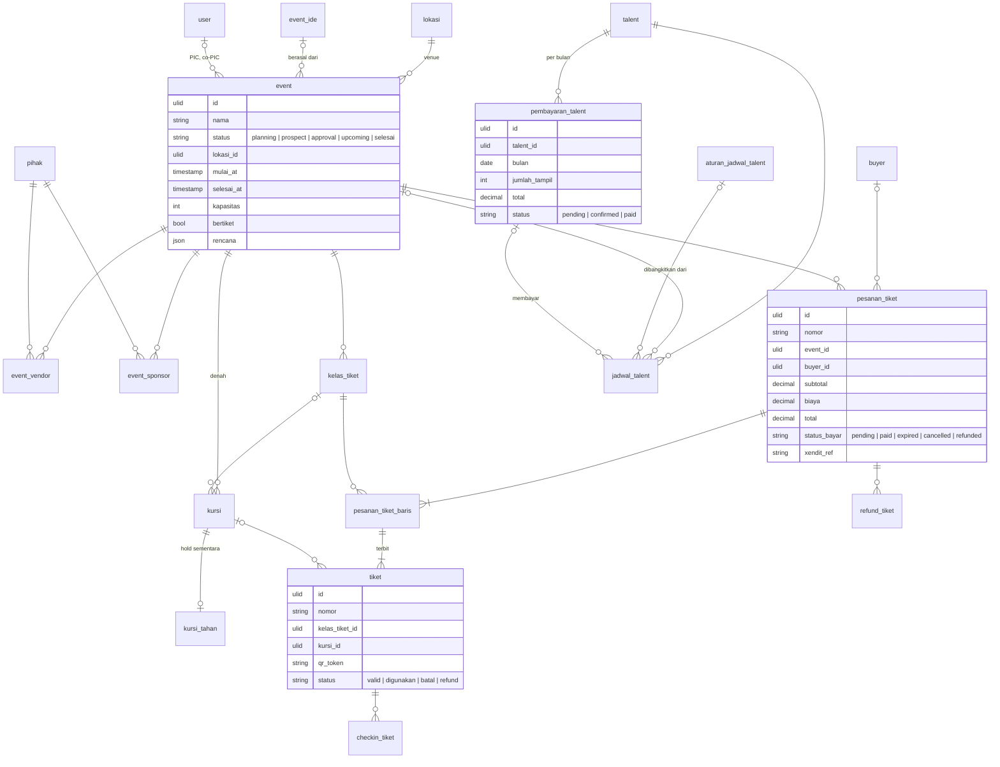

# Area: Tamu — Event & Tiket

Status: **rancangan + migration** (`2026_10_07_160000_create_erp_event_tiket_tables.php`), di atas area [Orang & Divisi](orang-divisi.md) (peran Pihak `talent`). Importer belum ditulis, karena butuh dump lama untuk diuji.

## Sumber di sistem lama (diperiksa 2026-10-06)

- `laksamana-office/event-mysql` (EMS, `getAll`/`saveAll` blob per koleksi) dan `ticketing-mysql` (situs publik, endpoint sempit, Xendit). Keduanya memakai satu database `lakk5493_db_ems`.
- `deploy/event/index.html` (EMS: event, denah kursi, kelas tiket, check-in, refund, jadwal talent, pembayaran talent), `deploy/ticketing/` (toko tiket).
- Koleksi: `events`, `event_details`, `ideas`, `ticket_classes`, `seats`, `orders`, `tickets`, `checkins`, `refunds`, `talents`, `schedules`, `recurring_rules`, `talent_payments`, `calendar_extra`; tabel publik `users` (Buyer), `sessions`, `resets`, `seat_holds`, `gagal`.

### Aturan lama yang dipertahankan

1. **Status event** (sejak 3 Agu 2026): Planning → (Prospect → Approval) → Upcoming → Event Done. Nilai lama: Draft = Planning; Today/Confirmed/Ongoing = Upcoming; Finished = Event Done; Cancelled = Planning dengan pengajuan ditolak (acara batal tidak boleh terhitung terlaksana).
2. **Hanya event Upcoming yang boleh dijual** (sudah disetujui manajemen).
3. **Harga selalu dihitung server** dari kelas tiket; total dari peramban hanya tampilan.
4. **Lunas hanya lewat webhook Xendit** dengan `x-callback-token`; tidak ada tombol "sudah bayar".
5. **Kursi baru Sold setelah uang masuk**; sebelumnya hanya *hold* sementara di tabel terpisah dengan token dan waktu habis.
6. **Check-in:** hasil `Valid` atau ditolak; membatalkan check-in dicatat sebagai baris koreksi (keputusan K-09, issue #185), bukan menghapus.
7. **Refund** per pesanan: diminta → disetujui/ditolak; satu pesanan hanya punya satu refund yang belum ditolak.
8. **Talent dibayar per bulan** dari jadwal tampil yang terlaksana: jumlah tampil × tarif, status Pending → Confirmed → Paid, dengan bukti transfer.

## Keputusan

| Hal | Keputusan |
|---|---|
| Event | `event` dengan `status` CHECK (`planning`, `prospect`, `approval`, `upcoming`, `selesai`) dan jejak pengajuan (diajukan, disetujui/ditolak, oleh). Venue = Lokasi |
| Perencanaan event (`event_details`: rundown, timeline, layout, tugas) | kolom JSON `rencana` di `event`: hanya dibaca orang, tidak pernah difilter atau dijumlah. Vendor dan sponsor berbayar **bukan** JSON: `event_vendor`, `event_sponsor` |
| Ide event | `event_ide`; event menunjuk idenya |
| Kelas tiket, kursi | `kelas_tiket` (harga, kuota, masa jual), `kursi` (status `tersedia`/`terkunci`/`terjual`, posisi denah JSON) |
| Hold kursi | `kursi_tahan`, satu baris per kursi, dengan token dan `berakhir_at` (aturan 5) |
| Buyer | `buyer` (akun publik) + `buyer_sesi`, `buyer_reset`. Bukan `user`, bukan `pihak` (`CONTEXT.md` Buyer) |
| Pesanan | `pesanan_tiket` + `pesanan_tiket_baris` (harga disalin dari kelas saat pesan); `status_bayar` CHECK (`pending`, `paid`, `expired`, `cancelled`, `refunded`); `xendit_ref` unik |
| Tiket | `tiket` (nomor unik, token QR unik, status `valid`/`digunakan`/`batal`/`refund`) |
| Check-in | `checkin_tiket` baris per pindaian, `jenis` = `checkin`/`koreksi` (aturan 6) |
| Refund | `refund_tiket` |
| Jadwal talent | `jadwal_talent` (tarif disalin), `aturan_jadwal_talent` (berulang, hari sebagai bitmask), `pembayaran_talent` per bulan; jadwal menunjuk pembayarannya |
| `calendar_extra`, `gagal` (rate limit) | tidak diimpor: catatan kalender dipindah saat area Konten/Agenda; rate limit memakai limiter Laravel |

## ERD

Kolom teknis ADR-0007 tidak digambar.

### Aturan (langkah 7)

Dijaga database (diuji di `tests/Feature/Erp/EventTiketSchemaTest.php`):

- Semua status dibatasi `CHECK` ke nilai di atas; `event.selesai_at >= mulai_at`.
- Uang `>= 0` (rupiah bulat); `pesanan_tiket.total = subtotal + biaya`; `paid` ⇔ `dibayar_at` terisi.
- `kelas_tiket`: `kuota > 0` bila diisi, `jual_selesai >= jual_mulai`.
- `kursi`: kode unik per event. `kursi_tahan`: satu hold per kursi.
- `pesanan_tiket_baris.qty > 0`; `tiket.nomor` dan `qr_token` unik.
- `checkin_tiket.jenis IN ('checkin','koreksi')`.
- `aturan_jadwal_talent.hari` bitmask 1–127. Jam selesai jadwal **tidak** dibandingkan dengan jam mulai: tampil malam melewati tengah malam (22:00–02:00).
- `pembayaran_talent`: satu per talent per bulan; `bulan` hari pertama; `paid` ⇔ `dibayar_at`.
- Baris pesanan, tiket, check-in, dan refund tidak ikut terhapus diam-diam: pesanan dengan tiket tidak bisa dihapus (`RESTRICT`).

Dijaga service: aturan 2–5 (jual hanya Upcoming, harga server, webhook, hold), satu kursi hanya punya satu tiket aktif, satu refund aktif per pesanan, total pembayaran talent dari jadwal `done`.

### JSON (langkah 8)

| Kolom | Alasan |
|---|---|
| `event.rencana` (rundown, timeline, layout, daftar tugas) | catatan perencanaan yang hanya dibaca; vendor/sponsor yang menyangkut uang sudah dipisah |
| `kursi.tata_letak` (`x, y, w, h, bentuk, pola, petak`) | hanya menggambar denah |
| `event_ide.evaluasi` | catatan penilaian ide, tidak dijumlah |

### Riwayat (langkah 9)

Harga tiket disalin ke `pesanan_tiket_baris`; tarif talent disalin ke `jadwal_talent`. Mengubah kelas tiket atau tarif bawaan tidak mengubah pesanan dan jadwal lama.

## Pemetaan lama → v2

| Lama (`lakk5493_db_ems`) | v2 | Aturan impor |
|---|---|---|
| `events` | `event` | status lewat `PETA_STATUS`; `venue` teks → Lokasi lewat nama, sisanya `venue_impor`; `pic`/`co_pic` → pencocok nama; `poster_img` → berkas |
| `event_details` | `event.rencana` + `event_vendor` + `event_sponsor` | vendor/sponsor → Pihak lewat nama; status `Pending/Confirmed/Paid` |
| `ideas` | `event_ide` | |
| `ticket_classes` | `kelas_tiket` | `sold` tidak diimpor (dihitung) |
| `seats` | `kursi` | `status` → `tersedia/terkunci/terjual`; posisi → `tata_letak` |
| `seat_holds` | `kursi_tahan` | hanya yang belum habis |
| `users`, `sessions`, `resets` (publik) | `buyer`, `buyer_sesi`, `buyer_reset` | hash kata sandi dipertahankan |
| `orders` (+ `items`) | `pesanan_tiket` + `pesanan_tiket_baris` | `payment_status` huruf kecil; `payment_ref` → `xendit_ref`; `access_token` disimpan sebagai hash |
| `tickets` | `tiket` | `order_item_id` → baris pesanan |
| `checkins` | `checkin_tiket` | `result = Valid` → diterima |
| `refunds` | `refund_tiket` | |
| `talents` | `pihak` + `talent` | area Orang & Divisi |
| `schedules`, `recurring_rules`, `talent_payments` | `jadwal_talent`, `aturan_jadwal_talent`, `pembayaran_talent` | `days_of_week` → bitmask; `transfer_proof` → berkas |

## Belum dikerjakan

1. Importer `core:import erp-event` (setelah `erp-orang`). Butuh dump `ems` dan berkas poster/bukti.
2. Uang tiket ke `arus_kas` (Xendit → dompet) dan pembayaran talent dari dompet: setelah area Kas di-merge.
3. Kalender tambahan (`calendar_extra`).
