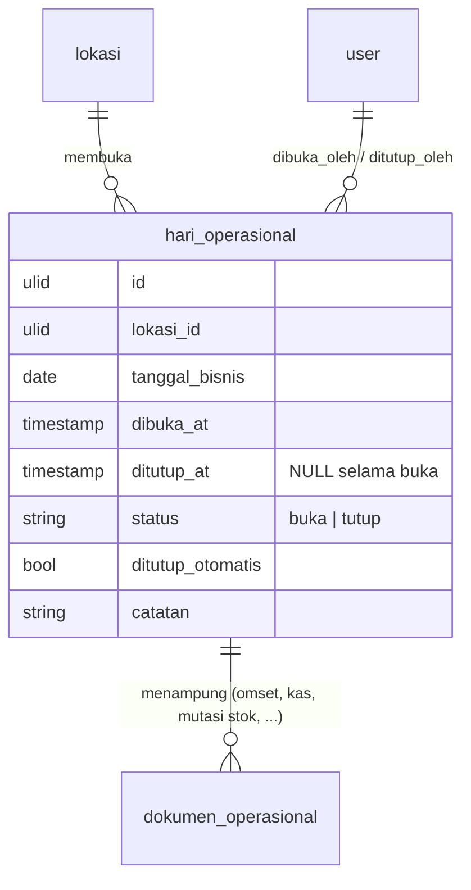

# Hari Operasional — rancangan v2

Jawaban owner Q6 (2026-10-02): pergantian hari harus **fleksibel**, seperti buka shift dan tutup shift yang dihitung sebagai satu sesi.
Status: **usulan**, menunggu L8–L10 di [`pertanyaan-owner.md`](pertanyaan-owner.md).

Nama yang dipakai **Hari Operasional**, bukan "Sesi" atau "Shift". Di `CONTEXT.md`, *Sesi* sudah berarti masa login seorang User, dan *Shift* sudah berarti jam kerja kru di Jadwal. Memakai salah satunya untuk hal ketiga akan membuat percakapan dan kode salah paham.

## Masalah hari ini

Venue tutup lewat tengah malam, tetapi semua sistem memotong hari di pukul 00.00:

- **POS (ESB)** mencatat bill pukul 01.00 di tanggal berikutnya. Modul Analytics terpaksa memecah omset malam ke dua tanggal (catatan Office 11 Sep 2026, Performa Talent).
- **Reservasi** melebarkan jendela tanggal ke hari sebelumnya untuk booking lewat tengah malam.
- **Absensi** berhenti menebak tanggal pulang, dan menghitung lama kerja dari selisih dua ketukan, setelah kru pagi yang pulang lewat tengah malam tercatat "pulang cepat 16 jam".
- **Input Omset** memilih tanggal dengan tangan, tanpa aturan yang sama dengan modul lain.

Jam potong tetap, misalnya 05.00, menyelesaikan sebagian besar kasus. Tetapi pada malam event yang selesai pukul 05.30, pada hari tutup lebih awal, atau saat ada outlet kedua dengan jam berbeda, satu angka tetap selalu salah di suatu malam.

## Rancangan

Setiap Lokasi membuka dan menutup harinya. Rentang di antara keduanya adalah satu Hari Operasional, dan semua yang terjadi di dalamnya milik tanggal bisnis yang sama.

### Aturan

1. **Satu yang buka per Lokasi.** Paling banyak satu Hari Operasional berstatus `buka` per Lokasi. Ini dijaga database lewat kolom bantu `lokasi_buka` (berisi `lokasi_id` saat buka, `NULL` saat tutup) dengan indeks unik.
2. **Tanggal bisnis ditetapkan saat buka.** Usulannya adalah tanggal WIB dari `dibuka_at`, dan yang membuka bisa menggesernya bila perlu. Tanggal itu unik per Lokasi: `UNIQUE (lokasi_id, tanggal_bisnis)`.
3. **Rentang tidak boleh tumpang tindih.** Hari baru hanya bisa dibuka kalau hari sebelumnya di Lokasi itu sudah tutup.
4. **Setiap kejadian dipetakan dari jamnya.** Bill POS, transaksi kas, mutasi stok, atau ketukan absen pada pukul *t* di Lokasi *L* milik Hari Operasional yang rentangnya `[dibuka_at, ditutup_at)` memuat *t*. Ini yang menyelesaikan masalah lewat tengah malam: bill pukul 01.30 otomatis jatuh ke malam sebelumnya, sampai hari itu benar-benar ditutup.
5. **Di luar rentang ada cadangan.** Kejadian saat tidak ada hari yang buka (sebelum buka, atau setelah tutup) memakai jam batas Lokasi (pengaturan, bawaan 05.00) dan diberi tanda `di_luar_jam`. Tanda ini membuat datanya tidak hilang dan bisa diperiksa.
6. **Lupa menutup.** Kalau hari belum ditutup sampai jam batas berikutnya, sistem menutupnya pada waktu kejadian terakhir yang tercatat dan menandai `ditutup_otomatis`. Membuka hari baru juga menawarkan penutupan hari yang tertinggal.
7. **Dokumen menyimpan hasilnya.** Setiap dokumen operasional menyimpan `tanggal_bisnis` (DATE) dan `hari_operasional_id` saat ditulis. Laporan tidak perlu menghitung ulang rentang. Kalau jam tutup dikoreksi belakangan, pemetaan ulang dijalankan sebagai tindakan admin yang tercatat, bukan diam-diam.
8. **Input manual tetap boleh memilih.** Layar seperti Input Omset Harian memilih tanggal bisnis dari Hari Operasional yang ada, tidak mengetik tanggal bebas.
9. **Membuka ulang hari yang sudah tutup** butuh Kewenangan (lihat [`akses.md`](akses.md)) dan alasan tertulis.

### Hubungan dengan yang lain

- **Shift kru (Jadwal) dan Absensi:** sebuah shift milik Hari Operasional tempat ia dimulai. Ini sejalan dengan cara Absensi sekarang menghitung lama kerja.
- **Tutup kasir di POS:** ESB kemungkinan sudah punya tutup shift kasir (L9). Kalau ya, jam buka dan tutup diambil dari ekspor ESB, dan kasir tidak mencatatnya dua kali. Hari Operasional tetap milik Laksamana karena dipakai juga oleh stok, kas, dan absensi.
- **Report Daily:** mengirim Report Daily bisa menjadi tombol "Tutup Hari" (L8).
- **Central Kitchen:** sebagai Lokasi sendiri, CK bisa membuka hari sendiri, atau memakai tanggal kalender saja kalau jam kerjanya tidak melewati tengah malam (L10).
- **Penyimpanan waktu:** instan disimpan UTC dan ditampilkan WIB (ADR-0007). `tanggal_bisnis` tidak pernah dihitung oleh klien.

## Pilihan yang ditolak

- **Tanggal kalender (pukul 00.00):** kondisi sekarang, sumber semua tambalan di atas.
- **Satu jam potong tetap saja:** benar hampir setiap malam, salah pada malam event panjang dan saat outlet kedua punya jam lain. Jam potong tetap dipakai, tetapi hanya sebagai cadangan (aturan 5).
- **Memakai shift kru sebagai hari:** shift tiap divisi berbeda dan saling tumpang tindih, sehingga tidak bisa menjadi satu batas untuk omset.
