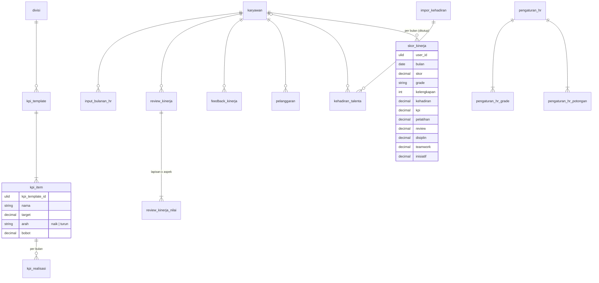

# Area: SDM — HR (People Score)

Status: **rancangan + migration** (`2026_10_07_200000_create_erp_hr_tables.php`), di atas area [Orang & Divisi](orang-divisi.md) (`karyawan`, `divisi`). Importer belum ditulis, karena butuh dump lama untuk diuji.

## Sumber di sistem lama (diperiksa 2026-10-06)

- `laksamana-office/hr-mysql` + `deploy/hr`: satu dokumen HR (`rev` tunggal) dipecah ke 23 koleksi blob. Data produksi ada di karyawan, divisi, template KPI, realisasi KPI, input bulanan, review, pelanggaran, career path, pengaturan, dan impor kehadiran Talenta (audit core, lampiran B). Badge, reward, coaching, OKR, mood, saran, suksesi, kompetensi, kalender: **kosong**.
- Bentuknya juga sudah dipetakan di migration `core` Tim A (`2026_09_26_190000`), yang dibekukan.

### People Score lama (dihitung di peramban, pindah ke service)

Per karyawan per bulan, tujuh komponen 0–100 dengan bobot di Pengaturan:

| Komponen | Sumber utama | Cadangan |
|---|---|---|
| Kehadiran | impor Talenta: kehadiran (kredit ÷ hari kerja) × 70% + ketepatan (1 − penalti telat ÷ hari kerja) × 30%; tidak dinilai bila tidak pernah tap sebulan | input bulanan manual |
| KPI | KPI divisi: tiap item capaian = realisasi ÷ target (atau target ÷ realisasi bila arahnya turun), dijepit 0–120, rata-rata berbobot | `kpiOverride` di input bulanan |
| Pelatihan | % materi wajib Akademi yang lulus | catatan pelatihan manual (kosong di produksi) |
| Review tamu | 80 + 5 × feedback positif − 10 × negatif | input bulanan |
| Disiplin | 100 − Σ potongan per tingkat pelanggaran (yang tidak dibatalkan) | — |
| Teamwork | review berlapis (self/manager/hr/ceo, berbobot), aspek Attitude + Communication, skala 1–10 × 10 | input bulanan |
| Inisiatif | review berlapis, aspek Initiative + Ownership | input bulanan |

Komponen kosong memakai nilai bawaan; **kelengkapan** = bobot komponen yang berdata ÷ total bobot. Di bawah 40% skor ditandai "data kurang" (tidak dipakai untuk ranking/promosi). Grade dari ambang di Pengaturan. Skor beberapa bulan dirata-rata berbobot hari kerja.

## Keputusan

| Hal | Keputusan |
|---|---|
| Karyawan, divisi | `karyawan`, `divisi` (area Orang & Divisi) |
| Pengaturan skor | `pengaturan_hr` berlaku-dari (bobot tujuh komponen, nilai bawaan, ambang kelengkapan, bobot lapisan review, bobot kehadiran) + `pengaturan_hr_grade` + `pengaturan_hr_potongan` (per tingkat pelanggaran) |
| KPI | `kpi_template` per Divisi (berlaku dari) + `kpi_item` (target, arah, bobot) + `kpi_realisasi` per item per bulan |
| Input bulanan | `input_bulanan_hr` per karyawan per bulan, satu kolom per komponen cadangan + `kpi_override` |
| Review | `review_kinerja` per karyawan per bulan + `review_kinerja_nilai` (lapisan × aspek, 1–10) |
| Feedback tamu | `feedback_kinerja` (positif/negatif) |
| Pelanggaran | `pelanggaran` (jenis, tingkat, SP, status aktif/dibatalkan) |
| Kehadiran Talenta | `impor_kehadiran` (per bulan, siapa/kapan) + `kehadiran_talenta` (karyawan × tanggal, status, jam, menit telat, kredit; baris asli sebagai JSON) |
| Skor yang sudah dipakai | `skor_kinerja` per karyawan per bulan: salinan hasil saat bulan ditutup (skor, grade, kelengkapan, tujuh komponen), supaya ranking/promosi tidak bergeser ketika data atau bobot berubah (ADR-0007, riwayat) |
| Pelatihan manual | **tidak**: Akademi sumbernya (`akademi.md`) |
| Koleksi kosong (badge, reward, coaching, OKR, mood, saran, suksesi, kompetensi, kalender) dan career path (3 baris) | **tidak dirancang** sampai dipakai; ketiga career path dilaporkan saat impor untuk diputuskan HR |

## ERD

### Aturan (langkah 7)

Dijaga database (diuji di `tests/Feature/Erp/HrSchemaTest.php`):

- Semua `bulan` adalah `DATE` hari pertama.
- Nilai komponen 0–100 (KPI realisasi bebas, skor KPI 0–120 dijepit service); nilai review 1–10; `arah IN ('naik','turun')`; bobot `>= 0`.
- Satu input bulanan, satu review, satu skor per karyawan per bulan; satu realisasi per item per bulan; satu nilai per review × lapisan × aspek.
- `review_kinerja_nilai.lapisan IN ('self','manager','hr','ceo')`.
- `feedback_kinerja.jenis IN ('positif','negatif')`; `pelanggaran.status IN ('aktif','dibatalkan')`.
- Pengaturan: ambang kelengkapan 0–100; grade unik per pengaturan.

Dijaga service: seluruh rumus People Score di atas; menutup bulan menulis `skor_kinerja` sekali.

### JSON (langkah 8)

| Kolom | Alasan |
|---|---|
| `kehadiran_talenta.baris_asli` | baris berkas Talenta apa adanya, untuk diperiksa ulang; angka yang dipakai skor sudah menjadi kolom |

## Pemetaan lama → v2

| Lama (`lakk5493_db_hr`) | v2 | Aturan impor |
|---|---|---|
| `employees` | `karyawan` | area Orang & Divisi |
| `divisions` | `divisi` | L4 |
| `kpi_templates` (`divId`, `items[]`) | `kpi_template` + `kpi_item` | `dir` `up`/`down` → `naik`/`turun` |
| `kpi_actuals` | `kpi_realisasi` | `bulan` teks → `DATE` |
| `monthly_inputs` | `input_bulanan_hr` | string kosong → `NULL` |
| `reviews` (`layers{L}.aspects{a}`) | `review_kinerja` + `review_kinerja_nilai` | |
| `feedbacks` | `feedback_kinerja` | |
| `violations` | `pelanggaran` | `Dibatalkan` → `dibatalkan` |
| `attendance_months` + `attendance_days` | `impor_kehadiran` + `kehadiran_talenta` | `talenta_id` → karyawan lewat `user.talenta_id` |
| `settings` (`scoreWeights`, `defaultComponentScore`, `grades`, `violationDeduct`, `reviewLayerWeights`) | `pengaturan_hr` + grade + potongan | berlaku dari `2000-01-01` |
| `audit` | — | log, tidak diimpor ke tabel bisnis |

## Belum dikerjakan

1. Importer `core:import erp-hr`. Butuh dump `hr`.
2. Service People Score; bandingkan per karyawan per bulan dengan layar HR lama.
3. Keputusan HR atas career path (3 baris) dan koleksi yang kosong.
