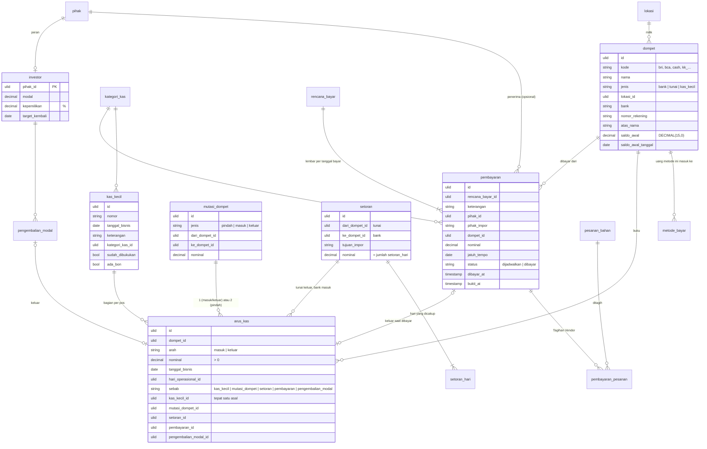

# Area: Kas

Status: **rancangan + migration + importer** (`2026_10_07_110000`; `core:import erp-kas` setelah `account` dan `erp-orang`, `app/Erp/Kas/Imports/KasImporter.php`, tes `KasImportTest`). Service saldo belum.
Dasar: ADR-0007, ADR-0008 (tanpa buku besar; uang di sini uang operasional), asumsi L6 dan L7 ([`pertanyaan-owner.md`](pertanyaan-owner.md) bagian D). Area ini juga menyelesaikan `rencana_bayar` / `tagihan_vendor` yang ditunda dari [`pembelian-persediaan.md`](pembelian-persediaan.md).

## Sumber di sistem lama (diperiksa 2026-10-06)

- `laksamana-office/finance-mysql/lib_finance_mysql.php`: Kas Kecil (relasional) dan Brankas (blob `bk_state`).
- `deploy/finance/kas/index.html`: Buku Kas, Input Transaksi, **Planning Pembayaran** (pindah dari Brankas 2 Sep 2026).
- `deploy/finance/brankas/index.html`: Saldo & Rekening, **Mutasi Wallet**, Pengembalian Modal.
- `kompas-mysql/lib_kompas_mysql.php`: `rekap_setoran` (setoran cash ke bank, 12 Agu dan 4 Sep 2026).

### Bentuk data lama

| Lama | Isi | Catatan |
|---|---|---|
| `kk_pos` | pos Kas Kecil (Kas Kecil, Pengajuan Pembayaran (PO), …) | saldo per pos = Σ debet − Σ kredit |
| `kk_kategori` | kategori transaksi | FK `SET NULL` dari `kk_trx` |
| `kk_trx` + `kk_trx_pos` | satu transaksi, dibagi ke beberapa pos (debet/kredit `BIGINT`); penanda `input` (**sudah masuk pembukuan**) dan `bon` (**bon sudah ada**) | penulis berupa nama teks |
| `bk_state.mutasi` | Mutasi Wallet: `pindah` (antar wadah), `masuk` (setor dari luar), `keluar` (tarik ke luar) | blob |
| `bk_state.bayar` | Planning Pembayaran: lembar per tanggal bayar, baris berisi keterangan, kategori, vendor (teks), dibayar dari wadah mana, nominal, status `scheduled`/`paid`, bukti `{ok, at, by}` | blob |
| `bk_state.investor` | investor: modal, kepemilikan %, target; `returns[]` = pengembalian modal `{date, amount, dari, by}` | blob |
| `bk_state.setting` | saldo awal per wadah, peta metode pembayaran → bank | blob |
| `kompas.rekap_setoran` | setoran: tanggal, tujuan (teks bank), hari yang dicakup + nominal per hari | blob Kompas |

Wadah uang di layar lama: BRI, Mandiri, BCA, UOB, dan Cash / Brankas Fisik (kode tetap di kode program).

### Aturan lama yang dipertahankan

1. **Saldo tidak pernah disimpan.** Kas Kecil dan Brankas sama-sama menghitungnya dari riwayat. Menyimpannya membuat dua sumber kebenaran.
2. **Saldo wadah** = saldo awal + omset diakui (Rekap Penjualan, per metode bayar yang dipetakan ke wadah) + setoran masuk + mutasi masuk − setoran keluar − mutasi keluar − pembayaran **yang sudah dibayar** − pengembalian modal.
3. **Pembayaran terjadwal tidak mengurangi saldo**; hanya yang `paid`.
4. **Mutasi `pindah` ke wadah yang sama ditolak.**
5. **Setoran** dihitung server dari cash hari yang dicakup, dan per hari **dijepit ke sisa cash** hari itu, jadi tidak bisa menyetor lebih dari yang ada.
6. **Metode bayar yang belum dipetakan ke wadah dilaporkan**, tidak dijatuhkan ke bank pertama.
7. **Pengembalian modal tanpa wadah asal** tidak mengurangi wadah mana pun dan dilaporkan.
8. **Bukti transfer menyimpan siapa dan kapan**, terpisah dari status dibayar.
9. **Vendor pembayaran diketik bebas** dan tidak ditimpa ke master; yang tidak dikenali ditandai.
10. Kategori yang **sudah dipakai** tidak bisa dihapus, hanya dinonaktifkan.

## Keputusan

| Hal | Keputusan | Alasan |
|---|---|---|
| Tempat uang | satu master **`dompet`**, `jenis` = `bank` / `tunai` / `kas_kecil` | wadah Brankas dan pos Kas Kecil sama-sama "tempat uang yang saldonya dihitung". Nama mengikuti audit core ("saldo dompet") dan istilah layar ("wallet") |
| Buku uang | **`arus_kas`**: satu baris = satu uang masuk/keluar di satu dompet, menunjuk tepat satu dokumen asal | pola yang sama dengan `mutasi_stok`; aturan 1 dan 2 menjadi satu `SUM` |
| Kas Kecil | dokumen `kas_kecil`; bagian per pos ditulis langsung sebagai `arus_kas` | `kk_trx_pos` tidak punya isi lain selain dompet + debet/kredit |
| Mutasi Wallet | dokumen `mutasi_dompet` | nama layar lama; `arus_kas` adalah bukunya |
| Planning Pembayaran | `rencana_bayar` (lembar per tanggal) + **`pembayaran`** (baris) | baris tidak selalu ke vendor (Gaji, Pajak, Sewa). Pembayaran ke Pihak vendor adalah **Tagihan Vendor** (`CONTEXT.md`), dan boleh menunjuk beberapa Pesanan Bahan (P4) lewat `pembayaran_pesanan` |
| Kategori | satu daftar **`kategori_kas`** untuk Kas Kecil dan Planning Pembayaran | lama: tabel `kk_kategori` + daftar tetap `BAYAR_KAT` di kode. Asumsi, belum ditanyakan ke owner |
| Investor | peran Pihak `investor` + dokumen `pengembalian_modal` | investor adalah pihak luar (`orang-divisi.md`) |
| Setoran | dokumen `setoran` + `setoran_hari` (nominal per hari dicakup) | aturan 5 |
| Metode bayar | master `metode_bayar` → `dompet` | aturan 6; omset per metode masuk dari area Penjualan harian |
| Saldo awal | kolom `dompet.saldo_awal` + `saldo_awal_tanggal` | lama: `bk_state.setting.awal` |
| Piutang (bon tamu) | **bukan** area ini | datanya di Kompas (`KP.piutang`); area Penjualan harian |
| Kwitansi / invoice (`inv_*`) | **bukan** area ini | dokumen penjualan (DP event); area Tamu & Penjualan |
| Akses Kas/Brankas (`kk_akses`, `bk_akses`, `*_peran`) | tabel Akses bersama ([`akses.md`](akses.md)) | matriksnya diimpor saat Modul pindah |

## ERD

Kolom teknis ADR-0007 tidak digambar. `lokasi`, `pihak`, `user`, `hari_operasional`, `pesanan_bahan` adalah tabel bersama.

### Saldo

`saldo(dompet, s.d. tanggal T)` = `saldo_awal` + Σ `arus_kas.nominal` masuk − Σ keluar, untuk `saldo_awal_tanggal ≤ tanggal_bisnis ≤ T`. Omset per metode bayar (aturan 2) ditambahkan oleh area Penjualan harian sebagai `sebab = omset` dengan FK ke dokumennya, tanpa mengubah tabel lain.

### Aturan (langkah 7)

Dijaga database (diuji di `tests/Feature/Erp/KasSchemaTest.php`):

- `dompet.jenis IN ('bank','tunai','kas_kecil')`; `kode` unik.
- `arus_kas`: `arah IN ('masuk','keluar')`, `nominal > 0`, tepat satu kolom asal terisi dan cocok dengan `sebab`. Satu dokumen tidak bisa menggerakkan uang dua kali: `(kas_kecil_id, dompet_id, arah)`, `(mutasi_dompet_id, arah)`, `(setoran_id, arah)`, `pembayaran_id`, `pengembalian_modal_id` unik.
- `mutasi_dompet`: bentuk menurut `jenis` (`pindah` = dua dompet berbeda; `masuk` = hanya tujuan; `keluar` = hanya asal), `nominal > 0`.
- `setoran`: `nominal > 0`; `setoran_hari` unik per hari, `nominal > 0`.
- `pembayaran`: `nominal > 0`; `status IN ('dijadwalkan','dibayar')`; `dibayar_at` terisi tepat saat `dibayar`.
- `rencana_bayar`: satu lembar per Lokasi per tanggal bayar.
- `investor.kepemilikan` antara 0 dan 100; `modal >= 0`.
- Semua FK `RESTRICT`, kecuali dari dokumen ke barisnya sendiri (`CASCADE`).

Dijaga service (belum ada service v2):

- Menulis `arus_kas` saat dokumen dibuat atau dibayar, dan menghapusnya saat dokumen dibatalkan (dokumennya tetap ada, dengan `dibatalkan_at`). Pola sama dengan check-in Pesanan Bahan.
- `setoran.nominal` = Σ `setoran_hari.nominal`, dan per hari tidak melebihi sisa cash hari itu (aturan 5). Butuh Laporan Harian dari area Penjualan harian.
- `setoran.dari_dompet_id` berjenis `tunai`, `ke_dompet_id` berjenis `bank`.
- Bukti transfer diisi `bukti_at` dan `bukti_oleh` bersamaan. Tidak bisa `CHECK`: MySQL melarang `CHECK` pada kolom FK ber-`SET NULL`, dan User yang dihapus memang mengosongkan `bukti_oleh`.
- Kategori yang sudah dipakai hanya bisa dinonaktifkan (aturan 10; `RESTRICT` sudah menolak hapus permanen).

### JSON (langkah 8)

Tidak ada. Seluruh blob `bk_state` menjadi tabel.

### Riwayat (langkah 9)

`arus_kas` adalah riwayatnya sendiri. Rekening tujuan vendor dibaca dari `pihak_rekening` saat transfer; kalau perlu dibuktikan kemudian, nomor rekening disalin ke `pembayaran` saat dibayar (belum dibuat, menunggu L7).

## Pemetaan lama → v2

| Lama | v2 | Aturan impor |
|---|---|---|
| wadah `bri`/`mandiri`/`bca`/`uob`/`cash` | `dompet` (`bank`/`tunai`), Lokasi Outlet | `kode` sama dengan kunci lama |
| `kk_pos` | `dompet` (`kas_kecil`), `kode` = `kk_<id>`, `legacy_id` = id | |
| `bk_state.setting.awal` | `dompet.saldo_awal` | tanggal awal = transaksi tertua dompet itu |
| `bk_state.setting` peta metode | `metode_bayar.dompet_id` | `kode` = kunci metode **Report Daily** (`PAYS`: cash, qris_esb, edc_bri, transfer_uob, compliment, voucher, error_*, …), karena Report Daily mencatat per metode itu; dompet dari peta lama, atau bawaan `MAP_BAWAAN` (QR Order, ojol, transfer → UOB). Compliment, voucher, error, member deposit tidak masuk dompet mana pun |
| `kk_kategori` + `BAYAR_KAT` | `kategori_kas` | nama sama digabung tanpa membedakan huruf besar-kecil |
| `kk_trx` | `kas_kecil` | `input` → `sudah_dibukukan`, `bon` → `ada_bon`, `dibuat_oleh` → User lewat pencocok nama (`orang-divisi.md`) |
| `kk_trx_pos` | `arus_kas` (`sebab = kas_kecil`) | debet → masuk, kredit → keluar; baris yang berisi keduanya menjadi dua baris |
| `bk_state.mutasi` | `mutasi_dompet` + `arus_kas` | `by` → pencocok nama |
| `bk_state.bayar` | `rencana_bayar` (per `batch`) + `pembayaran` | `paid` → `dibayar` + `arus_kas`; `bukti.at/by` → `bukti_at/oleh`; `vendor` → Pihak vendor lewat nama, sisanya `pihak_impor`; `dueDate` → `jatuh_tempo` |
| `bk_state.investor` | `pihak` + `investor` | `capital`, `ownership`, `targetDate` |
| `investor.returns[]` | `pengembalian_modal` + `arus_kas` | tanpa `dari` → `dompet_id` kosong, tanpa arus kas, dilaporkan (aturan 7) |
| `kompas.rekap_setoran` | `setoran` + `setoran_hari` + 2 `arus_kas` | `tujuan` → dompet bank lewat nama bank, sisanya `tujuan_impor` (aturan lama `bankDariTujuan`) |

## Hasil impor (salinan lokal produksi, 2026-10-06)

Data kas di produksi masih kecil: Kas Kecil 3 pos, 12 kategori, 3 transaksi; Brankas 0 Planning Pembayaran, 2 mutasi wallet, 1 investor dengan 9 pengembalian modal; Kompas 9 setoran (63 hari dicakup). Saldo awal dan peta metode di pengaturan Brankas kosong, jadi dipakai bawaan layar lama.

Semua total cocok dengan data lama sampai rupiah: Kas Kecil debet/kredit, setoran (keluar cash = masuk bank = jumlah per hari), pengembalian modal, mutasi wallet. Tidak ada kasus yang perlu diputuskan. Idempoten.

## Belum dikerjakan

1. ~~Importer `core:import erp-kas`~~: selesai.
2. Service saldo dan penulisan `arus_kas`, dengan tes yang membandingkan saldo per dompet dengan layar Brankas lama.
3. Area Penjualan harian: Laporan Harian, omset per metode bayar (`arus_kas.sebab = omset`), piutang bon tamu, dan pengecekan sisa cash untuk setoran.
