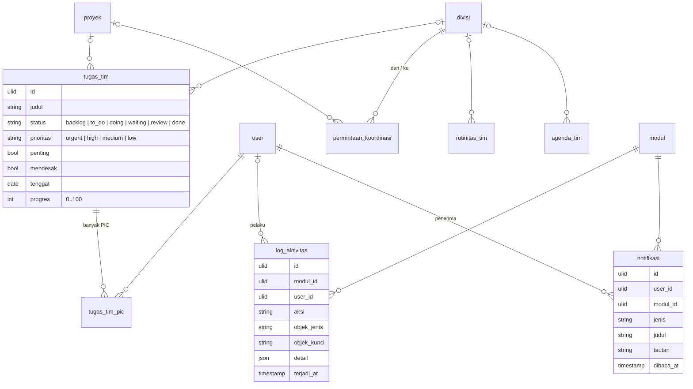

# Area: Kerja Tim, Log Aktivitas, Notifikasi

Status: **rancangan + migration + importer** (`2026_10_07_220000`; `core:import erp-kerja-tim` setelah `erp-po-proyek`, `app/Erp/Proyek/Imports/KerjaTimImporter.php`, tes `BdImportTest`).

Dua hal yang dipakai banyak Modul tetapi belum punya tempat:

1. **Alat kerja tim BD** (BD OS): tugas, rutinitas, permintaan koordinasi antar-divisi, agenda.
2. **Log aktivitas dan notifikasi**, yang di sistem lama ada di tiap Modul dengan bentuk sendiri: `marketing_aktivitas`, `marketing_notifikasi`, `konten_logs`, `konten_notifs`, `akademi_activity`, `reservasi_audit`, `hr_audit`, `stock_activity_log`.

## Sumber di sistem lama (diperiksa 2026-10-06)

- `bd-mysql` koleksi `tasks` (176 baris), `routines`, `coord_requests`, `agenda`; konstanta di `deploy/bd/index.html`.
- Log dan notifikasi Modul lain: audit core, lampiran B.

### Aturan lama yang dipertahankan

1. **Tugas**: Backlog → To Do → Doing → Waiting → Review → Done; prioritas Urgent/High/Medium/Low; penanda penting/mendesak (matriks Eisenhower); progres 0–100; boleh dipegang beberapa PIC; boleh menunjuk proyek.
2. **Permintaan koordinasi** dari satu divisi ke divisi lain: Diminta → Diproses → Review → Selesai, dengan peminta, penerima tugas, prioritas, tenggat, dan proyek.
3. **Rutinitas**: pekerjaan berulang dengan frekuensi, PIC, penting/mendesak, aktif.
4. **Log** mencatat siapa, kapan, aksi apa, terhadap apa, dan detailnya; **notifikasi** untuk seorang penerima, dengan tanda sudah dibaca.

## Keputusan

| Hal | Keputusan |
|---|---|
| Tugas | `tugas_tim` + `tugas_tim_pic` (banyak PIC); status, prioritas `CHECK` |
| Permintaan koordinasi | `permintaan_koordinasi` (dari/ke Divisi) |
| Rutinitas, agenda | `rutinitas_tim`, `agenda_tim` |
| Log | **satu** `log_aktivitas` untuk semua Modul: Modul, pelaku, aksi, jenis objek + kuncinya, detail JSON. `aktivitas_akademi` di area Akademi bisa dipindah ke sini saat Akademi dibangun |
| Rujukan objek di log | `objek_jenis` + `objek_kunci` (teks, ULID atau legacy id), **tanpa FK**: log menunjuk tabel apa pun, dan objek yang dihapus tidak boleh menghapus jejaknya. Satu-satunya pengecualian aturan "setiap rujukan adalah FK" (ADR-0007), dan namanya sengaja tidak berakhiran `_id` |
| Notifikasi | satu `notifikasi`: penerima (User), Modul, jenis, judul, isi, tautan, `dibaca_at` |

## ERD

### Aturan (langkah 7)

Dijaga database (diuji di `tests/Feature/Erp/KerjaTimSchemaTest.php`):

- Status dan prioritas tugas, status permintaan koordinasi `CHECK`; progres 0–100; satu PIC sekali per tugas.
- Permintaan koordinasi: divisi asal ≠ divisi tujuan.
- Log dan notifikasi tidak ikut terhapus bila objeknya dihapus (tanpa FK objek); notifikasi ikut terhapus bersama User penerimanya (`CASCADE`).

### JSON (langkah 8)

| Kolom | Alasan |
|---|---|
| `log_aktivitas.detail` | detail audit, tidak pernah difilter atau dijumlah (ADR-0007 menyebut detail audit sebagai contoh) |

## Pemetaan lama → v2

| Lama | v2 | Aturan impor |
|---|---|---|
| `bd.tasks` | `tugas_tim` + `tugas_tim_pic` | `pics[]` (atau `pic`) → User; `project` → `proyek`; `div` → Divisi |
| `bd.coord_requests` | `permintaan_koordinasi` | `fromDiv`/`toDiv` → Divisi; `by`/`to` → User |
| `bd.routines`, `bd.agenda` | `rutinitas_tim`, `agenda_tim` | |
| `marketing.activities`, `konten.logs`, `akademi.activity`, `reservasi.audit`, `hr.audit`, `stock.activity_log` | `log_aktivitas` | Modul dari asal tabel; `refType`/`refId` → `objek_jenis`/`objek_kunci` |
| `marketing.notifs`, `konten.notifs` | `notifikasi` | penerima lewat pencocok nama |

## Hasil impor (salinan lokal produksi, 2026-10-06)

- 205 tugas BD (220 PIC). Rutinitas, permintaan koordinasi, dan agenda kosong di produksi.
- Semua 4.296 log dari Marketing, Konten, Akademi, Reservasi, HR, dan Stock masuk ke `log_aktivitas`; 4.037 pelakunya cocok ke User, sisanya nama lama di `user_impor`. Idempoten.
- **Notifikasi tidak ada yang diimpor**: 16 notifikasi Marketing tidak menyimpan penerima, dan 172 notifikasi Konten adalah pengumuman ke semua kru (`for_user = all`). Tabel `notifikasi` per penerima; memecah pengumuman per orang berarti mengarang status "sudah dibaca". Keduanya dilaporkan.
- Dilaporkan: 7 tugas dengan divisi "Project" (tidak ada di daftar L4).

## Belum dikerjakan

1. ~~Importer `core:import erp-kerja-tim`~~: selesai (log semua Modul ikut).
2. Menulis log dari service v2 (satu helper, bukan per Modul).
