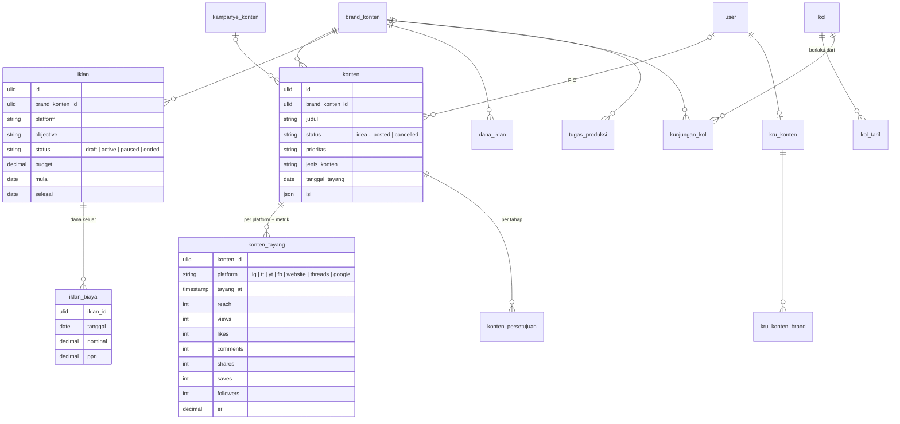

# Area: Modul pendukung — Konten

Status: **rancangan + migration** (`2026_10_07_210000_create_erp_konten_tables.php`), di atas area [Orang & Divisi](orang-divisi.md) (peran Pihak `kol`). Importer belum ditulis, karena butuh dump lama untuk diuji.

## Sumber di sistem lama (diperiksa 2026-10-06)

- `laksamana-office/konten-mysql` + `deploy/konten`: koleksi `brands`, `campaigns`, `content`, `ads`, `ad_funds`, `kols`, `visits`, `prod_tasks`, `bank`, `users`, `logs`, `notifs`, `assets`, `shootings`, pengaturan. Isi produksi (audit core lampiran B): brand 4, konten 59, iklan 114, dana iklan 29, KOL 38, kunjungan 4, tugas produksi 7, bank ide 1, kru 13. `assets` dan `shootings` kosong.

### Aturan lama yang dipertahankan

1. **Status konten**: Idea → Research → (Draft) → Script → Design → Shooting → Editing → Revision → Approval → Scheduled → Posted, atau Cancelled. Posted dan Cancelled masuk arsip.
2. **Satu konten tayang di beberapa platform** (IG, TikTok, YouTube, Facebook, Website, Threads, Google; nama panjang lama dipetakan ke kode), dengan **metrik per platform** (reach, views, likes, comments, shares, saves, followers, ER). Satu platform bisa dihapus metriknya sendiri (G-01, issue #177).
3. **Alur persetujuan** konten: Planner → Designer → Editor → Account Manager → Content Director → Publish.
4. **Iklan**: platform iklan, objective, status draft/aktif/dijeda/selesai, budget, spend; **PPN 11% dihitung otomatis pada dana keluar**.
5. **Dana iklan** dicatat per brand per tanggal.
6. **KOL** (KOL / Media Partner) dengan riwayat tarif; **kunjungan** KOL: direncanakan → terkonfirmasi → hadir/tidak hadir → selesai.
7. Kru Konten punya kapasitas, jam kerja, keahlian, dan brand yang dipegang.

## Keputusan

| Hal | Keputusan |
|---|---|
| Brand | `brand_konten`; angka KPI (target reach/followers) kolom; profil kreatif (tone, pilar, hashtag, audiens, warna) JSON `profil` |
| Konten | `konten` dengan status/prioritas `CHECK`; isi kreatif (hook, naskah, caption, shot list, referensi, checklist, komentar) JSON `isi` |
| Tayang per platform | `konten_tayang` (konten × platform, waktu tayang, URL, metrik sebagai kolom) |
| Persetujuan | `konten_persetujuan` per tahap |
| Kampanye | `kampanye_konten` |
| Iklan | `iklan` + `iklan_biaya` (dana keluar per tanggal, dengan PPN disimpan per baris) |
| Dana iklan | `dana_iklan` |
| KOL | Pihak + `kol` (area Orang & Divisi) + `kol_tarif` berlaku-dari; `kunjungan_kol` |
| Tugas produksi, bank ide | `tugas_produksi`, `ide_konten` |
| Kru | `user` + `penempatan_peran` (konten) + `kru_konten` (kapasitas, jam kerja, keahlian, tersedia) + `kru_konten_brand` |
| Aset, shooting (kosong), log, notifikasi | belum: aset/shooting dirancang saat dipakai; log dan notifikasi menjadi fitur bersama |

## ERD

### Aturan (langkah 7)

Dijaga database (diuji di `tests/Feature/Erp/KontenSchemaTest.php`):

- Status dan prioritas konten, platform tayang, tahap persetujuan, status iklan, status kunjungan, jenis KOL dibatasi `CHECK`.
- Satu baris tayang per konten × platform; metrik `>= 0`; ER 0–100.
- Uang `>= 0`; `iklan.selesai >= mulai`; satu tarif KOL per tanggal berlaku.
- Tayang, persetujuan ikut konten (`CASCADE`); biaya iklan ikut iklan.

Dijaga service: PPN 11% dihitung saat biaya iklan ditulis (aturan 4), status Posted mengisi waktu tayang, alur persetujuan berurutan.

### JSON (langkah 8)

| Kolom | Alasan |
|---|---|
| `brand_konten.profil` | tone, pilar, hashtag, audiens, warna: panduan kreatif yang dibaca utuh |
| `konten.isi` | hook, naskah, caption, shot list, referensi, checklist, komentar revisi: isi kreatif yang dibaca dan diedit utuh; semua angka dan status sudah kolom |
| `kru_konten.jam_kerja` | jadwal ketersediaan kru, dibaca utuh |

### Riwayat (langkah 9)

Tarif KOL berlaku-dari (`rateHistory` lama). PPN disimpan per baris biaya iklan, jadi perubahan tarif pajak tidak menulis ulang biaya lama.

## Pemetaan lama → v2

| Lama | v2 | Aturan impor |
|---|---|---|
| `brands` | `brand_konten` | `pic` → User (pencocok nama) |
| `campaigns` | `kampanye_konten` | |
| `content` | `konten` + `konten_tayang` + `konten_persetujuan` | `status` huruf kecil; `platforms[]` + `metrics{platform}` → baris tayang (nama panjang → kode, `PLATFORM_ALIAS`); `approvals` → persetujuan |
| `ads` + `expenses[]` | `iklan` + `iklan_biaya` | `spend` dibandingkan dengan Σ biaya, beda dilaporkan |
| `ad_funds` | `dana_iklan` | |
| `kols` (`rateHistory`) | `pihak` + `kol` + `kol_tarif` | `whatsapp`/`instagram`/`tiktok` → kontak Pihak |
| `visits` | `kunjungan_kol` | |
| `prod_tasks` | `tugas_produksi` | |
| `bank` | `ide_konten` | |
| `users` | `user` + `penempatan_peran` + `kru_konten` | `roles[]` → peran; `pin` dibuang (`orang-divisi.md`) |

## Belum dikerjakan

1. Importer `core:import erp-konten` (setelah `erp-orang`). Butuh dump `konten`.
2. Rumus performa konten (agregasi dashboard) di service.
3. Permintaan desain dari Marketing (#190) sebagai dokumen di sini.
