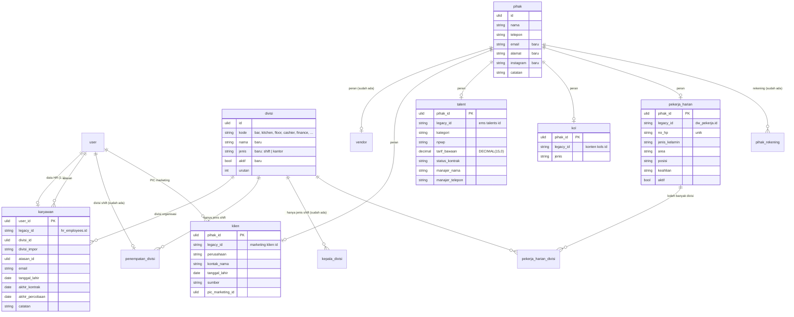

# Area: Orang & Divisi (master)

Status: **rancangan + migration + importer** (`2026_10_07_090000_create_erp_orang_divisi_tables.php`; `core:import erp-orang` setelah `core:import account`, `app/Erp/Master/Imports/OrangImporter.php`, tes `tests/Feature/Erp/OrangImportTest.php`).
Dasar: jawaban owner Q1 dan Q2, asumsi L4 dan L5 ([`pertanyaan-owner.md`](pertanyaan-owner.md) bagian D), ADR-0007, audit [`../db/audit-core.md`](../db/audit-core.md) temuan 7 dan 8.

Area ini dikerjakan sebelum area lain karena setiap dokumen merujuk orang: siapa yang mengajukan, menerima, dibayar, dinilai, atau menjadi PIC. Selama orang belum punya satu tempat, setiap area terpaksa menyimpan nama sebagai teks (`*_impor`).

## Masalah hari ini

Audit core mencatat **12 daftar orang** dan **3 daftar divisi**:

- Orang: `user` (identitas), `hr_employees`, `akademi_users`, `marketing_pengguna`, `marketing_staf`, `konten_users`, `bd_people`, `stock_users`, `stock_ordering_users`, `dw_pekerja`, `event_talents`, `ticketing_buyers`. Hanya `hr_employees.user_id` dan `bd_people.user_id` yang punya FK ke `user`.
- Divisi: `divisi` (empat divisi shift, identitas), `hr_divisions` (8), `akademi_divisions` (6). Jadwal memakai bar, kitchen, floor, cashier.
- Relasi lewat teks nama: `pic`, `oleh`, `byName`, `mktPIC`, `pic_name` di Stock, BD, Konten, Kompas, Reservasi, Event, dan Marketing.

## Temuan di kode lama (diperiksa 2026-10-06)

**Daftar kru per modul adalah salinan Roster Office.** Konten, Akademi, Ordering (Stock), BD, dan Cashier menarik kru yang punya Akses ke Modul itu lewat `listModuleRoster` (`account-mysql`). Kru dicocokkan lewat **id Office dulu, baru nama**:

- Konten: `id` kru diganti ke id Office (`deploy/konten/index.html`, `autoSyncOfficeRoster`).
- BD: `bd_people.officeUserId`.
- Marketing: `marketing_staf.officeId`.

Isi yang benar-benar milik modul hanyalah **peran di modul itu** (role) dan beberapa atribut kerja: skill/kapasitas/jam kerja di Konten, atasan di BD, `div` di Marketing/BD. PIN per modul di `stock_users`/`konten_users` adalah sisa sebelum login Office, dan tidak dipakai lagi oleh Sesi Office.

Jadi jawaban Q1 ("kru = User yang sama") terbukti di kode. v2 **tidak** membuat tabel orang per modul.

## Keputusan

| Hal | Keputusan | Sumber |
|---|---|---|
| Orang yang login | Selalu `user`. Daftar kru per modul tidak punya tabel sendiri | Q1 + temuan di atas |
| Peran di modul | `penempatan_peran` di [`akses.md`](akses.md), bukan kolom `role` per modul | Q1 (pengaturan di dalam modul) |
| Data HR seorang User | `karyawan`, 1:1 dengan `user` | baru; menggantikan `hr_employees` |
| Orang/organisasi di luar User | `pihak`, dengan tabel peran 1:1: `vendor` (sudah ada), `klien`, `talent`, `kol`, `pekerja_harian` | L5 + temuan 8 audit |
| Satu pihak, banyak peran | Boleh. Misalnya seorang talent yang juga vendor sound system | — |
| Buyer | Tetap akun publik sendiri (area Tamu), **bukan** `pihak` dan bukan `user` | `CONTEXT.md` Buyer |
| Divisi | Satu tabel `divisi` untuk semua modul, dengan `jenis` = `shift` atau `kantor` | Q2 + L4 |
| Divisi seorang User | Dua hubungan dengan arti berbeda: `penempatan_divisi` (shift di Jadwal, sudah ada) dan `karyawan.divisi_id` (tempat di organisasi, untuk HR, Akademi, KPI) | lihat "Kenapa dua" |

### Kenapa dua hubungan User → Divisi

Untuk kru shift keduanya hampir selalu sama (kru Bar ada di Divisi Bar). Untuk staf kantor berbeda: di Jadwal mereka **Nonshift** (`penempatan_divisi.divisi_id = NULL`), tetapi di HR mereka anggota Finance atau Marketing & Digital.

Kalau dilebur menjadi satu kolom, v1 Jadwal akan menerima kode divisi kantor yang tidak dikenalnya (`CoreAccountRepository` membaca `penempatan_divisi` dan mengembalikan `kode`-nya ke Jadwal). Jadi selama v1 hidup:

- `penempatan_divisi` dan `kepala_divisi` hanya menunjuk divisi `jenis = shift` (dijaga service).
- `karyawan.divisi_id` boleh menunjuk divisi jenis apa pun.

Setelah Jadwal pindah ke v2, area SDM boleh menilai ulang apakah keduanya bisa menjadi satu.

## ERD

Kolom teknis ADR-0007 (`created_*`, `updated_*`, `version`, `deleted_at`) tidak digambar. `user`, `divisi`, `penempatan_divisi`, `kepala_divisi` adalah tabel identitas yang sudah ada; `divisi` mendapat tiga kolom baru.

### Aturan (langkah 7)

Dijaga database (diuji di `tests/Feature/Erp/OrangDivisiSchemaTest.php`):

- `divisi.jenis IN ('shift','kantor')`.
- `karyawan.user_id` adalah PK sekaligus FK `RESTRICT` ke `user`: User yang punya data HR tidak bisa dihapus permanen. Ia dinonaktifkan (User Nonaktif), sesuai `CONTEXT.md`.
- Tabel peran memakai `pihak_id` sebagai PK, jadi satu Pihak paling banyak satu baris per peran.
- `pekerja_harian.no_hp` unik: Pekerja Harian dikenali dari nomor HP (`CONTEXT.md`).
- `talent.tarif_bawaan >= 0`, rupiah bulat (ADR-0007).
- Semua FK `RESTRICT`, kecuali `karyawan.atasan_id` dan `klien.pic_marketing_id` (`SET NULL`: hilangnya rujukan opsional tidak mengubah angka apa pun).

Dijaga service (belum ada service v2):

- `penempatan_divisi` dan `kepala_divisi` hanya menunjuk divisi `jenis = shift` selama v1 Jadwal masih dipakai.
- `karyawan.atasan_id` tidak boleh menunjuk dirinya sendiri, dan rantai atasan tidak boleh berputar.

### JSON (langkah 8)

Tidak ada kolom JSON di area ini.

### Riwayat (langkah 9)

- Tarif talent per tampil yang sudah dipakai dihitung di dokumen jadwal tampil (area Tamu), jadi `tarif_bawaan` boleh diubah di tempat.
- Tarif KOL (`rateHistory`) adalah riwayat. Ia masuk area Konten sebagai tabel berlaku-dari, tidak di sini.
- Perubahan divisi atau atasan karyawan belum perlu riwayat. Kalau HR butuh laporan "divisi per bulan", ini menjadi tabel `karyawan_divisi` berlaku-dari di area SDM.

## Daftar divisi (asumsi L4)

Kode shift tidak berubah, karena v1 memakainya. Kode kantor baru.

| kode | nama | jenis | dari HR (`hr_divisions`) | dari Akademi (`akademi_divisions`) |
|---|---|---|---|---|
| `bar` | Bar | shift | Bar | Galangan Bar |
| `kitchen` | Kitchen | shift | Kitchen | Galangan Dapur |
| `floor` | Floor | shift | Store/Service* | Service/FOH* |
| `cashier` | Cashier | shift | Store/Service* | Service/FOH* |
| `event` | Event | kantor | Event | Sales & Event |
| `finance` | Finance | kantor | Finance | Finance & Admin |
| `hr_ga_legal` | HR/GA/Legal | kantor | HR/GA/Legal | — |
| `marketing_digital` | Marketing & Digital | kantor | Marketing & Digital | Marketing & Digital |
| `management` | Management | kantor | Management | — |

\* Store/Service dan Service/FOH dipecah per orang: ke `floor` atau `cashier` menurut Penempatan Divisi orang itu. Kalau tidak ada, `karyawan.divisi_id` kosong dan nama lama disimpan di `divisi_impor`.

Materi Akademi untuk "Service/FOH" berlaku untuk dua divisi. Ini menjadi tabel banyak-ke-banyak `materi_divisi` di area Akademi, tidak di sini.

## Pemetaan daftar lama → v2

| Daftar lama | Menjadi | Kunci cocok | Yang tidak ikut |
|---|---|---|---|
| `user` (identitas) | `user`, tetap | — | — |
| `hr_employees` | `karyawan` | `user_id` (FK yang sudah ada); kalau kosong, `talentaId`, lalu nama | `role`, `level`, `status`, `joinDate`, `phone` dibandingkan dengan kolom Roster di `user`; kalau berbeda dilaporkan, `user` tetap sumber |
| `akademi_users` | `user` + `penempatan_peran` (akademi) | id Office, lalu nama | `division` → dipakai hanya untuk melaporkan beda dengan `karyawan.divisi_id` |
| `marketing_pengguna` | `user` + `penempatan_peran` (marketing) | `acc`, lalu nama | — |
| `marketing_staf` | `user` | `officeId`, lalu nama | baris tanpa User (sumber manual) dilaporkan |
| `konten_users` | `user` + `penempatan_peran` (konten) | id Office, lalu nama | `skills`, `capacity`, `workHours`, `brands`, `avail` → profil kerja di area Konten; `pin` dibuang |
| `bd_people` | `user` + `karyawan.atasan_id` (dari `boss`) | `officeUserId`, lalu nama | `div` → hanya pembanding; `role` → `penempatan_peran` (bd) |
| `stock_users`, `stock_ordering_users` | `user` + `penempatan_peran` (stock) | nama | `pin` dibuang; `keterangan` → pembanding Tim |
| Kasir/PIC Kompas (`cashiers`, `pics` di blob) | `user` | nama | — |
| `dw_pekerja` | `pihak` + `pekerja_harian` (+ `pekerja_harian_divisi`, `pihak_rekening` dari `bank`) | `no_hp` | `pin` → diputuskan di area SDM (absensi Pekerja Harian) |
| `event_talents` | `pihak` + `talent` (+ `pihak_rekening`) | id lama | `photo` → penyimpanan berkas; `default_fee` → `tarif_bawaan` |
| `marketing_klien` | `pihak` + `klien` | id lama | `nextFU`, `lastContact` → area Tamu (tindak lanjut); `mktPIC` → `pic_marketing_id` |
| `konten_kols` | `pihak` + `kol` | id lama | `rateImage`, `rateValue`, `rateHistory`, `categories` → area Konten |
| `ticketing_buyers` | tetap akun Buyer (area Tamu) | — | — |

### Nama sebagai rujukan

Di setiap importer v2, kolom lama yang berisi nama orang (`pic`, `oleh`, `byName`, `mktPIC`, `pic_name`, …) diselesaikan ke `user_id` lewat **satu** pencocok bersama, dengan urutan:

1. id Office (`user.legacy_id`)
2. `username`
3. `nama` atau `nama_tampilan`, tanpa membedakan huruf besar-kecil dan spasi

Kalau hasilnya nol atau lebih dari satu User, kolom FK dibiarkan kosong, nama lama disimpan di `*_impor`, dan kasusnya dicetak di akhir impor. Pola ini sama dengan importer Persediaan.

## Hasil impor (salinan lokal produksi, 2026-10-06)

- 52 Karyawan dari 53 baris HR: id HR = id Office untuk 51, sisanya lewat Talenta/nama; 1 tanpa User dilaporkan. 3 punya atasan (dari `bd.people.boss_id`), 3 punya divisi organisasi (HR hanya mengisi `div_id` untuk 3 orang).
- 29 Pekerja Harian (31 baris divisi), 17 Talent, 63 Klien (semua PIC Marketing cocok lewat id Office), 38 KOL; 147 Pihak, 44 rekening.
- Beda HR vs Roster dilaporkan (jabatan, tanggal bergabung); Roster tetap sumber.
- Divisi: data BD memakai **Business Development** dan **Purchasing**, yang tidak ada di daftar L4; keduanya ditambahkan sebagai divisi kantor (`business_development`, `purchasing`). Daftar lengkap di `OrangImporter::DIVISI`.
- Dijalankan dua kali tanpa perubahan (idempoten). Mengulang `core:import account` sesudahnya tidak menghapus divisi kantor.

## Belum dikerjakan

1. ~~Importer `core:import erp-orang`~~ dan ~~pencocok nama → User bersama~~ (`PencocokUser`): selesai. Pencocok juga dipakai importer area lain; `*_impor` di Persediaan bisa diisi ulang dengannya.
3. **`penempatan_peran` dan tabel Akses lain** ([`akses.md`](akses.md)), lalu peta peran lama per modul.
4. **`CONTEXT.md`:** istilah Pihak, Karyawan, Klien, Talent, KOL ditambahkan bersama rancangan ini; arti Divisi diperluas.
