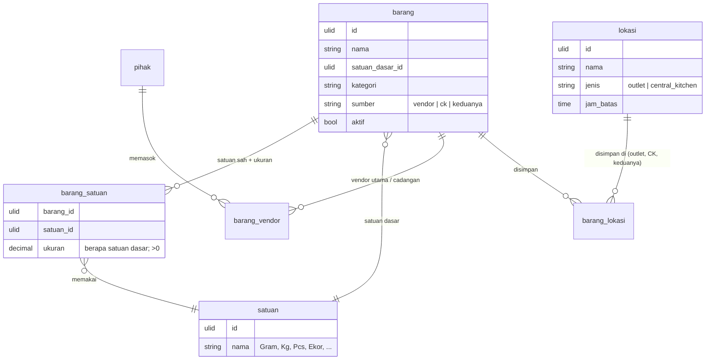
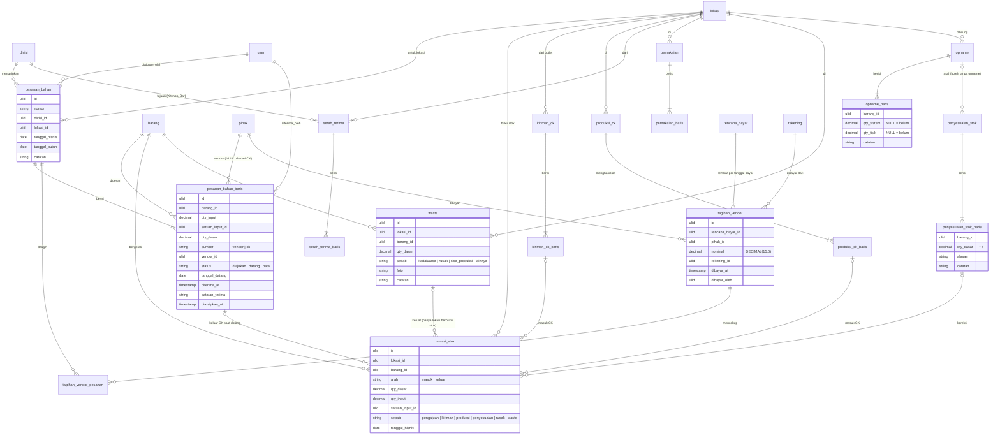

# Area: Pembelian & Persediaan

Status: **tabel master dan dokumen stok sudah jadi migration** (`2026_10_05_090000`, `_100000`, `_110000`; model di `app/Erp/Master` dan `app/Erp/Persediaan`). Pembayaran vendor (`rencana_bayar`, `tagihan_vendor`) pindah ke area Kas karena butuh master `rekening`. Pertanyaan yang belum dijawab owner memakai perilaku sistem lama (asumsi L1–L11 di [`pertanyaan-owner.md`](pertanyaan-owner.md) bagian D).
Istilah: `CONTEXT.md` bagian *Operations & stock*. Aturan tabel: ADR-0007.

## Yang sudah diputuskan

| Hal | Keputusan | Sumber |
|---|---|---|
| Katalog | Satu katalog **Barang** untuk Stock dan HPP | Q3 |
| Alur pembelian | Tetap dua alur terpisah: **Pesanan Bahan** (Stock, bahan baku) dan **PO Proyek** (BD) | Q4 |
| Beli tanpa pesanan | **Pembelian Langsung** adalah dokumen sendiri, bukan Pesanan Bahan | P1 |
| Persetujuan | Belum ada. Siklus dokumen tanpa langkah "disetujui"; nanti ditambah sebagai Kewenangan (`akses.md`) tanpa mengubah tabel | P5 |
| Tagihan | Satu **Tagihan Vendor** bisa untuk beberapa pesanan (N:M lewat baris tagihan) | P4 |
| Lokasi | Satu Outlet + Central Kitchen, stok masing-masing dihitung terpisah | P2 |
| Satuan | Diatur per Barang: satuan sah, **Satuan Dasar**, **Ukuran Satuan**. Stok selalu dalam Satuan Dasar, dikonversi sekali saat ditulis | P3 + cek Stock lama |
| Uang | Rupiah bulat `DECIMAL(15,0)`; harga per Satuan Dasar `DECIMAL(15,4)` | Q5, ADR-0007 |
| Akuntansi | Tidak dibangun; ESB yang memegang | P7, ADR-0008 |

## Master data (langkah 3, sudah jadi migration)

Tabel: `lokasi`, `satuan`, `pihak`, `pihak_rekening`, `vendor` (1:1 dengan pihak), `vendor_hari_tutup`, `kategori_barang`, `barang`, `barang_satuan`, `barang_vendor`, `barang_lokasi`, `barang_harga`. Aturan yang dijaga database (diuji di `tests/Feature/Erp/MasterBarangSchemaTest.php`): `CHECK` untuk jenis lokasi, sumber barang, ukuran > 0, qty beli > 0, hari 0–6; FK `RESTRICT`; satu vendor utama per barang (`urutan` 0); nama satuan unik tanpa peduli huruf besar-kecil; `harga_per_dasar` dihitung database. Diagram di bawah adalah rancangan awalnya.



- Ukuran Satuan disimpan sebagai riwayat (`berlaku_dari`). Mutasi yang sudah ditulis menyimpan qty dalam Satuan Dasar, jadi mengubah ukuran tidak menulis ulang masa lalu. Aturan ini sudah dipegang `lib_stock_ck.php`.
- `pihak` (vendor) dirancang bersama area SDM/orang; apakah Stock dan BD berbagi daftar vendor menunggu L5.
- Barang berkunci `id`, bukan nama. Di modul lama, `products` dan `vendors` berkunci nama dan `orders.item` merujuk lewat teks; pemetaan nama → id dibuat saat impor.

## Pemetaan Barang dari data lama (langkah 10, master saja)

Diperiksa 2026-10-05 di salinan lokal `lakk5493_db_stock`. Yang dicatat di sini hanya jumlah dan aturannya; daftar barisnya dibuat ulang di lokal dengan SQL di bawah, tidak disimpan di repo.

**Stock dan HPP sudah satu katalog (Q3 terbukti di data).** Ke-395 nama di `products` sama persis dengan ke-395 nama di `hpp_bahan`, karena HPP mengikuti nama Stock lewat `lib_hpp_nama.php`. Jadi setiap pasangan menjadi satu baris `barang`:

| Asal | Menjadi | Aturan impor |
|---|---|---|
| `products.nama` | `barang.nama` + `legacy_id` (nama) | kunci baru ULID; nama lama disimpan supaya bisa dipetakan |
| `products.data.satuan[]` | `barang_satuan` | satuan dinormalkan tanpa peduli huruf besar-kecil (`ML` = `Ml`) ke tabel `satuan` |
| `products.data.satuanDasar` | `barang.satuan_dasar_id` | dari Stock; kalau kosong (132 barang), pakai `hpp_bahan.satuan` |
| `products.data.isi` | `barang_satuan.ukuran` | hanya angka > 0 (aturan `pur_isi_normal` lama) |
| `products.data.packIsi/packSatuan` (CK) | `barang_satuan` satuan "Pack" | digabung dengan `isi`; `isi` menang kalau keduanya ada |
| `products.data.utama/cadangan` | `barang_vendor` (utama + cadangan) | vendor dari Stock; HPP hanya mengisi yang kosong |
| `products.data.sumber/diOutlet/area` | `barang_lokasi` + kategori | `ck` → CK saja, `both` → keduanya, lainnya → Outlet |
| `hpp_bahan.qty_beli/harga_beli` | `barang_harga` (riwayat, `berlaku_dari`) | harga per satuan dasar `DECIMAL(15,4)` = harga ÷ qty, dihitung saat impor |
| `hpp_bahan.sisi_harga`, `di_purchasing` | kolom di `barang` | arti persisnya dikonfirmasi saat merancang HPP |

**Importer:** `php artisan core:import erp-barang` (`app/Erp/Master/Imports/BarangImporter.php`), hanya ke MySQL lokal. Bisa dijalankan berulang: run kedua tidak mengubah baris atau `version`. Hasil di salinan lokal 2026-10-05: 395 barang, 22 satuan, 725 baris satuan barang (80 tanpa ukuran = satuan sah yang belum bisa dikonversi, perilaku lama), 50 vendor, 332 vendor-barang, 410 barang-lokasi, 366 harga beli. Kasus yang tidak ditebak dicetak di akhir perintah: kolomnya dibiarkan kosong sampai diputuskan.

**Yang harus diputuskan orang sebelum impor (bukan oleh kode):**

- **19 barang** punya Satuan Dasar berbeda antara Stock dan HPP. Contohnya, Stock menghitung Asam Jawa per Pcs sedangkan HPP per Gram, dan Chicken Wings per Gram di Stock tetapi per Pcs di HPP. Memilih salah satu secara otomatis akan membuat stok atau HPP salah hitung.
- **6 barang** punya vendor berbeda antara Stock dan HPP. 241 bahan HPP tidak mengisi vendor sama sekali.
- **22 nama barang (60 baris pesanan)** di `orders` tidak ada lagi di katalog. Sebagian karena barangnya diganti nama (misalnya "Minyak Goreng 18L" menjadi "Minyak Goreng (18L)"), sebagian karena dihapus. Impor butuh tabel alias nama lama → barang, yang diisi dan disetujui orang Purchasing.

**Temuan untuk rancangan dokumen:** pesanan lama (`orders`, 2.618 baris, 31 Des 2025 – 23 Sep 2026) **tidak menyimpan vendor sama sekali**. Vendor hanya ada di master barang, sehingga riwayat "dulu dibeli dari siapa" hilang setiap kali vendor utama diganti. Di v2, Pesanan Bahan menyimpan vendornya sendiri di dokumen (aturan riwayat ADR-0007).

SQL untuk membuat daftar periksa di MySQL lokal (jangan di dev atau production):

```sql
USE lakk5493_db_stock;
-- Satuan Dasar beda antara Stock dan HPP
SELECT p.nama, JSON_UNQUOTE(JSON_EXTRACT(p.data,'$.satuanDasar')) stock, h.satuan hpp
FROM products p JOIN hpp_bahan h ON h.nama = p.nama
WHERE IFNULL(JSON_UNQUOTE(JSON_EXTRACT(p.data,'$.satuanDasar')),'') <> ''
  AND LOWER(h.satuan) <> LOWER(JSON_UNQUOTE(JSON_EXTRACT(p.data,'$.satuanDasar')));
-- vendor beda
SELECT h.nama, JSON_UNQUOTE(JSON_EXTRACT(p.data,'$.utama')) stock, h.vendor hpp
FROM products p JOIN hpp_bahan h ON h.nama = p.nama
WHERE h.vendor <> '' AND LOWER(h.vendor) <> LOWER(IFNULL(JSON_UNQUOTE(JSON_EXTRACT(p.data,'$.utama')),''));
-- nama di pesanan yang tidak ada di katalog
SELECT item, COUNT(*) baris, MAX(LEFT(waktu,10)) terakhir
FROM orders WHERE item NOT IN (SELECT nama FROM products) GROUP BY item ORDER BY baris DESC;
```

## Opname & Penyesuaian Stok (cara mencatat, diserahkan ke Tim B)

Owner: opname belum dipakai (layar Daily Stock Opname lama ada, 0 baris). Arahnya, setiap Head boleh memutuskan koreksi. Usulan pencatatannya:

1. **Opname** (dokumen per Lokasi per Hari Operasional): siapa menghitung, kapan, dan per Barang qty **sistem** (dipotret saat mulai), qty **fisik**, serta catatan. Qty yang belum dihitung disimpan `NULL`, berbeda dari `0`; aturan ini sudah ada di `opname.php` lama. Selisih tidak disimpan, selalu dihitung fisik − sistem. Status: `draf` → `selesai`.
2. **Penyesuaian Stok** (dokumen terpisah, merujuk satu Opname): dibuat oleh User yang punya Kewenangan `stok.koreksi` untuk Lokasi itu (Head, L11). Setiap baris berisi Barang, qty penyesuaian (+/−), dan **alasan wajib** yang dipilih dari daftar (rusak, kedaluwarsa, salah catat, hilang, lainnya) ditambah catatan bebas. Status: `draf` → `disahkan`. Setelah disahkan, dokumen tidak bisa diubah, dan koreksi atasnya dibuat dengan penyesuaian baru.
3. Mutasi stok dari penyesuaian ditulis sebagai baris mutasi biasa yang menunjuk dokumen penyesuaiannya. Saldo tetap `SUM(masuk) − SUM(keluar)`, tidak pernah disimpan, sesuai aturan CK lama.
4. Kalau nanti owner menetapkan batas nilai (L11), penyesuaian di atas batas mendapat status `menunggu` sebelum `disahkan`. Itu menambah satu nilai status, bukan tabel baru.

Dengan pola ini, setiap selisih punya jejak siapa memutuskan, kenapa, dan opname mana asalnya, tanpa mengubah riwayat mutasi.

## Alur lama yang diikuti

Diperiksa di `laksamana-office/stock-mysql` dan `finance-mysql` (2026-10-05):

1. **Pengajuan bahan.** Kru suatu divisi (Kitchen, Bar, Floor, Office) mengajukan barang lewat Ordering, dikelompokkan dalam satu *batch* (185 batch, 2.618 baris). Setiap baris adalah satu barang, dengan qty, satuan, dan tanggal butuh.
2. **Diproses Purchasing.** Barang ber-`sumber` vendor dipesan ke vendor utamanya, sedangkan barang CK dipenuhi Central Kitchen. Vendor **tidak** tercatat di baris pesanan.
3. **Check-in kedatangan.** Baris ditandai Datang, beserta tanggal terima dan catatan terima. Status baris hanya Aktif atau Arsip.
4. **Buku stok hanya ada untuk Central Kitchen** (`ck_stock`). Isinya produksi (masuk), kiriman balik dari outlet (masuk), pengajuan outlet yang datang (keluar, otomatis saat check-in), penyesuaian (+/−), dan rusak. Saldo selalu dihitung dari jumlah mutasi, tidak pernah disimpan.
5. **Outlet tidak punya saldo stok** (tabel `stock` kosong). Yang dicatat adalah peristiwanya:
   - Serah Terima ke Kitchen/Bar (dengan foto)
   - Pemakaian per acara (RND, Prasmanan)
   - Waste (Kadaluarsa, Rusak, Sisa Produksi, Lainnya, dengan foto)
6. **Pembayaran vendor** lewat Planning Pembayaran: satu lembar per tanggal bayar, baris per vendor, dikelompokkan per rekening pembayar, dengan bukti bayar (siapa dan kapan). Rekening penerima dibaca dari Daftar Kontak Vendor.
7. **Pembelian langsung** keluar dari Kas Kecil sebagai transaksi berkategori, tanpa efek ke stok.

v2 mempertahankan alur ini apa adanya, termasuk "outlet belum punya saldo". Perubahannya ada di bentuk data: semua rujukan menjadi FK, vendor tercatat di dokumen, qty dalam Satuan Dasar, dan setiap mutasi menunjuk dokumen asalnya.

## ERD dokumen

Sudah menjadi migration `2026_10_05_110000_create_erp_persediaan_tables.php`, dengan beberapa perbedaan dari diagram di bawah:
- `rencana_bayar`, `tagihan_vendor`, dan `tagihan_vendor_pesanan` ditunda ke area Kas, dan di sana menjadi `rencana_bayar`, `pembayaran`, `pembayaran_pesanan`, dengan `dompet` sebagai rekening pembayar ([`kas.md`](kas.md)).
- Setiap dokumen punya `nomor` unik, `tanggal_bisnis`, `hari_operasional_id` (nullable: CK memakai tanggal kalender, L10), dan pembatalan `dibatalkan_at`/`dibatalkan_oleh` (kecuali Pesanan Bahan, yang dibatalkan per baris, serta Opname dan Penyesuaian yang memakai status).
- Teks lama yang tidak cocok dengan baris mana pun disimpan di kolom `*_impor` (misalnya `diajukan_oleh_impor`); v2 tidak pernah menulisnya.
- Aturan yang dijaga database (diuji di `tests/Feature/Erp/PersediaanSchemaTest.php`): satu Hari Operasional terbuka per Lokasi; mutasi tepat satu asal yang cocok dengan `sebab`, dan satu baris asal hanya sekali menggerakkan stok; baris dari CK tanpa vendor; qty > 0; penyesuaian `disahkan` wajib `disahkan_at` dan qty ≠ 0.

Master `barang`, `satuan`, `barang_satuan`, `barang_vendor`, `barang_lokasi` ada di bagian Master data di atas. `pihak`, `lokasi`, `divisi`, `user`, dan `hari_operasional` adalah tabel bersama. Kolom teknis ADR-0007 (`created_*`, `updated_*`, `version`) tidak digambar.



### Aturan (langkah 5 dan 7)

- **Pesanan Bahan:** setiap baris punya statusnya sendiri: `diajukan` → `datang`, atau `batal`. Ini persis perilaku lama, di mana check-in dilakukan per barang. Diarsipkan adalah penanda waktu (`diarsipkan_at`), bukan status, karena Arsip lama hanya menyembunyikan baris dari daftar aktif.
- **Vendor ditulis ke baris saat diproses,** diambil dari vendor utama barang saat itu. Mengganti vendor utama tidak mengubah pesanan lama.
- **Barang CK** (`sumber = ck`): saat baris berstatus `datang`, satu `mutasi_stok` keluar ditulis di lokasi CK. Membatalkan check-in menghapus mutasi itu. Aturan ini sama dengan `pur_ck_sinkron_order` lama: mutasi dari pengajuan hanya berubah lewat check-in.
- **Mutasi menunjuk tepat satu asal.** Satu kolom FK nullable per jenis dokumen, ditambah `CHECK` bahwa tepat satu terisi, sesuai `sebab`. Produksi CK dan penyesuaian, yang di sistem lama berupa baris langsung di buku, di v2 mendapat dokumen kecil, supaya selalu ada "siapa, kapan, kenapa".
- **Buku stok per Lokasi:** hari ini hanya CK yang punya buku stok (L1, perilaku lama). Serah Terima, Pemakaian, dan Waste outlet tetap dokumen tanpa mutasi. Karena setiap barisnya sudah berisi Barang dan qty Satuan Dasar, menyalakan buku stok outlet nanti cukup dengan mulai menulis mutasi, tanpa mengubah tabel.
- **Saldo** = `SUM(masuk) − SUM(keluar)` per lokasi per barang. Tidak pernah disimpan. Sistem lama tidak menolak saldo negatif, dan v2 juga tidak; layar menandainya.
- **Tidak ada yang dihapus permanen.** Di sistem lama Serah Terima, Pemakaian, dan Waste bisa diubah dan dihapus. v2 tetap membolehkan mengubah, tetapi menghapus menjadi pembatalan (`dibatalkan_at` + `dibatalkan_oleh`) sesuai ADR-0007, sehingga laporan bulan lalu tidak berubah diam-diam.
- **Tagihan Vendor** adalah baris di Planning Pembayaran (L7). Satu tagihan boleh menunjuk beberapa Pesanan Bahan lewat `tagihan_vendor_pesanan` (P4). Nominal tidak dihitung dari pesanan, karena di sistem lama nilainya diketik dari nota vendor. `rekening` (rekening pembayar) adalah master milik area Kas.
- **Tidak ada langkah persetujuan** (P5). Kalau nanti diperlukan, status `diajukan` dipecah menjadi `diajukan` → `disetujui` dan Kewenangan `pembelian.setujui` ditambahkan.

### Di luar area ini

- **Pembelian Langsung:** area Kas (Kas Kecil), tanpa efek stok (L6).
- **PO Proyek (BD):** area sendiri. Berbagi `pihak` vendor (L5), tetapi tidak berbagi dokumen (Q4).
- **HPP dan resep:** area sendiri. Memakai `barang` dan `barang_harga` dari sini.

## Pemetaan tabel lama → v2 (dokumen)

**Importer:** `php artisan core:import erp-persediaan` (`app/Erp/Persediaan/Imports/PersediaanImporter.php`), dijalankan **setelah** `erp-barang`, hanya ke MySQL lokal. Bisa diulang tanpa mengubah baris atau `version`. Hasil di salinan lokal 2026-10-06: 908 pesanan, 2.617 dari 2.618 baris pesanan (1 qty 0 dilewati), 207 mutasi CK (= semua baris `ck_stock`), 48 kiriman, 1 produksi, 5 penyesuaian, 32 serah terima, 4 pemakaian, 13 waste. Saldo CK per barang hasil impor sama persis dengan hitungan lama (diuji). Yang dilaporkan untuk diputuskan orang: 25 nama barang lama dibuat sebagai barang nonaktif, 149 pasangan barang+satuan tanpa ukuran (`qty_dasar` kosong), 1 batch dengan dua pengaju, 37 foto yang masih di database lama (belum dipindah ke penyimpanan berkas). Vendor pesanan lama tidak diisi, karena sistem lama tidak pernah mencatatnya.

| Lama (`lakk5493_db_stock`) | v2 | Catatan |
|---|---|---|
| `orders` (per baris), `batch_id`/`batch_name` | `pesanan_bahan` (per batch) + `pesanan_bahan_baris` | 724 baris pra-batch (tanpa `batch_id`) menjadi satu pesanan per `nomor_order`; nama barang lewat tabel alias (22 nama lama) |
| `orders.status` Aktif/Arsip, `kedatangan` Datang | `pesanan_bahan_baris.status`, `diarsipkan_at` | Datang → `datang`; 195 baris Arsip tanpa Datang → `batal` atau tetap `diajukan` + arsip (diputuskan saat impor) |
| `orders.tim` (teks, termasuk "Floor, FOH") | `pesanan_bahan.divisi_id` | lewat pemetaan divisi L4; nilai ganda diambil yang pertama |
| `ck_stock` | `mutasi_stok` (lokasi CK) + dokumen asal | `ref` → FK ke baris pesanan; `produksi`/`penyesuaian` lama menjadi dokumen impor dengan catatan "impor" |
| `serah_terima` | `serah_terima` + `_baris` | `tujuan` teks → divisi; `penerima` teks tetap teks bila tidak cocok dengan User |
| `usage_events` | `pemakaian` + `_baris` | `jenis` (RND, Prasmanan) menjadi kolom ber-`CHECK` |
| `waste` | `waste` | foto base64 di DB dipindah ke penyimpanan berkas |
| `opname` (0 baris) | `opname` + `_baris` | tidak ada yang diimpor |
| `vendors` | `pihak` (peran vendor) + rekening penerima | `tutupHari`, `perluJadwalJemput` menjadi kolom |
| `finance.bk_state.bayar` | `rencana_bayar` + `tagihan_vendor` | lembar per tanggal; bukti `{ok,at,by}` → `dibayar_at`, `dibayar_oleh` |
