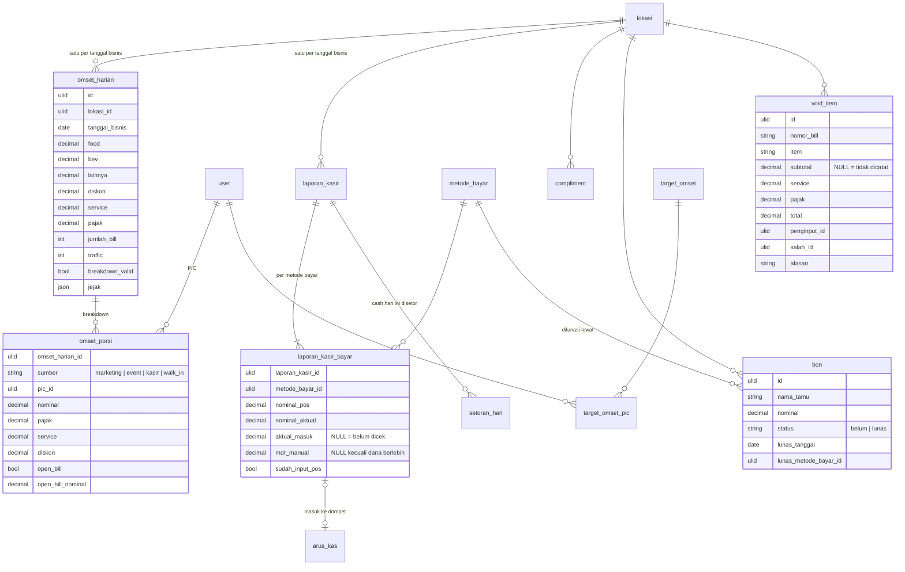

# Area: Penjualan Harian

Status: **rancangan + migration** (`2026_10_07_130000_create_erp_penjualan_harian_tables.php`). Dibangun di atas area [Kas](kas.md) (`metode_bayar`, `dompet`, `arus_kas`, `setoran`). Importer belum ditulis, karena butuh dump lama untuk diuji.
Dasar: ADR-0007, ADR-0008 (ESB adalah POS dan sumber bill; Laksamana mencocokkan, tidak menjadi POS kedua), [`hari-operasional.md`](hari-operasional.md).

## Sumber di sistem lama (diperiksa 2026-10-06)

- `laksamana-office/kompas-mysql/lib_kompas_mysql.php` (blob `app_state` + tabel `void_log`, `void_setting`).
- `deploy/finance/omset/index.html`: **Input Omset Harian** + Breakdown, **Report Daily** (kasir), Compliment, **Piutang** (bon tamu), Void.
- `deploy/finance/kas/index.html`: **Rekap Penjualan** (aktual masuk, MDR, penanda Input POS, setoran).

### Bentuk data lama

| Lama (di blob `app_state` kecuali disebut) | Isi |
|---|---|
| `daily[]` | per tanggal: food, bev, lainnya, discount, service_charge, tax, traffic, bill, qty_food/bev/others; `bd` = breakdown sumber omset (`marketing[]`, `event[]`, `kasir[]` per PIC, `self` walk-in); `bdValid`; `log` = jejak siapa mengisi |
| `reports{tgl}` | Report Daily kasir: per metode bayar `pos` dan `actual`; dari Rekap Penjualan: `aktual` masuk rekening, `mdrManual`, penanda `esb` (sudah diinput ke POS), `setor` |
| `compliments[]` | tanggal, nama tamu, alasan, nominal, PIC (+ id Office + divisi), dicatat oleh |
| `piutang[]` | bon tamu: tanggal, nama, nominal, status, pelunasan (tanggal, metode bayar, oleh) |
| `employees{divi}[]` | daftar PIC per sumber (marketing, kasir, event) + target per PIC |
| `settings` | target bulanan perusahaan, hari kerja |
| tabel `void_log` | void: tanggal, nomor bill, item, subtotal/service/tax (sejak 17 Sep 2026), total, penginput, yang salah, alasan, pembatalan |
| tabel `void_setting` | persen pajak (10%) dan service (5%) untuk void |

### Aturan lama yang dipertahankan

1. **Tiga angka penjualan, ketiganya sah:** net = food + bev + lainnya − diskon (Dashboard Omset); tagihan = net + service + pajak (Rekap Penjualan); net sales = tagihan − compliment (Laporan CFO). Compliment adalah metode bayar di Report Daily, jadi ia ada di dalam tagihan.
2. **Pendapatan tidak boleh kosong**, diskon tidak boleh melebihi pendapatan, traffic ≥ jumlah bill, tidak ada angka negatif.
3. **Report Daily mencatat dua angka per metode bayar**: POS (mesin) dan actual (uang yang ada). Selisih per metode, bukan total, karena lebih di satu metode bisa menutupi kurang di metode lain.
4. **Aktual masuk disimpan, MDR dihitung** (21 Agu 2026): MDR = actual − aktual masuk. Kosong ≠ nol: kosong berarti belum dicek, nol berarti tidak ada uang masuk. **MDR diketik hanya bila dana berlebih** (aktual masuk > actual, 26 Agu 2026), dan tidak boleh negatif.
5. **Open Bill dihitung hanya bila centangnya hidup**; angkanya tidak dinolkan saat centang dicabut.
6. **Porsi PIC** = omset + pajak + service + open bill dari baris breakdown PIC itu. Dicocokkan lewat id Office dulu, baru nama.
7. **Bon** muncul sebagai selisih Report Daily sampai dilunasi; pelunasan dicatat dengan tanggal dan metode bayar, dan muncul di Report Daily tanggal pelunasannya. Beberapa bon satu orang boleh dilunasi bersama.
8. **Void:** total = subtotal + service + pajak; pajak = 10% × subtotal (bukan subtotal + service); service 5% × subtotal. Baris sebelum 17 Sep 2026 tidak punya rincian: itu "tidak dicatat", bukan nol.
9. **Jejak menumpuk**: setiap kali Input Omset atau Report Daily disimpan, nama dan waktu penyimpan ditambahkan, tidak ditimpa (insiden pajak Rp2.514 23 Agu 2026).
10. Hari yang hanya punya compliment tetap menjadi hari (tergambar minus); tidak dibuang.

## Keputusan

| Hal | Keputusan | Alasan |
|---|---|---|
| Satu hari penjualan | `omset_harian` per Lokasi per `tanggal_bisnis` (+ Hari Operasional) | aturan 1–2; kolom bertipe, bukan blob |
| Breakdown | `omset_porsi`: satu baris per sumber (marketing, event, kasir, walk-in) dan PIC | aturan 5–6; PIC menjadi FK `user` |
| Report Daily | `laporan_kasir` + `laporan_kasir_bayar` per Metode Bayar | aturan 3–4; `aktual_masuk` dan `mdr_manual` boleh `NULL` dengan arti sendiri |
| Uang masuk dompet | `arus_kas.sebab = omset` menunjuk `laporan_kasir_bayar` | aturan 2 di `kas.md`: saldo dompet sekarang satu `SUM` |
| Setoran ↔ hari | `setoran_hari.laporan_kasir_id` | pengecekan sisa cash per hari membaca Report Daily |
| Jejak | kolom `JSON` `jejak` (daftar `{user_id, nama, at}`) | aturan 9; ADR-0007 membolehkan JSON untuk detail audit yang tidak difilter atau dijumlah |
| Compliment, Bon, Void | dokumen sendiri, dibatalkan (bukan dihapus) | lama: dihapus dari blob |
| Target | `target_omset` berlaku-dari + `target_omset_pic` | target menentukan bonus bulan lalu; tidak boleh ditimpa (ADR-0007) |
| Pajak & service void | `pengaturan_penjualan` berlaku-dari | aturan 8 |
| Impor bill/menu ESB | belum (lihat Belum dikerjakan) | layar Analytics mengurai ekspor di peramban; tidak ada tabel lama untuk dipetakan |
| Mutasi BRI + pencocokan DP | **bukan** area ini | DP reservasi/event: area Tamu |
| Rokok (`rokok`, `rokok_items`) | belum dirancang | perlu dicek apakah titipan atau stok |

## ERD

Kolom teknis ADR-0007 tidak digambar. `lokasi`, `hari_operasional`, `user`, `divisi`, `metode_bayar`, `dompet`, `arus_kas`, `setoran_hari` adalah tabel area lain.

### Aturan (langkah 7)

Dijaga database (diuji di `tests/Feature/Erp/PenjualanHarianSchemaTest.php`):

- `omset_harian`: semua uang `>= 0`; food + bev + lainnya `> 0`; diskon `<=` food + bev + lainnya; traffic `>=` jumlah bill; satu per `(lokasi_id, tanggal_bisnis)`.
- `omset_porsi`: `sumber IN ('marketing','event','kasir','walk_in')`; uang `>= 0`; angka open bill hanya bila `open_bill` hidup **atau** tetap tersimpan (aturan 5), jadi tidak di-`CHECK`.
- `laporan_kasir`: satu per `(lokasi_id, tanggal_bisnis)`. `laporan_kasir_bayar`: satu per metode; uang `>= 0`; `mdr_manual` `NULL` atau `>= 0`.
- `arus_kas`: `sebab` ditambah `omset` dengan FK `laporan_kasir_bayar_id`, unik; arah selalu `masuk`.
- `bon`: `status IN ('belum','lunas')`; `lunas` ⇔ `lunas_tanggal` dan `lunas_metode_bayar_id` terisi; `nominal > 0`.
- `compliment.nominal > 0`; `void_item.total > 0`; rincian void lengkap atau kosong sama sekali.
- `target_omset`: satu per `(lokasi_id, berlaku_dari)`; `target_omset_pic` satu per User per peran.
- `pengaturan_penjualan`: persen antara 0 dan 100, satu per `berlaku_dari`.

Dijaga service:

- `arus_kas` untuk `omset` ditulis dari `laporan_kasir_bayar`: ke `metode_bayar.dompet_id`, sebesar `aktual_masuk` (metode bank) atau `nominal_aktual` (cash). Metode yang belum dipetakan tidak menulis arus kas dan dilaporkan (aturan 6 `kas.md`).
- Setoran per hari ≤ cash aktual hari itu − yang sudah disetor (aturan 5 `kas.md`).
- Total void = subtotal + service + pajak dengan persen dari `pengaturan_penjualan` yang berlaku.
- Jejak hanya ditambah, tidak pernah ditulis ulang.

### JSON (langkah 8)

| Kolom | Isi | Alasan boleh JSON |
|---|---|---|
| `omset_harian.jejak`, `laporan_kasir.jejak` | daftar `{user_id, nama, at}` setiap kali disimpan | detail audit, tidak pernah difilter, dijumlah, atau di-join |

### Riwayat (langkah 9)

Target dan persen pajak/service void berlaku-dari. Porsi PIC disimpan per hari di `omset_porsi`, jadi bonus bulan lalu tidak bergeser saat PIC berganti divisi.

## Pemetaan lama → v2

| Lama | v2 | Aturan impor |
|---|---|---|
| `daily[]` | `omset_harian` (Lokasi Outlet) | dua baris di tanggal yang sama dijumlahkan seperti `kp_peta_harian`, dan dilaporkan; `log` → `jejak` |
| `daily[].bd.marketing/event/kasir[]` | `omset_porsi` | `picId` → `employees{divi}[].officeUserId` → User; sisanya nama; tidak cocok → `pic_impor` |
| `daily[].bd.self` | `omset_porsi` `walk_in` | |
| `reports{tgl}.pay{k}` | `laporan_kasir` + `laporan_kasir_bayar` | `k` → `metode_bayar.kode`; kunci warisan `bri`/`mandiri`/`bca` (sebelum 12 Agu 2026) → metode `edc_*` dan dilaporkan |
| `reports{tgl}.aktual`, `mdrManual`, `esb` | kolom `laporan_kasir_bayar` | string kosong lama sudah dihapus dari blob, jadi tidak ada = `NULL` |
| `reports{tgl}.mdr` (sebelum 21 Agu 2026) | `aktual_masuk` = actual − mdr | jalur lama yang masih dibaca layar |
| `compliments[]` | `compliment` | `picOfficeId` → User; `picDiv` → Divisi |
| `piutang[]` | `bon` | `lunasPayKey` → `metode_bayar`; `lunasBy` → pencocok nama |
| `void_log` | `void_item` | rincian 0 sebelum 17 Sep 2026 → `NULL`; `batal_*` → `dibatalkan_*` |
| `void_setting` | `pengaturan_penjualan` | berlaku dari `2000-01-01` |
| `settings` + `employees{divi}[].target` | `target_omset` + `target_omset_pic` | berlaku dari `2000-01-01` |

## Belum dikerjakan

1. Importer `core:import erp-penjualan` (setelah `erp-kas` dan `erp-orang`). Butuh dump `kompas`.
2. Service tiga angka penjualan, porsi PIC, MDR, dan selisih Report Daily, dibandingkan dengan layar lama per hari.
3. **Impor ESB** (ADR-0008): tabel `pos_bill` dan `pos_penjualan_menu` berkunci nomor bill / kode menu ESB, diisi dari ekspor Bill Report dan Menu Report di server. Tanggal bisnisnya diambil dari Hari Operasional yang memuat jam bill. Dirancang setelah contoh berkas ekspor tersedia.
4. Rokok.
