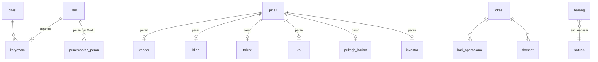

# Peta `core` ERP v2

Satu halaman untuk melihat seluruh rancangan ERP (ADR-0006): area apa saja, tabel mana yang dipakai bersama, bagaimana area saling merujuk, dan urutan merge PR yang masih bertumpuk. Rincian tiap area ada di dokumen areanya; aturan tabel di ADR-0007.

Status per 2026-10-07: semua area di bawah (#209–#223) sudah punya rancangan, migration, model, dan tes skema. **Importer dan service belum**, karena butuh dump database lama.

## Area dan tabelnya

| Area | Dokumen | Tabel | PR |
|---|---|---|---|
| Identitas (tetap) | `docs/db/identity.md` | `user`, `modul`, `izin_akses`, `larangan`, `admin_modul`, `divisi`, `divisi_kata`, `kepala_divisi`, `penempatan_divisi` | sudah di `main` |
| Master Barang & Lokasi | [pembelian-persediaan.md](pembelian-persediaan.md) | `lokasi`, `satuan`, `pihak`, `pihak_rekening`, `vendor`, `vendor_hari_tutup`, `kategori_barang`, `barang`, `barang_satuan`, `barang_vendor`, `barang_lokasi`, `barang_harga` | `main` |
| Persediaan + Hari Operasional | [pembelian-persediaan.md](pembelian-persediaan.md), [hari-operasional.md](hari-operasional.md) | `hari_operasional`, `pesanan_bahan` (+ baris), `mutasi_stok`, `kiriman_ck`, `produksi_ck`, `serah_terima`, `pemakaian`, `waste`, `opname`, `penyesuaian_stok` (+ baris) | `main` |
| Orang & Divisi | [orang-divisi.md](orang-divisi.md) | `karyawan`, `pekerja_harian` (+ divisi), `klien`, `talent`, `kol`; kolom baru di `divisi`, `pihak` | #209 |
| Resep & HPP | [resep-hpp.md](resep-hpp.md) | `resep`, `resep_baris`, `resep_harga`, `pengaturan_hpp`, `kontrol_bahan` (+ baris); kolom baru di `satuan`, `barang` | #210 |
| Kas | [kas.md](kas.md) | `dompet`, `metode_bayar`, `kategori_kas`, `arus_kas`, `kas_kecil`, `mutasi_dompet`, `setoran` (+ hari), `rencana_bayar`, `pembayaran` (+ pesanan), `investor`, `pengembalian_modal` | #211 |
| Akses di dalam Modul | [akses.md](akses.md) | `halaman`, `peran`, `kewenangan`, `peran_halaman`, `peran_kewenangan`, `penempatan_peran` | #212 |
| Penjualan Harian | [penjualan-harian.md](penjualan-harian.md) | `omset_harian`, `omset_porsi`, `laporan_kasir` (+ bayar), `compliment`, `bon`, `void_item`, `pengaturan_penjualan`, `target_omset` (+ PIC); `arus_kas.sebab = omset` | #213 (di atas #211) |
| Proyek & PO Proyek | [po-proyek.md](po-proyek.md) | `proyek` (+ PIC), `pengajuan_pembelian` (+ penyetuju), `po_proyek` | #214 |
| Tamu — Reservasi | [reservasi.md](reservasi.md) | `meja`, `kategori_reservasi`, `sumber_info`, `reservasi` (+ kedatangan, tindak lanjut, DP), `daftar_tunggu` | #215 (di atas #211) |
| Tamu — Event & Tiket | [event-tiket.md](event-tiket.md) | `event_ide`, `event` (+ vendor, sponsor), `kelas_tiket`, `kursi`, `kursi_tahan`, `buyer` (+ sesi, reset), `pesanan_tiket` (+ baris), `tiket`, `checkin_tiket`, `refund_tiket`, `jadwal_talent`, `aturan_jadwal_talent`, `pembayaran_talent` | #216 (di atas #209) |
| SDM — Jadwal, Absensi, DW | [sdm.md](sdm.md) | `shift`, `jadwal_kru`, `shift_bawaan`, `pengajuan_jadwal`, `lokasi_absen`, `wajah_terdaftar`, `ketukan_absen`, `posisi_dw`, `tarif_posisi_dw`, `permintaan_dw`, `penugasan_dw`, `pembayaran_dw`, pengaturan ×3 | #217 (di atas #209) |
| SDM — Akademi | [akademi.md](akademi.md) | `materi` (+ divisi), `program_belajar`, `program_materi`, `progres_materi`, `progres_program`, `aktivitas_akademi`, `pengaturan_akademi` | #218 (di atas #209) |
| Tamu — Acara Marketing | [acara-marketing.md](acara-marketing.md) | `acara` (+ rincian, pembayaran, persetujuan, tugas), `template_tugas_acara`, `tindak_lanjut_klien` | #219 (di atas #209 + #211) |
| SDM — HR | [hr.md](hr.md) | `pengaturan_hr` (+ grade, potongan), `kpi_template`, `kpi_item`, `kpi_realisasi`, `input_bulanan_hr`, `review_kinerja` (+ nilai), `feedback_kinerja`, `pelanggaran`, `impor_kehadiran`, `kehadiran_talenta`, `skor_kinerja` | #220 (di atas #209) |
| Konten | [konten.md](konten.md) | `brand_konten`, `kampanye_konten`, `konten` (+ tayang, persetujuan), `iklan` (+ biaya), `dana_iklan`, `kol_tarif`, `kunjungan_kol`, `tugas_produksi`, `ide_konten`, `kru_konten` (+ brand) | #221 (di atas #209) |
| Kerja Tim, Log, Notifikasi | [kerja-tim.md](kerja-tim.md) | `tugas_tim` (+ PIC), `permintaan_koordinasi`, `rutinitas_tim`, `agenda_tim`, `log_aktivitas`, `notifikasi` | #223 (di atas #214) |

## Tabel bersama dan siapa yang merujuknya

Inilah tulang punggung `core`. Setiap area hanya merujuk ke sini dan ke dirinya sendiri, kecuali hubungan antar-area yang disebut di bagian berikutnya.

| Tabel bersama | Dirujuk oleh |
|---|---|
| `user` | hampir semua dokumen: pencatat, PIC, penyetuju (kolom teknis ADR-0007 + kolom bisnis) |
| `divisi` | karyawan, penempatan/kepala divisi, permintaan DW, posisi DW, KPI, materi Akademi, proyek, PO proyek, compliment, tugas acara |
| `lokasi` | dompet, Hari Operasional, semua dokumen stok/uang/penjualan, meja, event, lokasi absen, acara |
| `hari_operasional` | dokumen stok, kas kecil, setoran, arus kas, Report Daily, Omset Harian, compliment, bon, void, ketukan absen |
| `pihak` (+ peran) | vendor (Persediaan, PO Proyek, Planning Pembayaran), klien (Acara), talent (Event), KOL (Konten), pekerja harian (SDM), investor (Kas) |
| `barang`, `satuan` | Persediaan, Resep, Kontrol Bahan Baku, PO Proyek (opsional) |
| `metode_bayar`, `dompet` | Report Daily, bon, DP reservasi, pembayaran acara |

## Hubungan antar-area

| Dari | Ke | Lewat |
|---|---|---|
| Kas `pembayaran_pesanan` | Persediaan `pesanan_bahan` | Tagihan Vendor mencakup beberapa Pesanan Bahan |
| Penjualan Harian `laporan_kasir_bayar` | Kas `arus_kas` | omset per metode bayar masuk ke dompet |
| Kas `setoran_hari` | Penjualan Harian `laporan_kasir` | cash hari itu yang disetor |
| Resep `resep.barang_id` | Master `barang` | base CK yang dipesan outlet |
| Event `jadwal_talent` | Master `talent` | |
| SDM `ketukan_absen`, `penugasan_dw` | Master `pekerja_harian` | |
| HR `*` | Master `karyawan` | |
| Acara `acara.klien_id` | Master `klien` | |

Hubungan yang **direncanakan** tetapi belum dibuat (dicatat di "Belum dikerjakan" area masing-masing): pembayaran tiket, DP reservasi, pembayaran acara, pembayaran talent, transfer DW, dan realisasi PO Proyek ke `arus_kas`; DP ↔ mutasi bank; impor bill/menu ESB.

## Urutan merge PR

PR bertumpuk otomatis dipindah base-nya ke `main` oleh GitHub setelah PR dasarnya di-merge dan branch-nya dihapus.

1. #209 Orang & Divisi, #210 Resep & HPP, #211 Kas, #212 Akses, #214 PO Proyek, #222 peta ini (semuanya langsung di atas `main`, boleh urutan apa pun).
2. Setelah #211: #213 Penjualan Harian, #215 Reservasi.
3. Setelah #209: #216 Event & Tiket, #217 SDM, #218 Akademi, #220 HR, #221 Konten.
4. Setelah #214: #223 Kerja Tim.
5. Setelah #209 **dan** #211: #219 Acara Marketing (ia memuat merge branch Kas; diff-nya mengecil sendiri begitu #211 masuk).

`CONTEXT.md` dan `docs/erp/README.md` disentuh hampir semua PR (baris istilah dan status). Konflik di sana selalu berupa dua penambahan di tempat yang sama: simpan keduanya.

## Verifikasi

Semua branch di atas digabung di satu worktree lokal dan diuji di Docker MariaDB 10.11 (versi produksi) dan MySQL 8.4: `migrate` → `migrate:rollback --step=1` → `migrate`, lalu semua tes skema `tests/Feature/Erp/*SchemaTest.php`. Hasil per putaran dicatat sebagai komentar di PR. Temuan yang sudah diperbaiki: kolom generated yang ditolak MariaDB (#208), nama index > 64 karakter (#214), dan `CHECK ... IN` yang tidak membedakan huruf besar-kecil di `utf8mb4_unicode_ci` (dicatat di README "Aturan kerja").

## Yang dibuang setelah semua area pindah

Tabel `core` per-modul yang dibekukan (`jadwal_*`, `dw_*`, `abs_*`, `marketing_*`, `konten_*`, `akademi_*`, `hr_*`, `bd_*`, `event_*`, `ticketing_*`, `hlife_*`, `reservasi_*`, `finance_*`, `kompas_*`, `stock_*`) dihapus oleh satu migration setelah area penggantinya ada di `main` dan Modul-nya pindah ke v2 (ADR-0006). Tidak ada data yang hilang: data modul tidak pernah dipindah ke tabel itu, dan importer v2 membaca database lama.

## Belum ada area

| Modul lama | Kenapa |
|---|---|
| Howandi Life (`hlife`) | audit core: di luar ERP (catatan pribadi pemilik: bisnis, aset, target, keuangan pribadi). Usul: tetap di database lamanya; perlu konfirmasi owner |
| Investor (`investor/`, laporan Kompas) | baca-saja dari area Penjualan Harian dan Kas |
| Analytics, Radar | layar baca-saja di atas area lain + impor ESB |
| VIP Marketing, rokok Kompas, aset & shooting Konten | bentuknya perlu dicek / tabel lama kosong |
