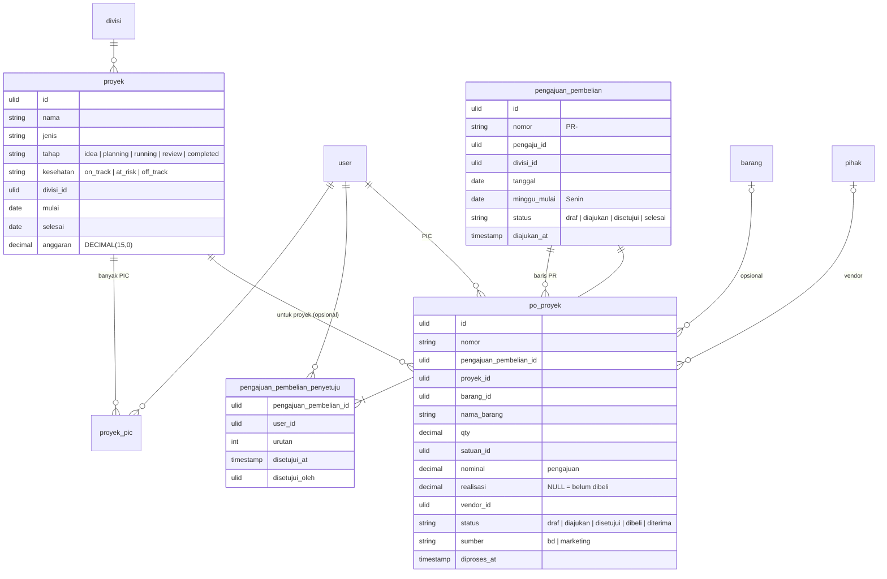

# Area: Proyek & PO Proyek (BD)

Status: **rancangan + migration + importer** (`2026_10_07_140000`; `core:import erp-po-proyek` setelah `erp-orang` dan `erp-barang`, `app/Erp/Proyek/Imports/PoProyekImporter.php` + `BdPeople`, tes `BdImportTest`).
Dasar: Q4 (Pesanan Bahan dan PO Proyek tetap dua alur), L5 (satu daftar vendor, asumsi), P5 (persetujuan belum ada di Pesanan Bahan; **di BD sudah ada**, lihat di bawah), ADR-0007.

## Sumber di sistem lama (diperiksa 2026-10-06)

- `laksamana-office/bd-mysql/lib_bd_mysql.php`: koleksi `projects`, `purchase_orders` (baris PO), `purchase_requests` (lembar PR mingguan), `people`, `tasks`, `routines`, `coord_requests`, `agenda`. Semua isi di `data` JSON; kolom SQL hanya cuplikan.
- `deploy/bd/index.html`: papan Purchasing, lembar PR, Proyek.
- Masuk dari modul lain: `tambah_po` (Marketing mengirim permintaan pembelian ke papan Purchasing BD) dan `set_realisasi` (Kas Kecil menulis nominal belanja ke baris PO).

### Alur lama

1. Baris **PO** dibuat di papan Purchasing BD atau dikirim Marketing. Isinya barang (teks), qty, satuan, nominal pengajuan, vendor (teks), divisi, PIC, tanggal butuh, proyek (opsional).
2. Baris-baris PO yang belum ikut lembar dikumpulkan menjadi **PR mingguan** (`PR-<no>`, minggu mulai Senin). PR dibuat `Draft`, lalu "Kunci & ajukan".
3. **Persetujuan PR**: daftar penyetuju adalah orang tertentu (dulu kunci `finance`/`ceo`/`head`, sekarang id orang), masing-masing mencatat nama, waktu, dan siapa yang menekan.
4. Status PO: `Draft` → `Diajukan` → `Approved` → `Dibeli` → `Diterima`. Status PR: `Draft` → `Diajukan` → `Disetujui` → `Selesai`.
5. **Realisasi**: nominal yang benar-benar dibelanjakan, ditulis dari Kas Kecil. String kosong = belum dibeli, berbeda dari nol (dibeli seharga nol). Realisasi juga menandai "sudah diproses" dan memindahkan status ke `Diterima`; menghapusnya mengembalikan status sebelumnya.
6. Cara bayar (CASH/ONLINE/CREDIT) dihapus atas permintaan tim; tidak diimpor.

## Keputusan

| Hal | Keputusan | Alasan |
|---|---|---|
| PO Proyek ≠ Pesanan Bahan | tabel sendiri `po_proyek` | Q4 |
| Barang | `barang_id` **opsional** + `nama_barang` wajib | BD membeli banyak hal di luar katalog bahan (dekorasi, sewa, perlengkapan event) |
| Vendor | FK `pihak` (L5: daftar vendor bersama), teks lama di `vendor_impor` | L5 |
| PR mingguan | `pengajuan_pembelian` + `pengajuan_pembelian_penyetuju` | persetujuan per orang dengan jejak siapa/kapan (alur 3) |
| Realisasi | kolom `realisasi` `NULL` = belum dibeli | alur 5; nol tetap bermakna |
| "Sudah diproses" | `diproses_at` / `diproses_oleh` | menggantikan `proses` + `statusSebelum`; status sebelumnya tidak perlu disimpan karena status bisa dibaca dari `disetujui_at`/`dibeli_at` |
| Asal | `sumber` = `bd` / `marketing` | `tambah_po` lama |
| Proyek | `proyek` + `proyek_pic` (banyak PIC) | `pics[]` lama |
| Anggaran terpakai | dihitung = Σ realisasi PO proyek, tidak disimpan | `spent` lama diketik; saat impor dibandingkan dan bedanya dilaporkan |
| Tugas, rutinitas, permintaan koordinasi, agenda | **bukan** area ini | area Modul pendukung |

## ERD

Kolom teknis ADR-0007 tidak digambar. `user`, `divisi`, `pihak`, `barang`, `satuan`, `lokasi` adalah tabel bersama.

### Aturan (langkah 7)

Dijaga database (diuji di `tests/Feature/Erp/PoProyekSchemaTest.php`):

- `proyek.tahap`, `proyek.kesehatan`, `pengajuan_pembelian.status`, `po_proyek.status`, `po_proyek.sumber` dibatasi `CHECK` ke nilai di atas.
- `proyek.selesai >= mulai` bila keduanya diisi; `anggaran >= 0`.
- `pengajuan_pembelian.minggu_mulai` selalu Senin; `status <> 'draf'` ⇔ `diajukan_at` terisi.
- Penyetuju: satu orang sekali per PR, `urutan` unik per PR.
- `po_proyek`: `nominal >= 0`, `realisasi` `NULL` atau `>= 0`, `qty > 0` bila diisi; selalu menyebut Lokasi (ADR-0007; impor: Outlet).
- Semua FK `RESTRICT`; penyetuju ikut terhapus bersama PR (`CASCADE`); PO tidak ikut terhapus bersama PR atau proyek.

Dijaga service:

- PR hanya `disetujui` setelah semua penyetuju mengisi `disetujui_at`.
- Realisasi diisi → `diproses_at` terisi dan status `diterima`; realisasi dikosongkan → keduanya kembali (alur 5).
- PO di PR yang sudah diajukan tidak boleh diubah nominalnya.

### JSON (langkah 8)

Tidak ada.

### Riwayat (langkah 9)

PO menyimpan nominal pengajuan dan realisasinya sendiri, jadi tidak ada nilai yang dibaca ulang dari master.

## Pemetaan lama → v2

| Lama (`lakk5493_db_bd`) | v2 | Aturan impor |
|---|---|---|
| `projects` | `proyek` + `proyek_pic` | `stage` → `tahap` huruf kecil; `pics[]` (atau `pic`) → User lewat `bd_people.officeUserId`, lalu nama; `div` → Divisi (`orang-divisi.md`), sisanya `divisi_impor`; `spent` dibandingkan dengan Σ realisasi |
| `purchase_requests` | `pengajuan_pembelian` | `no` → `nomor` `PR-<no>`; `nama` → pengaju; `approvals{id orang}` → penyetuju; kunci lama `finance`/`ceo`/`head` dipetakan seperti `migrasiApprovals` |
| `purchase_orders` | `po_proyek` | `item` → `nama_barang` (+ `barang_id` bila nama sama dengan Barang); `vendor` → Pihak lewat nama, sisanya `vendor_impor`; `Approved` → `disetujui`; `realisasi` `''` → `NULL`; `proses`/`prosesAt`/`prosesBy` → `diproses_*`; `byName` → pengaju; PO dari Marketing → `sumber = marketing` |
| `payment` | — | dihapus tim (alur 6) |

## Hasil impor (salinan lokal produksi, 2026-10-06)

- 36 proyek (49 PIC), 12 PR (36 penyetuju, semua tertaut ke User), 104 PO. Total pengajuan 142.068.508 dan realisasi 87.446.000 sama dengan data lama. Idempoten.
- Semua PIC, penyetuju, dan pengaju BD dirujuk lewat `bd.people.id` → `officeUserId` (`BdPeople`).
- Dilaporkan: 1 divisi tidak dikenal (divisi "Project" milik BD, tidak ada di daftar L4).

## Belum dikerjakan

1. ~~Importer `core:import erp-po-proyek`~~: selesai.
2. Tautan realisasi ke Kas Kecil (`arus_kas`/`kas_kecil` dari `kas.md`): kolom `kas_kecil_id` di `po_proyek` ditambahkan setelah area Kas di-merge.
3. Tugas, rutinitas, permintaan koordinasi, agenda: area Modul pendukung.
