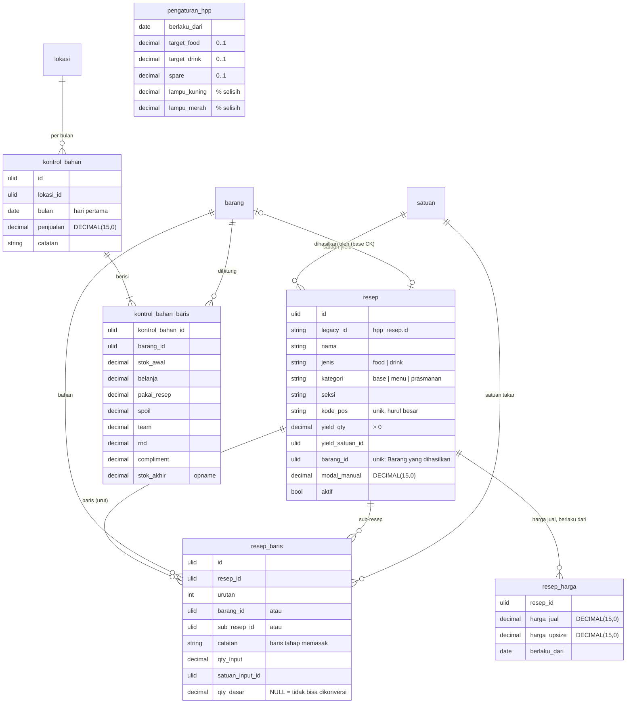

# Area: Resep & HPP

Status: **rancangan + migration** (`2026_10_07_100000_create_erp_resep_hpp_tables.php`). Importer belum ditulis, karena butuh dump lama untuk diuji.
Dasar: ADR-0007, ADR-0008 (HPP dan resep milik Laksamana, bukan ESB), Q3 (satu katalog Barang), area [`pembelian-persediaan.md`](pembelian-persediaan.md) (Barang, Satuan, `barang_harga`).

## Sumber di sistem lama (diperiksa 2026-10-06)

- Backend `laksamana-office/stock-mysql/hpp.php`, nama bersama `lib_hpp_nama.php`.
- Layar `deploy/stock/hpp/index.html`: **Bahan & Harga**, **Daftar Resep**, **Kalkulator HPP**, **Kontrol Bahan Baku**, Pengaturan.
- Commit terakhir yang mengubah perilaku: 29 Sep 2026, kategori resep Menu jadi / Prasmanan / Base & olahan.

### Bentuk data lama

| Tabel lama | Isi | Masalah |
|---|---|---|
| `hpp_bahan` | bahan + harga beli (`qty_beli`, `harga_beli`), satuan, vendor (teks), `di_purchasing`, `sisi_harga` | berkunci **nama**; uang `DOUBLE`; vendor teks |
| `hpp_resep` | resep: `jenis` food/drink, `tipe` base/dish, `seksi`, `kode` (kode menu POS), yield, harga jual, `modal_manual`, `di_purchasing` | baris bahan di blob `bahan` JSON yang merujuk **nama**; Prasmanan disimpulkan dari awalan teks `seksi` |
| `hpp_pakai`, `hpp_bulan` | Kontrol Bahan Baku per bulan: stok awal, belanja, terpakai resep, spoil, team, RND, compliment, opname; penjualan bulan itu | `bulan` teks `CHAR(7)`; bahan lewat nama; `DOUBLE` |
| `hpp_setting` | target COGS food/drink, spare (buffer), ambang lampu kuning/merah | blob JSON |

`hpp_bahan` sudah dipetakan ke `barang` + `barang_harga` oleh importer `erp-barang` (Q3: 395 nama sama dengan Stock). Area ini menambah resepnya.

### Aturan hitung lama yang dipertahankan

Semua dihitung di layar lama. Di v2 aturannya pindah ke service (ADR-0006), tidak disimpan sebagai angka:

1. **Modal resep berjenjang.** Setiap baris adalah Barang (harga per Satuan Dasar × qty) **atau** resep lain (modal resep itu ÷ yield-nya × qty dalam satuan yield-nya). Rujukan resep dicari dalam **jenis yang sama** dulu (food/drink).
2. **Siklus ditolak.** Resep yang (lewat resep lain) memakai dirinya sendiri tidak punya modal.
3. **Baris yang tidak bisa dikonversi tetap dihitung apa adanya**, tetapi diberi tanda ⚠ (perilaku lama, `qtySesuai` "campur"). Mengubahnya menjadi nol akan menurunkan modal ratusan resep diam-diam.
4. **Konversi:** keluarga baku dulu (Kg↔Gram, L↔Ml), baru ukuran per Barang. Kebalikannya membuat satu salah ketik per Barang mengalahkan fisika.
5. **Resep tanpa baris bahan** (catatan saja tidak dihitung sebagai bahan) memakai `modal_manual`. Insiden 21 Sep 2026: baris catatan membuat 10 menu bermodal Rp0.
6. **Spare** (buffer, bawaan 5%) dikenakan **sekali**, hanya pada menu (bukan base), dan tidak ikut naik ketika menu dirujuk resep lain.
7. **Modal per porsi = modal menu ÷ yield.** COGS = modal per porsi ÷ harga jual (insiden 20 Sep 2026: COGS 4.960% karena pembaginya lupa).
8. **Selisih Kontrol Bahan Baku** = (stok awal + belanja − opname) − (terpakai resep + spoil + team + RND + compliment). Lampu kuning/merah di atas persentase selisih di Pengaturan.

## Keputusan

| Hal | Keputusan | Alasan |
|---|---|---|
| Rujukan baris resep | FK: `barang_id` **atau** `sub_resep_id`, tepat satu, atau baris catatan saja | menggantikan nama + `ref`; `CHECK` menjaganya |
| Kategori | kolom `kategori` = `base` / `menu` / `prasmanan` | lama: `tipe` + awalan "PRASMANAN" di `seksi`. Awalan dibuang dari `seksi` saat impor |
| `sisi_harga` dan `di_purchasing` resep | `resep.barang_id`: Barang yang **dihasilkan** resep ini (base CK yang dipesan outlet lewat Purchasing). Harga Barang itu diambil dari resepnya | menggantikan dua saklar yang saling menjelaskan |
| `di_purchasing` bahan | kolom baru `barang.dipesan` (bawaan ya). Air, es dari mesin sendiri: tidak | perilaku lama "Perlu ada di Purchasing?" |
| Kode menu POS | `resep.kode_pos`, unik, huruf besar | dipakai mencocokkan menu di ekspor ESB (ADR-0008) |
| Harga jual | riwayat `resep_harga` (berlaku dari) | ADR-0007: nilai yang dipakai laporan masa lalu tidak ditimpa. `harga_lama` lama sudah pensiun (15 Agu 2026), tidak diimpor |
| Satuan keluarga | kolom baru `satuan.keluarga` + `satuan.faktor` (Gram 1, Kg 1000; Ml 1, L 1000) | aturan hitung 4 |
| Pengaturan HPP | tabel `pengaturan_hpp` berlaku-dari | target dan spare menggeser modal; laporan lama harus bisa dihitung ulang dengan angka saat itu |
| Kontrol Bahan Baku | dokumen `kontrol_bahan` per Lokasi per bulan + `kontrol_bahan_baris` per Barang | `bulan` menjadi `DATE` hari pertama; Lokasi wajib (ADR-0007) |

## ERD

Kolom teknis ADR-0007 tidak digambar. `barang`, `satuan`, `lokasi` dari area Pembelian & Persediaan.

### Aturan (langkah 7)

Dijaga database (diuji di `tests/Feature/Erp/ResepHppSchemaTest.php`):

- `resep.jenis IN ('food','drink')`, `kategori IN ('base','menu','prasmanan')`, `yield_qty > 0` (lama: yield nol dijatuhkan ke 1 karena pembagian nol menjalar ke semua menu), `modal_manual >= 0`.
- `(jenis, nama)` unik: rujukan lama dicari per jenis, jadi nama ganda dalam satu jenis sudah ambigu di sistem lama.
- `kode_pos` unik bila diisi. `barang_id` unik: satu Barang dihasilkan paling banyak satu resep.
- Baris resep: paling banyak satu dari `barang_id` / `sub_resep_id`. Baris tanpa keduanya adalah catatan: wajib `catatan`, tanpa qty. Baris bahan wajib `qty_input > 0` dan `satuan_input_id`.
- `(resep_id, urutan)` unik. Baris ikut terhapus bersama resepnya (`CASCADE`); Barang dan sub-resep yang dirujuk tidak bisa dihapus (`RESTRICT`).
- `resep_harga`: harga `>= 0`, `(resep_id, berlaku_dari)` unik.
- `pengaturan_hpp`: target dan spare antara 0 dan 1, lampu `>= 0`, kuning `<=` merah, `berlaku_dari` unik.
- `satuan`: `keluarga IN ('massa','volume')`, dan `keluarga` terisi tepat bila `faktor > 0` terisi.
- `kontrol_bahan.bulan` selalu hari pertama bulan; `(lokasi_id, bulan)` unik; `(kontrol_bahan_id, barang_id)` unik. Qty tidak dibatasi tanda: sistem lama menerima minus, dan koreksi diketik di sana.

Dijaga service (belum ada service v2):

- Resep tidak boleh memakai dirinya sendiri, langsung (A → A) atau lewat resep lain (A → B → A); ditolak saat menyimpan baris resep. Yang langsung pun dijaga service, karena MySQL melarang `CHECK` pada kolom FK ber-`CASCADE` (`resep_id`).
- `qty_dasar` dihitung sekali saat baris ditulis: ke Satuan Dasar Barang, atau ke satuan yield sub-resep, dengan aturan konversi 4. Kalau tidak bisa, `NULL` dan barisnya ditandai ⚠ (aturan 3).
- `kode_pos` dibakukan ke huruf besar.

### JSON (langkah 8)

Tidak ada. Blob `bahan` lama menjadi `resep_baris`; `hpp_setting` menjadi kolom.

### Riwayat (langkah 9)

- Harga beli: `barang_harga` (sudah ada, berlaku dari).
- Harga jual: `resep_harga`.
- Pengaturan HPP: `pengaturan_hpp`.
- Isi resep **tidak** diberi riwayat sekarang: sistem lama juga menimpanya, dan belum ada dokumen yang menyalin modal. Saat area Penjualan menghitung COGS dari bill ESB, modal per porsi **disalin** ke baris laporannya (ADR-0007), jadi mengubah resep tidak menulis ulang bulan lalu.

## Pemetaan lama → v2

| Lama | v2 | Aturan impor |
|---|---|---|
| `hpp_resep.id` | `resep.legacy_id` | ULID baru |
| `jenis`, `nama` | `jenis`, `nama` | |
| `tipe` + `seksi` | `kategori`, `seksi` | `seksi` berawalan `PRASMANAN` → `prasmanan`, awalan dibuang (sama dengan `seksiTanpaPras` lama); lainnya `base` / `menu` dari `tipe` (`dish` → `menu`) |
| `kode` | `kode_pos` | huruf besar; `''` → `NULL`; kode ganda dilaporkan |
| `yield_qty`, `yield_unit` | `yield_qty`, `yield_satuan_id` | satuan dinormalkan seperti `erp-barang` (`Gr` = `Gram`) |
| `harga_baru`, `harga_upsize` | `resep_harga` (berlaku dari `2000-01-01`, seperti `BarangImporter::BERLAKU_AWAL`) | `harga_lama` tidak diimpor; ia sudah dipindah ke `harga_baru` oleh layar lama |
| `modal_manual` | `modal_manual` | dibulatkan ke rupiah |
| `di_purchasing = 1` (resep) | `resep.barang_id` | Barang bernama sama; kalau tidak ada, dilaporkan |
| `bahan` JSON `{nama, qty, satuan, ref}` | `resep_baris` | `ref = resep` → `sub_resep_id` (jenis sama dulu); lainnya → `barang_id` lewat nama; `{catatan}` → baris catatan; urutan = posisi di JSON; nama yang tidak ditemukan dilaporkan (lama: 77 nama "hilang") |
| `hpp_bahan.di_purchasing` | `barang.dipesan` | |
| `hpp_bahan.sisi_harga = 'resep'` | `resep.barang_id` | resep bernama sama menjadi penghasil Barang itu |
| `hpp_setting` | satu baris `pengaturan_hpp` (berlaku dari `2000-01-01`) | bawaan lama bila kosong: 0,33 / 0,33 / 0,05 / 3 / 8 |
| `hpp_bulan` + `hpp_pakai` | `kontrol_bahan` (Lokasi = Outlet) + `kontrol_bahan_baris` | `bulan` `2026-08` → `2026-08-01`; bahan lewat nama seperti `erp-persediaan` |

## Belum dikerjakan

1. Importer `core:import erp-resep` (setelah `erp-barang`). Butuh dump lama.
2. Service modal (aturan hitung 1–7) dan tesnya dengan resep nyata: modal v2 harus sama dengan angka layar lama untuk setiap resep.
3. Isi `satuan.keluarga`/`faktor` untuk satuan yang sudah ada (Gram, Kg, Ml, L, …) lewat importer `erp-barang`.
4. Kalkulator HPP Marketing (`kalkHistori`, issue #184) adalah dokumen area Penjualan; ia akan menyalin modal dari sini.
