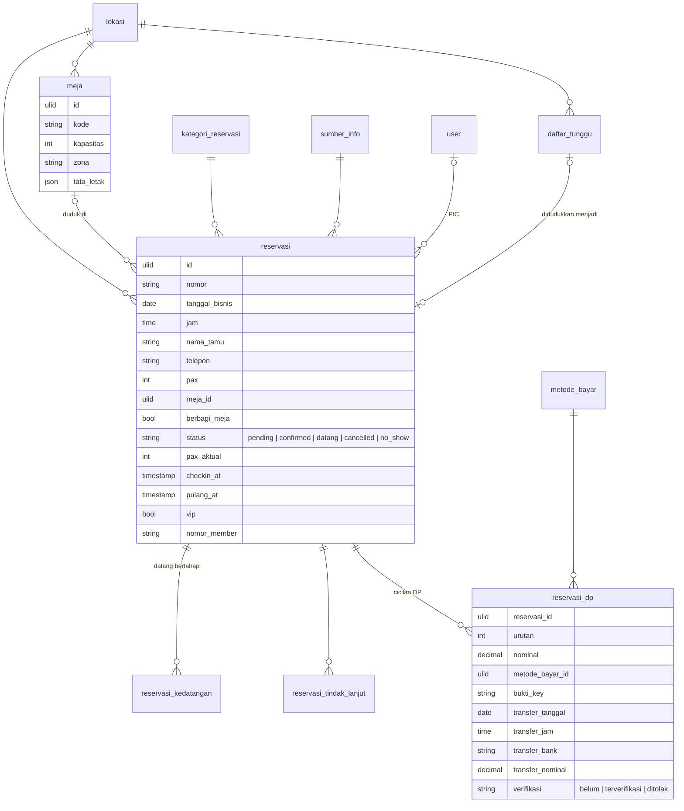

# Area: Tamu — Reservasi

Status: **rancangan + migration** (`2026_10_07_150000_create_erp_reservasi_tables.php`), di atas area [Kas](kas.md) (`metode_bayar`). Importer belum ditulis, karena butuh dump lama untuk diuji.
Area Tamu dipecah tiga: **Reservasi** (dokumen ini), Event & Tiket, dan Acara Marketing (klien, booking paket, DP event).

## Sumber di sistem lama (diperiksa 2026-10-06)

- `laksamana-office/reservasi-mysql/lib_reservasi_mysql.php`: blob `reservations` (satu baris per reservasi, isi di `data`), `settings` (master), `audit`; berkas bukti di folder data (`@f:` kunci).
- `deploy/reservasi/index.html`: daftar reservasi, Hari H (meja, check-in, waiting list), Dana Masuk, master (meja + denah, kategori, sumber info, metode DP).
- Kompas `bri_mutasi` mencocokkan mutasi BRI dengan DP reservasi (`res_id`, `dp_id`).

### Bentuk data lama

| Lama | Isi |
|---|---|
| `reservations[].data` | nama, HP, tanggal, jam, pax, meja, `sharing`, kategori, sumber, PIC (`picType`, `picName`), member + nomor, VIP, permintaan makanan/minuman, catatan, status, `actualPax`, `checkinAt`, `leftAt`, `arrivals[]`, `followups[]`, `autoClosed`, `cancelReason`, dokumen (`docReq*`), DP |
| DP | `dps[]` cicilan: nominal, metode, bukti, data transfer (tanggal, jam, bank, nama, nominal), `tfStatus` (`''`/`verified`/`rejected`), OCR. Reservasi lama punya satu DP di field datar (`dpAmount`, `dpMethod`, …) yang dibaca sebagai cicilan pertama (`ensureDps`) |
| `settings.tables`, `layouts`, `layoutOverrides*` | meja (id, kapasitas, zona) dan denahnya |
| `settings.categories`, `infoSources`, `dpMethods` | daftar pilihan |
| `settings.waitlist` | antrean: nama, HP, pax, catatan, status `waiting`/`seated`, meja, reservasi yang dibuat |
| `settings.reviews`, `feedbacks`, `seCrew`, `sePerms` | Service Excellent, bukan area ini |

### Aturan lama yang dipertahankan

1. **Status**: `Pending`, `Confirmed`, `Datang`, `Cancelled`, `No-show`. Nilai lama `Checked-in`/`Completed` = `Datang`; `Booking` = `Confirmed` (`normStatus`).
2. **Kedatangan bertahap**: rombongan bisa datang beberapa kali (`arrivals[]`: waktu, pax, oleh). `actualPax` = jumlahnya.
3. **Meja tidak boleh bentrok** pada jam yang sama, kecuali reservasi ditandai **berbagi meja**. Duduk melebihi kapasitas boleh setelah konfirmasi.
4. **DP bisa dicicil**; setiap cicilan diverifikasi sendiri terhadap bukti transfer dan mutasi bank.
5. **Walk-in dari waiting list** menjadi reservasi berstatus `Datang` dengan sumber `Walk-in`, dan barisnya di antrean menunjuk reservasi itu.
6. **Tanggal di Dana Masuk** bisa menurut tanggal reservasi atau tanggal uang masuk (`basis`, 3 Okt 2026).

## Keputusan

| Hal | Keputusan |
|---|---|
| Reservasi | `reservasi`, satu baris per booking, dengan Lokasi dan `tanggal_bisnis` + `jam` |
| Status | `CHECK` lima nilai huruf kecil: `pending`, `confirmed`, `datang`, `cancelled`, `no_show` |
| Kedatangan dan tindak lanjut | `reservasi_kedatangan`, `reservasi_tindak_lanjut` (bukan JSON) |
| DP | `reservasi_dp` per cicilan, metode = `metode_bayar` (area Kas); verifikasi `belum` / `terverifikasi` / `ditolak` |
| Meja | master `meja` per Lokasi; posisi di denah sebagai JSON (`tata_letak`), karena hanya digambar |
| Bentrok meja | **service** (aturan 3): bergantung pada jam dan perkiraan lama makan (`dineEstMin`), tidak bisa `UNIQUE` |
| Kategori, sumber info | master `kategori_reservasi`, `sumber_info` |
| Waiting list | `daftar_tunggu` per Lokasi per tanggal bisnis |
| Bukti dan dokumen | kunci berkas (`bukti_key`, `dokumen_key`) di penyimpanan berkas, bukan base64 di database |
| Tamu sebagai orang | **belum** menjadi `pihak`: nama + HP disimpan di reservasi, sama dengan perilaku lama. Ringkasan tamu (`ringkasTamu`) mengelompokkan lewat HP yang dinormalkan |

## ERD

Kolom teknis ADR-0007 tidak digambar.

### Aturan (langkah 7)

Dijaga database (diuji di `tests/Feature/Erp/ReservasiSchemaTest.php`):

- `reservasi.status` lima nilai; `pax > 0`; `pax_aktual >= 0`; `cancelled` ⇔ alasan batal boleh diisi (tidak dipaksa, data lama sering kosong).
- `reservasi_kedatangan.pax > 0`; `reservasi_dp.nominal >= 0` (cicilan lama boleh hanya berisi bukti), urutan unik per reservasi; `verifikasi` tiga nilai; terverifikasi/ditolak ⇔ waktu verifikasi terisi.
- `meja`: kode unik per Lokasi, `kapasitas > 0`.
- `daftar_tunggu.status IN ('menunggu','duduk','batal')`; `duduk` ⇔ `reservasi_id` terisi.
- Kedatangan, tindak lanjut, dan DP ikut reservasi (`CASCADE`); reservasi tidak dihapus permanen di layar (dibatalkan lewat status).

Dijaga service: bentrok meja (aturan 3), `pax_aktual` = Σ kedatangan, normalisasi HP, kategori/sumber bawaan untuk walk-in (aturan 5).

### JSON (langkah 8)

| Kolom | Alasan |
|---|---|
| `meja.tata_letak` (`{x, y, w, h, bentuk}`) | hanya untuk menggambar denah; tidak pernah difilter atau dijumlah |

### Riwayat (langkah 9)

Tidak ada nilai master yang dibaca ulang oleh reservasi lama; nama kategori/sumber diubah di master berarti label lama ikut berubah, sama dengan perilaku lama.

## Pemetaan lama → v2

| Lama | v2 | Aturan impor |
|---|---|---|
| `reservations[].data` | `reservasi` (Lokasi Outlet) | `id` → `legacy_id`; status lewat `normStatus`; `table` → `meja` per kode; `category`/`source` → master lewat nama (yang tidak ada dibuat); `picName` → User lewat pencocok nama, sisanya `pic_impor`; `createdBy` → `dicatat_oleh_impor` bila tak cocok |
| `arrivals[]`, `followups[]` | `reservasi_kedatangan`, `reservasi_tindak_lanjut` | `by` → pencocok nama |
| `dps[]` (atau field DP datar) | `reservasi_dp` | `method` → `metode_bayar` lewat nama (`QRIS BRI` → `qris_bri`, `Transfer UOB` → metode transfer UOB); `tfStatus` `verified`/`rejected`/`''`; `proofData` base64 → berkas, `bukti_key` |
| `docReqData` | `dokumen_key` | base64 → berkas |
| `settings.tables` + denah | `meja` | `cap` → `kapasitas`; x/y/w/h → `tata_letak` |
| `settings.waitlist` | `daftar_tunggu` | `seated` → `duduk` + `reservasi_id` |

## Belum dikerjakan

1. Importer `core:import erp-reservasi` (setelah `erp-kas`). Butuh dump `reservasi` dan folder berkasnya.
2. DP sebagai uang: pencocokan dengan mutasi bank (Kompas `bri_mutasi`) dan masuknya ke `arus_kas`, bersama area Acara Marketing (DP event memakai pola yang sama).
3. Denah per tanggal (`layoutOverrides`), review/feedback (Service Excellent).
