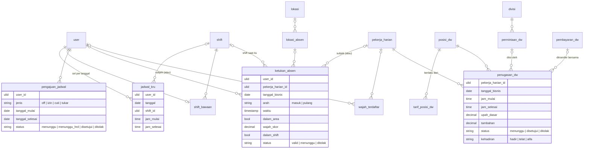

# Area: SDM — Jadwal, Absensi, Pekerja Harian

Status: **rancangan + migration** (`2026_10_07_170000_create_erp_sdm_tables.php`), di atas area [Orang & Divisi](orang-divisi.md) (`karyawan`, `pekerja_harian`, `divisi.jenis`). Importer belum ditulis, karena butuh dump lama untuk diuji.
HR (kinerja, KPI, pelanggaran, pelatihan) dan Akademi dirancang terpisah.

## Sumber di sistem lama (diperiksa 2026-10-06)

- `laksamana-office/jadwal-mysql` + `deploy/jadwal`: sel jadwal per kru per tanggal, pengajuan (OFF/IZIN/CUTI/TUKAR) yang disetujui Kepala Divisi lalu HRD, master shift, shift bawaan kru, jabatan, manajemen, pengaturan.
- `laksamana-office/absensi-mysql` + `absensi/`: lokasi absen (GPS + radius), wajah terdaftar (User dan Pekerja Harian), ketukan masuk/pulang dengan hasil GPS, wajah, dan shift; pengaturan.
- `laksamana-office/dw-mysql` + `deploy/dw`: pool Pekerja Harian, permintaan dari Head, penugasan (ajuan) dengan kehadiran dan nilai, tarif per posisi, penanda transfer mingguan.
- Struktur lama sudah dipetakan di migration `core` Tim A (`2026_09_26_130000/150000/160000`), yang dibekukan (ADR-0006).

### Aturan lama yang dipertahankan

1. **Satu sel jadwal per kru per tanggal**; jam boleh menimpa jam shift.
2. **Pengajuan jadwal**: `MENUNGGU` → (disetujui Kepala Divisi) `MENUNGGU_HRD` → `DISETUJUI` / `DITOLAK`. Jenis: OFF, IZIN, CUTI, TUKAR.
3. **Shift milik Hari Operasional tempat ia dimulai** (`hari-operasional.md`); lama kerja dihitung dari selisih dua ketukan, tidak menebak tanggal pulang.
4. **Ketukan absen**: satu `MASUK` dan satu `PULANG` per subjek per tanggal (pulang menimpa); hasil GPS (dalam area), wajah (skor + ambang), dan shift (dari jadwal, bawaan, atau penugasan DW) disimpan pada saat ketukan. Status `VALID`, `MENUNGGU` (perlu diputus), `DITOLAK`.
5. **Upah DW** = tarif posisi untuk satu shift dasar (bawaan 6 jam) + tambahan tetap bila shift lebih panjang (bawaan Rp20.000, berlaku untuk seluruh shift di atas dasar); di atas jam batas (bawaan 12 jam) hanya peringatan.
6. **Kehadiran DW**: kosong, `HADIR`, `TELAT`, `ALFA`.
7. **"Berapa yang sudah terisi"** dari permintaan DW dihitung dari penugasan, tidak disimpan.
8. **Transfer DW ditandai per minggu (Senin) per rekening tujuan**, karena satu transfer bisa mencakup beberapa penugasan, bahkan beberapa orang dengan rekening sama. Nomor rekening dibersihkan dari spasi/titik/strip sebelum dibandingkan.

## Keputusan

| Hal | Keputusan |
|---|---|
| Shift | master `shift` (jam `TIME`, bukan teks `HH:MM`) |
| Jadwal kru | `jadwal_kru` (User × tanggal), `shift_id` FK; kode lama yang sudah dihapus disimpan di `shift_impor` |
| Shift bawaan kru | `shift_bawaan` (satu per User) |
| Pengajuan | `pengajuan_jadwal` dengan `jenis` dan `status` ber-`CHECK`, jejak Head dan HRD terpisah |
| Jabatan (Jadwal) | **tidak** jadi tabel: `user.jabatan` (Roster) sumbernya; bedanya dilaporkan saat impor |
| Manajemen (boleh membuka rekap) | Kewenangan `jadwal.rekap` di tabel Akses (`akses.md`) |
| Subjek absen | `user_id` **atau** `pekerja_harian_id`, tepat satu (`CHECK`) — menggantikan pasangan teks `subjek_tipe`/`subjek_id` |
| Lokasi absen | `lokasi_absen` (titik GPS + radius), boleh menunjuk `lokasi` |
| Wajah | `wajah_terdaftar` per subjek; descriptor sebagai JSON (vektor, tidak pernah difilter) |
| Pengaturan | `pengaturan_jadwal`, `pengaturan_absen`, `pengaturan_dw` berlaku-dari, kolom bertipe |
| Posisi & tarif DW | `posisi_dw` + `tarif_posisi_dw` (berlaku dari); tarif dan tambahan **disalin** ke penugasan |
| Permintaan & penugasan DW | `permintaan_dw`, `penugasan_dw` |
| Transfer DW | `pembayaran_dw` (minggu × nomor tujuan) + `penugasan_dw.pembayaran_dw_id` |

## ERD

Kolom teknis ADR-0007 tidak digambar.

### Aturan (langkah 7)

Dijaga database (diuji di `tests/Feature/Erp/SdmSchemaTest.php`):

- `jadwal_kru`: satu per `(user_id, tanggal)`. `shift_bawaan`: satu per User.
- `pengajuan_jadwal`: `jenis` dan `status` ber-`CHECK`; `tanggal_selesai >= tanggal_mulai`; diputus (`disetujui`/`ditolak`) ⇔ `diputuskan_at`.
- `ketukan_absen`: tepat satu subjek; `arah` dan `status` ber-`CHECK`; satu per subjek × tanggal × arah; `wajah_skor` 0–1; `shift_sumber` ber-`CHECK`.
- `wajah_terdaftar`: tepat satu subjek; satu wajah aktif per subjek tidak di-`CHECK` (riwayat pendaftaran disimpan).
- `lokasi_absen.radius_m > 0`; lat −90..90, lng −180..180.
- `penugasan_dw`: `status`, `kehadiran` ber-`CHECK`; upah `>= 0`. Penilaian DW lama (`nilai_*`) sudah diganti kehadiran pada 5 Agu 2026 dan tidak dibawa.
- `permintaan_dw.jumlah > 0`; `pembayaran_dw`: `minggu_mulai` Senin, satu per minggu × nomor tujuan.
- Pengaturan: angka dalam rentang yang masuk akal (menit `>= 0`, ambang wajah 0–1, jam dasar `> 0`, jam batas `>=` jam dasar).

Dijaga service: alur persetujuan dua tahap (Head lalu HRD), pengecekan GPS/wajah/shift saat ketukan, upah dari tarif dan pengaturan yang berlaku (aturan 5), larangan mengisi permintaan melebihi jumlahnya, normalisasi nomor rekening (aturan 8).

### JSON (langkah 8)

| Kolom | Alasan |
|---|---|
| `wajah_terdaftar.descriptor` | vektor wajah 128 angka; hanya dibandingkan utuh oleh pencocok wajah |

### Riwayat (langkah 9)

Tarif DW, pengaturan absen/DW/jadwal berlaku-dari. Penugasan menyalin upah dasar dan tambahannya; ketukan menyalin shift, hasil GPS, dan skor wajah saat itu.

## Pemetaan lama → v2

| Lama | v2 | Aturan impor |
|---|---|---|
| `jadwal_setting.shifts` | `shift` | `HH:MM` → `TIME`; atribut lain dilaporkan |
| `jadwal_sel` | `jadwal_kru` | kode shift tak dikenal → `shift_impor` |
| `jadwal_setting.shiftKru` | `shift_bawaan` | |
| `jadwal_setting.jabatan` | — | dibandingkan dengan `user.jabatan`, beda dilaporkan |
| `jadwal_setting.manajemen` | `penempatan_peran`/Kewenangan `jadwal.rekap` | |
| `jadwal_pengajuan` | `pengajuan_jadwal` | status/jenis huruf kecil; `head_*` → `head_disetujui_*`; nama → pencocok nama |
| `abs_lokasi` | `lokasi_absen` | |
| `abs_wajah` | `wajah_terdaftar` | `USER:<id>` → User, `DW:<id>` → Pekerja Harian; foto base64 → berkas |
| `abs_punch` | `ketukan_absen` | `waktu` ms → `TIMESTAMP`; `tgl` → `tanggal_bisnis`; `subjek_*` → FK |
| `abs_setting` | `pengaturan_absen` | `awalMenit`, `akhirMenit`, `wajahWajib`, `wajahAmbang`, `lemburMinMenit`, `toleransiTelat`, `tanpaShiftBoleh` |
| `dw_setting` (`tarif`, `posisi`, `jamDasar`, `jamBatas`, `tambahanPanjang`, `kuota`, `bayarLunas`) | `posisi_dw`, `tarif_posisi_dw`, `pengaturan_dw`, `pembayaran_dw` | tarif berlaku dari `2000-01-01`; `bayarLunas{senin|tujuan}` → `pembayaran_dw` |
| `dw_permintaan` | `permintaan_dw` | `divisi` → Divisi; `posisi` → `posisi_dw` |
| `dw_ajuan` | `penugasan_dw` | upah dihitung sekali saat impor dengan tarif lama; `hadir ''` → `NULL` |
| `dw_pekerja` | `pekerja_harian` (area Orang & Divisi) | `bayar_*` → `pihak_rekening` |

## Belum dikerjakan

1. Importer `core:import erp-sdm` (setelah `erp-orang`). Butuh dump `jadwal`, `absensi`, `dw`.
2. Service: persetujuan dua tahap, validasi ketukan, upah DW, rekap kehadiran; dibandingkan dengan layar lama.
3. Pembayaran DW ke `arus_kas` (dari dompet mana): setelah area Kas di-merge.
4. HR dan Akademi.
