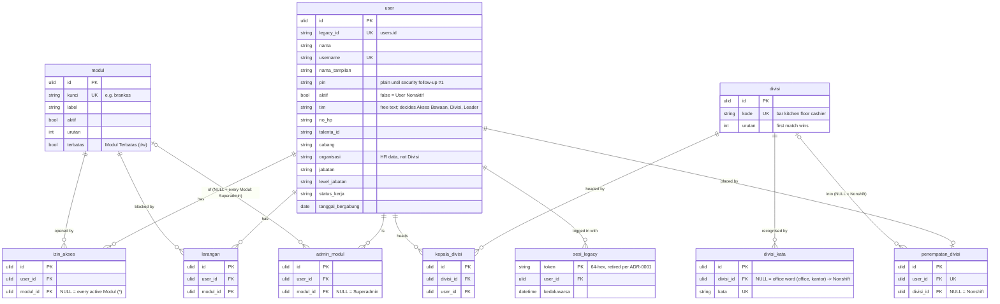

# PRD — Consolidate the legacy databases into one clean `core` database

Status: accepted (grilling session 2026-09-24); per-Modul consolidation in the legacy shape superseded by [ADR-0006](../adr/0006-erp-v2-redesigns-core-per-area.md) (2026-10-02). The goals below still stand, per business area. Vocabulary: [`CONTEXT.md`](../../CONTEXT.md).
Decisions: [ADR-0001](../adr/0001-sanctum-with-legacy-sesi-until-full-cutover.md) ·
[ADR-0002](../adr/0002-per-module-cutover-into-one-normalised-core-database.md) ·
[ADR-0003](../adr/0003-core-schema-glossary-names-and-ulid-keys.md) ·
[ADR-0004](../adr/0004-cutover-by-offline-import-behind-a-maintenance-flag.md)

## Problem

The Office runs on ~16 Backends, each with its own MariaDB database (`lakk5493_db_<mod>`, plus a `lakk5493_db_dev_<mod>` twin). Most tables are a few indexed columns plus a LONGTEXT `data` JSON blob that holds the real truth. The problems:

- There are no foreign keys between tables.
- There are five different optimistic-concurrency schemes.
- The schema is created at runtime by DDL.
- Shared concepts are copied everywhere. The Divisi synonym list exists in four places, and Kepala Divisi, Penempatan Divisi and Divisi itself live inside `jadwal_setting` JSON.

laksamana-api already serves these databases as they are (hybrid). This project gives it one database of its own that is worth keeping.

## Goals

1. **One database**, `core` (`lakk5493_laksamana_core`, dev twin `lakk5493_laksamana_dev_core`), owned by Laravel migrations.
2. **Clean relational schema**: typed columns, child tables and real foreign keys. JSON only for open-ended data.
3. **An ERD per module** (`docs/db/<module>.md`, Mermaid) plus an overview in `docs/db/README.md`.
4. **No behaviour change for the old frontends.** Compat routes keep byte-identical wire shapes, proven by parity against `core`.
5. **Zero lost writes at cutover**, and every data-changing step rehearsed locally first.

## Non-goals

- Changing any old frontend. They keep calling their old URLs.
- Merging the unrelated "divisi" lists of the HR, Akademi, Marketing, Kompas and Stock Panels into Divisi. They stay local groupings until those Backends are ported (CONTEXT.md: Divisi).
- laksamana-api's own production deployment, which is decided separately. ADR-0004 is revisited then.
- Hashing PINs. That is security follow-up #1, blocked on the Superadmin console showing PINs, so `user.pin` keeps the legacy plain-text value until then.

## Decisions

| Topic | Decision | Record |
|---|---|---|
| Source of truth | Per-module cutover. After cutover `core` is the module's only truth, its legacy database is frozen as a read-only archive, and nothing is dual-written | ADR-0002 |
| Blobs | Normalised into columns and child tables with FKs | ADR-0002 |
| Names | Indonesian glossary terms, singular. Shared tables unprefixed (`user`, `modul`, `divisi`); module tables prefixed with the module key (`finance_brankas`) | ADR-0003 |
| Technical columns | Laravel English: `created_at`, `updated_at`, `created_by`, `updated_by` (FK → `user`), `version` (INT, the one concurrency scheme), `deleted_at` only where legacy forbids a hard DELETE | ADR-0003 |
| Keys | ULID PK; unique `legacy_id` wherever a legacy id exists | ADR-0003 |
| Auth | Sanctum only for v1. Legacy `sesi` tokens stay on compat routes until every Backend runs on Laravel | ADR-0001 |
| Cutover | Offline import behind a per-module maintenance flag, rehearsed on the dev twin first. Rollback only before the flag is lifted | ADR-0004 |

## Cutover order

1. **Identity** (first, because every other FK points here): account (User, Modul, Izin Akses, Larangan, Admin Modul), plus Divisi, its synonym words, Kepala Divisi and Penempatan Divisi taken out of `jadwal_setting`.
2. Then the existing porting order in `docs/modules/README.md`: jadwal → dw → absensi → marketing → the RowSync family (konten, akademi, bd, event, hr, hlife) → finance → kompas → reservasi, stock, ticketing.

A module is cut over only after its legacy compat + v1 port milestone is done.

## Per-module cutover procedure (ADR-0004)

1. The module's legacy compat and v1 are ported and its parity is green (the existing milestone).
2. Write the `core` migrations, the ERD (`docs/db/<module>.md`) and an idempotent `php artisan core:import <module>` (legacy DB → `core`).
3. Rewire the module's services to `core`. The compat routes rebuild the legacy shapes.
4. Parity against `core` must be `N/N identical`, using an import of the restored dumps.
5. **Dev rehearsal**: the owner exports the dev database; the import runs locally; the owner loads the result into `lakk5493_laksamana_dev_core`; the dev frontends are checked.
6. **Production**:
   1. Turn on the maintenance flag (writes refused, reads served).
   2. The owner exports the database.
   3. The import runs locally and parity is checked.
   4. The owner imports the result through phpMyAdmin.
   5. Switch the connection and lift the flag.
7. Record a milestone (`docs/MILESTONES.md` + tag) and mark the legacy database frozen.

Claude writes and tests steps 2–4 locally. Only the owner touches the servers (CLAUDE.md §0).

## First ERD — identity (draft, to be finalised in the identity ticket)

Every table also carries the technical columns from ADR-0003 (omitted above). Improvements over legacy that this ERD makes possible:

- **Izin Akses and Larangan become separate tables** (legacy `grants.access` 1/0), and `*` becomes `modul_id NULL` instead of a magic string.
- **One `divisi_kata` table replaces the four copies** of the Divisi synonym list. Adding `foh` becomes one row.
- **Kepala Divisi and Penempatan Divisi get FKs to `user`**, so a deleted User can no longer leave a stale head id behind.
- `join_date` becomes a real `DATE` (legacy `varchar(10)`).

## Open items

- Whether `modul.terbatas` and the Tim word lists behind Akses Bawaan (`timBawaanJadwal`, `timBolehDw`, `timAdminRoster`) also move into tables, or stay in code.
- How `version` maps onto each module's legacy concurrency field in compat responses. This is settled per module.
- Revisit ADR-0004 once laksamana-api's production hosting (SSH or not) is known.
